# 02_Domain

> - Job
> - Step
> - ExcutionContext
> - JobRepository / JobLauncher

## 01_Job

> - Job
> - JobInstance
> - JobParameter
> - JobExecution


### **1-1) Job**

#### **기본 개념**

- 가장 상위에 있는 개념 / 하나의 배치 작업 자체를 의미한다.
  - ex_ API 서버의 접속 로그 데이터를 통계 서버로 옮기는 배치 ==> Job
- Job Configuration을 통해 생성되는 객체 단위
  - 배치 작업을 어떻게 구성하고 실행할 것인지 **전체적으로 설명하고 명세하는 객체**
  - **명세서, 설계도 역할을 하는 객체이다.**
- 배치 Job 을 구성하기 위한 최상위 인터페이스, 스프링 배치가 기본 구현체 제공
  - 구현체를 Bean으로 등록해서 실행을 시키는 용도
- 여러 Step을 포함하고 있는 컨테이너로서 **반드시 한개 이상의 Step으로 구성해야한다.**


#### **기본 구현체**

- **SimpleJob**

  - 순차적으로 **Step을 실행시키는 Job**

  - 모든 Job에서 유용하게 사용할 수 있는 표준 기증을 갖고 있다.

    

- **FlowJob**

  - **특정한 조건과 흐름**에 따라 Step을 구성하여 실행시키는 Job
  - **Flow 객체를 실행**시켜서 작업을 진행한다.


#### **구조**

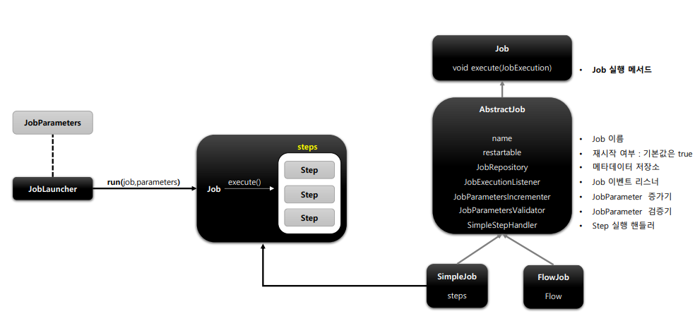

- JobLauncher
  - run (job, parameters) 라는 2개의 인자를 가지고 Job을 실행을 시킨다.
- Job
  - excute()를 실행하게 되면 Steps라는 list가 생성되고 안에 step을 순차적으로 실행기킨다. (Simple Job)
  - AbstractJob을 상속 받고 있다.
  - SimpleStepHandler를 통해 SimpleJob인지 FlowJob인지 판단한다.

```java

@Configuration 
@RequiredArgsConstructor
public class HelloJobConfiguration {

    private final JobBuilderFactory jobBuilderFactory; 
    private final StepBuilderFactory stepBuilderFactory; 


    @Bean
    public Job helloJob(){
        return jobBuilderFactory.get("helloJob") 
                .start(helloStep1()) // steps라는 List를 만들고 helloStep1을 Add한다.
                .next(helloStep2()) // steps List에 helloStep2를 Add한다.
                .build(); // 실제 Job 객체를 만들게 된다. (SimpleJob을 만들고 Job에 넣는다.)
    }

    @Bean
    public Step helloStep1(){
        return stepBuilderFactory.get("helloStep1") 
                .tasklet(new Tasklet() {
                    @Override
                    public RepeatStatus execute(
                        	StepContribution stepContribution, ChunkContext chunkContext) 																		throws Exception 
                    {
                        System.out.println("Hello Spring Batch");
                        return RepeatStatus.FINISHED;
                    }
                })
                .build();
    }

    @Bean
    public Step helloStep2(){
        return stepBuilderFactory.get("helloStep2") 
                .tasklet(((stepContribution, chunkContext) -> { 
                    System.out.println(">> step2 was executed");
                    return RepeatStatus.FINISHED;
                }))
                .build();
    }
}
```


### 1-2) JobInstance

#### **기본 개념**

- Job 이 실행될 때 (객체가 만들어져 실행될 때) 생성되는 **Job의 논리적 실행 단위 객체**
- 고유하게 식별 가능한 작업 실행을 나타낸다.
- Job의 설정과 구성은 동일 => Job이 실행되는 시점에 처리하는 내용은 다름
  - 즉 DB에서 긁어오는 값이 다를것이기 때문에 로직은 똑같아도 처리 내용이 다르다는 뜻
  - ex_  하루에 한번씩 배치 Job이 실행된다면 매일 실행되는 각각의 Job을 JobInstance로 표현하는 것
- **JobIndatnace 생성 및 실행**
  - 처음 시작 => JobInstance 생성
  - 이전 동일 => 이미 존재하는 JobInstance 리턴
    - 내부적 JobName + jobKey (jobParameter)를 가지고 JobInstance 객체를 얻음


#### **BATCH_JOBINSTANCE 테이블과 매핑**

- JOB_NAME과 JOB_KEY가 동일 데이터는 중복해서 저장할 수 없다.


#### **구성**

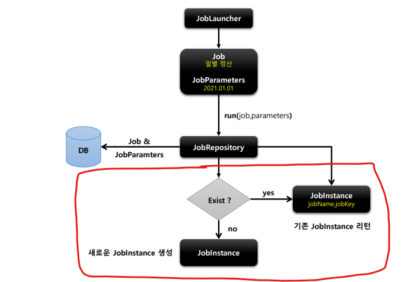

- **Parameter의 값이 같게 되면 Job을 수행하지 않고 기존 JobIndatnce를 리턴하게 된다.**


### 1-3) JobParameter

#### **기본 개념**

- 하나의 Job에 존재할 수 있는 여러개의 JobInstance를 구분하기 위한 용도
- JobParameters와 JobInstance는 1:1관계


#### **생성 및 바인딩**

- 어플리케이션 실행 시 주입
  - java -jar LogBatch.jar requestData=20210101
  - life cycle로 하여금 pakage로 target 폴더 생성
  - 그럼 jar파일이 만들어지는데 이때 java -jar로 어플리케이션 실행 시 주입해주면 된다.
    - 주의점 data(date)=2021/01/01, seq(long)=2L 과 같이 괄호를 치고 타입을 적어줘야한다.
    - 물론 string은 적지 않아도 된다.
  - 실행 시 주입이 된다.
- 코드로 생성
  - JobParameterBuilder, DefaultJobParametersConverter
  - 주로 JobParameterBuilder를 많이 사용한다.
- sqlEL이용
  - @Value("#{jobParamter[requestDate]}"), @JobScope, @StepScope 선언 필수

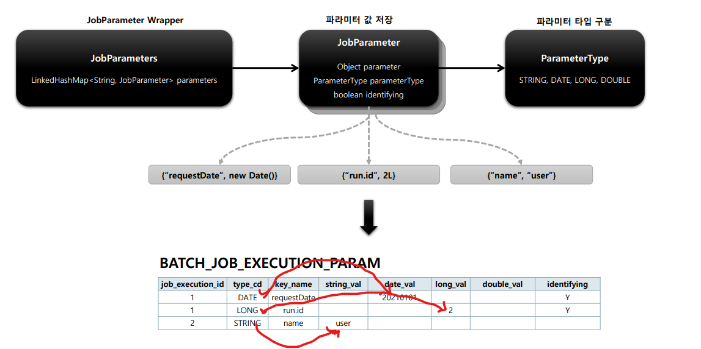


### 1-4) JobExecution

#### **기본 개념**

- JobInstance에 대한 한번의 시도를 의미하는 객체, Job 실행 중에 발생한 정보들을 저장하고 있는 객체

  - 시작시간, 종료시간, ,상태, 종료상태의 속성을 가진다.

  - JobInstance가 생성 될때마다 JobExecution이 생성된다.

    

- **JobInstance와의 관계**

  - JobExecution은 FAILED 또는 COMPLITED 등의 Job의 실행 결과 상태를 가진다.
  - JobExecution의 실행 상태 결과가 **COMPLETED**면 JobInstance 실행이 완료된 것으로 간주 
    **=> 재실행 불가(JobInstance가 동일한 경우)**
  - JobExecution의 실행 상태 결과가 **FAILED**면 JobInstance 실행이 완료되지 않은 것으로 간주
    **=> 재실행 가능**
    - JobParameter가 동일한 값으로 Job을 실행할지라도 JobInsatance를 계속 실행할 수 있음
  - JobExecution의 실행 상태 결과가 COMPLETED 될때까지 하나의 JobInstaance내에서 여러번의 시도가 생길 수 있다.

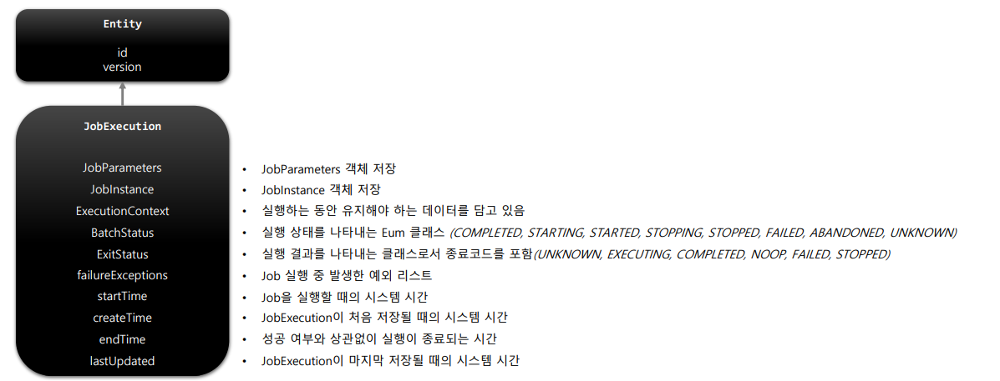

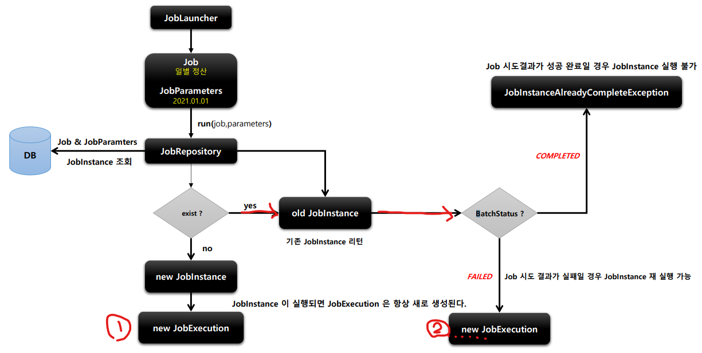

- Step에서 실행할 때 임의로 Exception을 주면 Job이 실패하게 된다.
- 이렇게 되면 다시 Execution을 실행할 수 있게 된다.
- **상황**
  - **Step1은 성공** 
  - **Step2 실패 => Step2만 재실행**


## 02_Step

> - Step
> - StepExecution
> - StepContribution

### **2-1) Step**

#### **기본 개념**

- Batch Job을 구성하는 독립적인 하나의 단계
  - 실제 배치 처리를 정의하고 컨트롤하는데 필요한 모든 정보를 가지고 있는 도메인
- 비즈니스 로직을 포함하는 모든 설정을 포함하고 있다.
- Job의 세부작업을 Task 기반으로 설정하고 명세해 놓는 객체


#### **구현체**

- TaskletStep : 가장 기본이 되는 클래스 => Tasklet 타입의 구현체들을 제어한다.
- PartitionStep : 멀티 스레드 방식으로 Step을 여러개로 분리해서 실행한다.
- JobStep : Step내에서 Job을 실행하도록 한다. (Step안에서 Job을 포함하는 방법)
- FlowStep : Step 내에서 Flow를 실행하도록 한다.

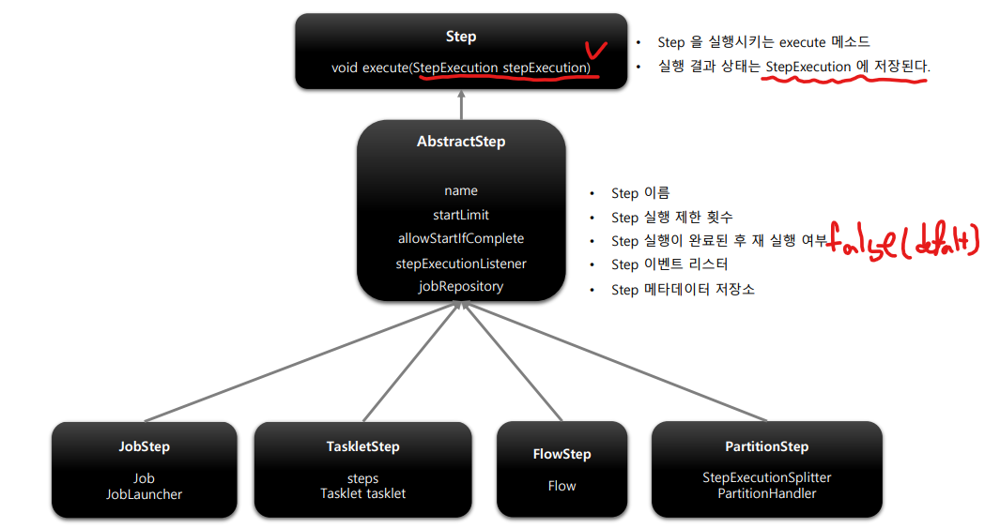


#### **API 설정에 따른 각 Step 설정**


- myTasklet이라는 Task를 직접 만들어서 빌드하는 과정


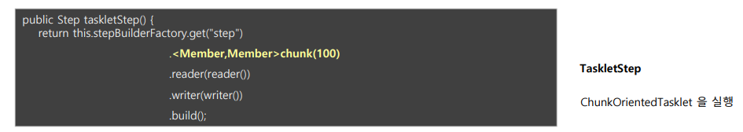

- Spring Batch에서 ChunkOrientedTasklet format을 제공하고 위와같이 사용하게 되면 된다.


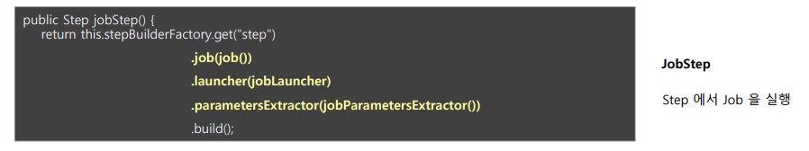

- job, launcher, parameterExtractor를 사용하면 Step안에 Job을 사용할 수 있게 된다.


- Flow Step을 실행하는 방법


### **2-2) StepExecution**

#### **기본 개념**

- Step 에 대한 한번의 시도를 의미하는 객체=> 실행 중에 발생한 정보들을 저장하고 있는 객체
  - 시작, 종료 시간, 상태, commit count, rollback count등의 속성을 가진다.
- Step 이 매번 시도될 때마다 생성되며 각 Step별로 생성
- **Job이 재시작 할때 실패한 Step만 실행**
- Step이 실행 되지 않았으면 StepExecution도 생성 안함
  - 즉 Step이 실제로 시작 됐을 때만 StepExecution을 실행함
  - **s1, s2, s3 실행 중 s1 성공, s2 실패? => s3는 StepExecution이 생성조차 되지 않음**
- JobExecution 과의 관계
  - StepExecution이 모두 완료 => JobExecution 완료
  - 하나라도 실패? JobExecution 실패

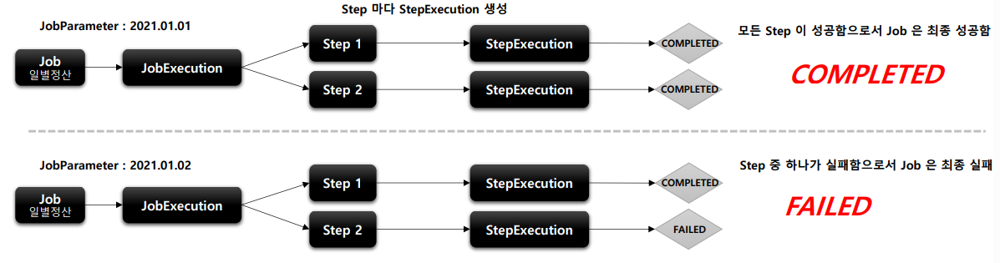

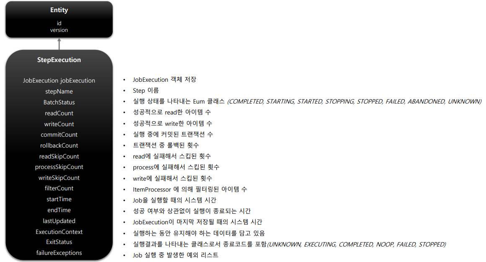


### **2-3) StepContribution**

#### **기본 개념**

- chunk 프로세스의 변경 사항을 버퍼링 한 후 StepExecution 상태를 업데이트하는 도메인 객체
- chunk 커밋 직전에 StepExecution의 apply 메서드를 호출하여 상태를 업데이트 함
- ExitStatus의 기본 종료코드 외 사용자 정의 종료코드를 생성해서 적용할 수 있음

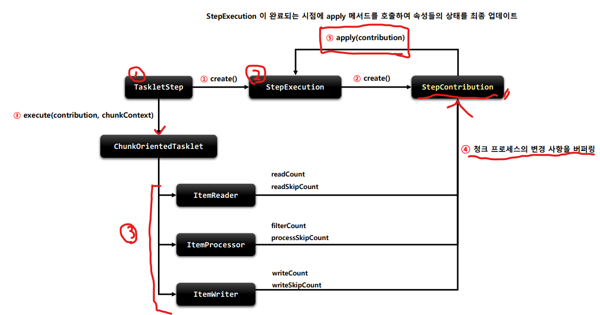

- StepContribution을 이용해서 다양한 객체를 가져올 수 있음
  - getInstance 등등


## 03_ExecutionContext

#### **기본 개념**

- 프레임워크에서 유지 및 관리하는 Map으로 된 컬렉션으로 StepExecution, JobExecution 객체의 상태를 저장하는 공유 객체
- DB 에 직렬화 한 값으로 저장됨
- **공유 범위**
  - Step
    - 각 Step의 StepExecution에 저장되며 Step간 서로 공유가 안된다.
  - Job
    - 각 Job의 JobExecution에 저장되며 job간 서로 공유 안됨. 
      하지만 **해당 Job의 Step간은 서로 공유가 된다.**
- Job 재 시작시 **이미 처리한 Row 데이터는 건너뛰고** 이후로 수행하도록 할 때 상태 정보를 활용한다.


#### **구조**

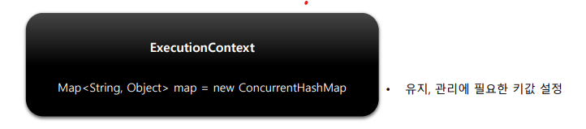

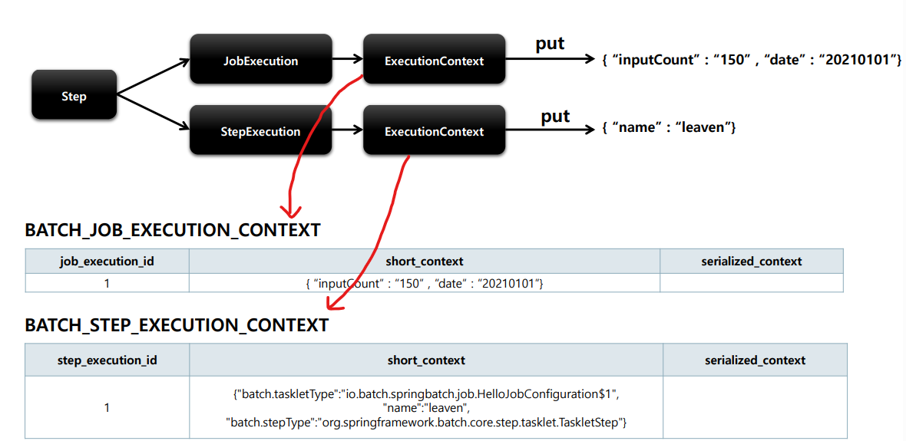

- JOB EXCUTION CONTEXT
  - Step간 공유가 되기 때문에 공유가능하게 설계를 진행하면 된다.
- STEP EXCUTION CONTEXT
  - STEP간에 공유가 되지 않기 때문에 공유되지 않도록 설계를 진행해야한다.


## 04_JobRepository / JobLauncher

#### **기본 개념**

- 배치 작업 중의 정보를 저장하는 저장소 역할
- Job이 언제 수행되었고, 언제 끝났으며, 몇 번이 실행되었고 실행에 대한 결과 등의 배치 작업의 수행과 관련된 모든 meta data를 저장한다.
  - JobLauncher, Job, Step 구현체 내부에서 CRUD 기능을 처리


#### **JobRepository 설정**

- @EnableBatchProcessing 선언하면 JobRepository가 자동으로 빈으로 생성됨
- BatchConfigurer 인터페이스를 구현하거나 BasicBatchConfigurer를 상속해서 JobRepository설정을 커스터마이징 할 수 있다.
  - JDBC 방식으로 설정 
    - 내부적으로 AOP 기술을 통해 트랜잭션 처리
    - 트랜잭션 isolation이 기본값 (최고 수준)
      - 다른 레벨 (READ_COMMITED, REPEATABLE_READ)로 지정가능
    - 메타 테이블의 TABLE PREFIX를 변경할 수 있음. (기본값 BATCH_)
  - InMemory방식으로 설정

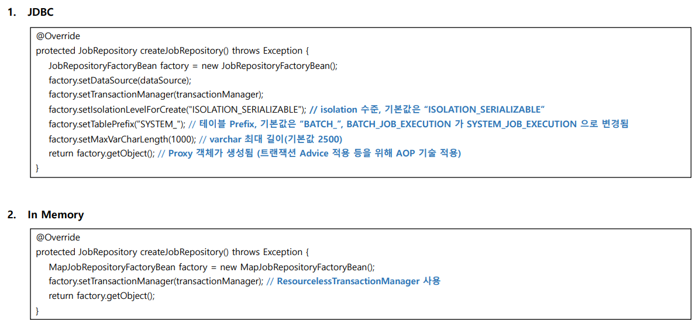

- extends BasicBatchConfigurer를 해줘여한다. 


## JobLauncher

#### **기본 개념**

- 배치 Job을 실행시키는 역할
- 인자 (Job, JobParameters) => return Execution
- 스프링 부트 배치가 구동되면 JobLauncher 빈이 자동 생성 된다.
  - DI를 받으면 된다. (직접 구동하고 싶을 경우)
- Job실행
  - JobLauncher.run(Job, JobParamters)
  - 스프링 부트 배치에서는 JobLauncherApplicationRunner가 자동적으로 JobLauncher를 실행
  - **동기적 실행**
    - taskExecutor를 SyncTaskExecutor로 사용할 경우 (default)
    - **스케줄러에 의한 배치처리에 적합** 
      => 배치처리시간이 길어도 상관없는 경우
  - **비 동기적 실행**
    - taskExecutor가 SimpleAsyncTaskExecutor로 설정할 경우
    - JobExecution을 획득한 후 Client에게 바로 JobExecution을 반환하고 배치처리를 완료한다.
    - HTTP 요청에 의해 배치처리에 적합함, 배치처리 시간이 길 경우 응답잉 늦어지지 않도록 함

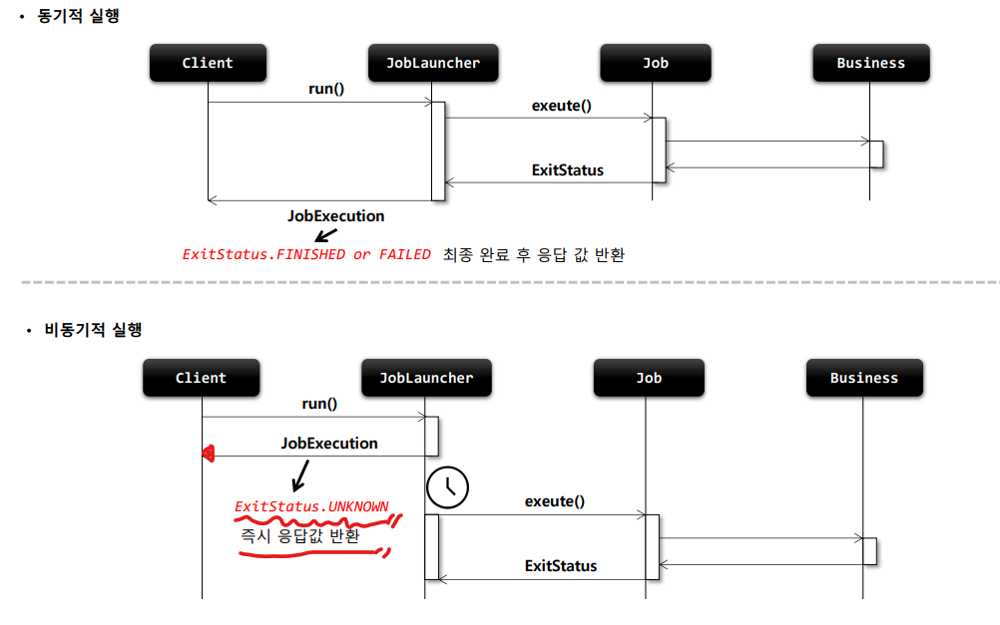


