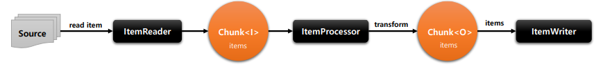
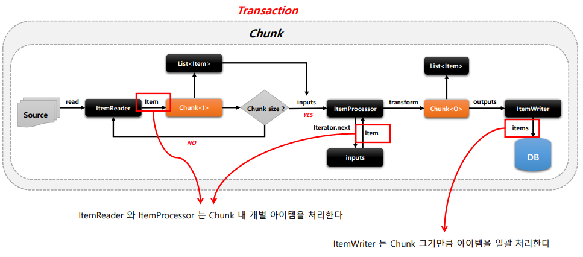
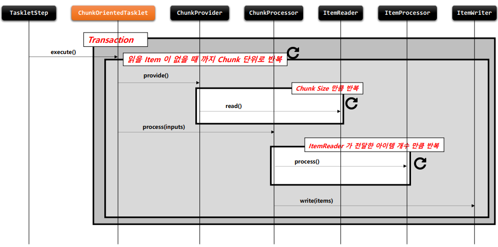
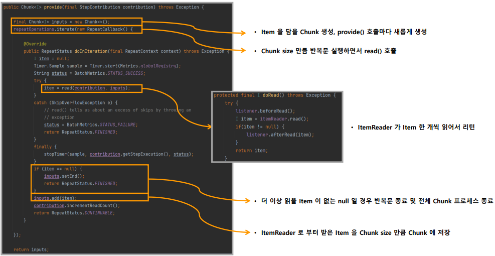
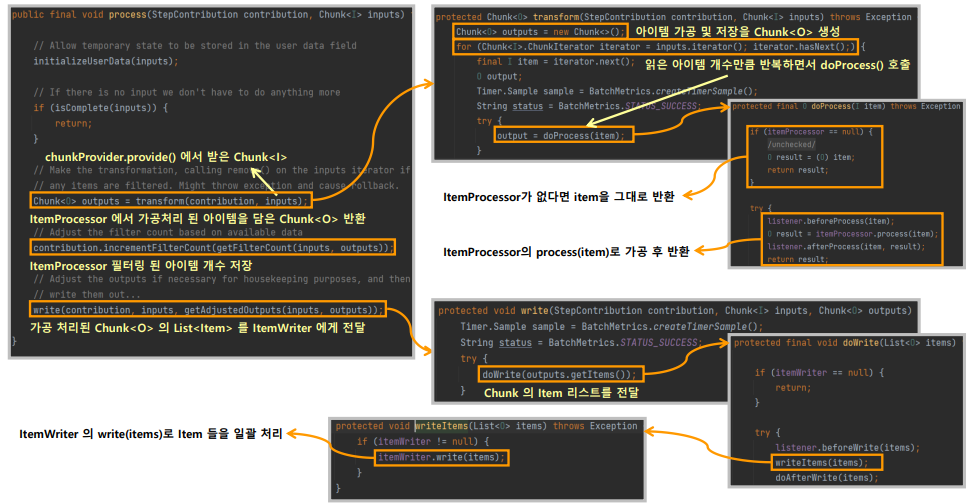
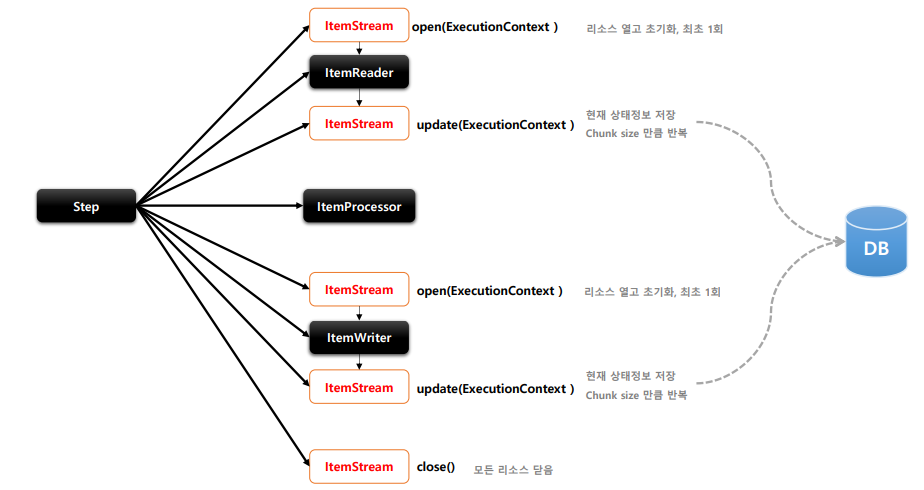
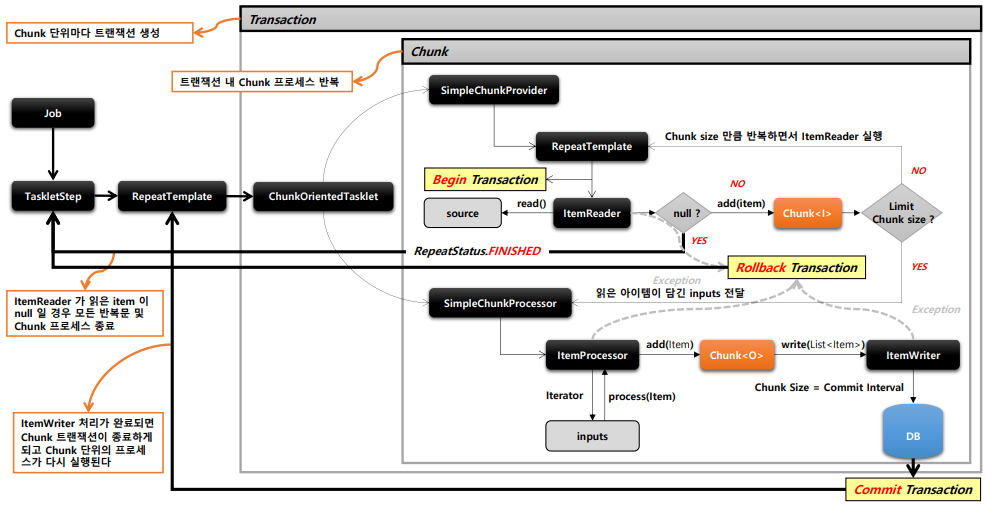
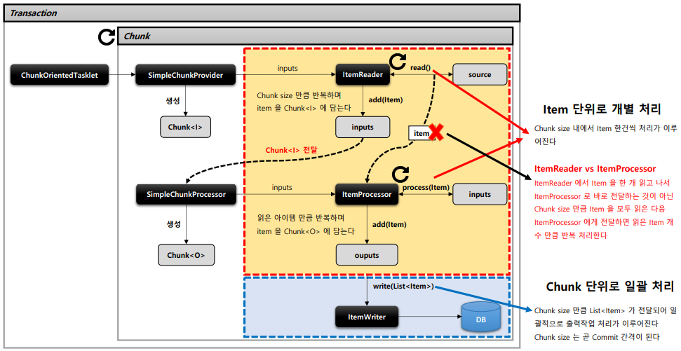

# Chunk Process

> - Chunk
> - ChunkOrientedTasklet
> - ItemReader/ ItemWriter/ ItemProcessor
> - ItemStream
> - 아키택처

## 01_Chunk

#### **기본 개념**

- 한번에 하나씩 입력 받음
- chunk 단위의 덩어리로 만든 후 chunk 단위로 트랜잭션 처리
  - 즉 Chunk 단위로 Commit, Rollback이 일어난다.

#### **Chunk<I>  vs Chunk<O>**

- Chunk<I>
  - ItemReader로  읽은 하나의 아이템을 Chunk 만큼 반복 저장
- Chunk<O>
  - ItemProcessor에서 적절하게 가공 => ItemWriter

#### **아키택처**

## 02_ChunkOrientedTasklet

#### **기본 개념**

- TaskletStep에 의해서 반복적으로 실행 => 매번 새로운 트랜잭션이 생성
- ChunkProvider
  - ItemReader를 핸들링
- ChunkProcessor
  - ItemProcessor, ItemWriter를 핸들링

### **ChunkProvider **

#### **기본 개념**

- Chunk<I> 를 만들고 내부적으로 반복문을 사용 => ItemReader.read()를 계속 호출 => item을 Chunk에 쌓음
- ChunkProvider가 호출될 때마다 새로운 Chunk 생성
- 반복문 종료 시점
  - Chunk size 만큼 item을 읽으면 종료 => ChunkProcessor로 넘어감
  - ItemReader가 읽은 item이 null => 반복문 종료 + Step 반복문 종료
- 구현체
  - SimpleChunkProvider
  - FaultTolerantChunkProvider

### ChunkProcessor

#### **기본 개념**

- Chunk<I> 의 item을 한건씩 처리한 후 Chunk<O>에 저장
- ChunkProcessor가 호출될 때마다 새로운 Chunk 생성
- ItemProcessor는 선택사항
  - 객체가 존재하지 않으면 ItemReader에서 읽은 Item 그대로가 Chunk<O>에 저장
- ItemProcessor 완료 => Chunk<O>에 있는 List<Item> => ItemWriter로 이동
  - transaction 종료, Step 반복문에서 새로운 ChunkOrientedTasklet 실행
- 구현체
  - SimpleChunkProcessor
  - FaultTolerantChunkProcessor

## 03_ItemReader/ ItemWriter/ ItemProcessor

### ItemReader

#### **기본개념**

- Custom Reader : 구현 시 멀티 스레드 환경에서 스레드에 안전하게 구현할 필요가 있음
- ChunkOrientedTaklet 에 필수요소

- T read()
  - 입력 데이터 읽고 다음 데이터 이동
  - 아이템 = 파일 한줄 or DB의 1 개 row 등이 될 수 있음
  - 더 처리할 Item이 없으면 예외 발생 x => 다음 단계로 넘어감 

### ItemWriter

#### **기본개념**

- Chunk 단위로 데이터를 받아 일괄 출력
- 아이템 하나가 아닌 리스트를 전달 받음
- 필수요소

### ItemProcessor

- 데이터 가공, 변형, 필터링
- 반드시 필요한 것은 아님 = Option

## 04_ItemStream

#### **기본 개념**

- ItemReader와 ItemWriter 처리 중 상태를 저장
  - 오류 발생하면 실패한 곳에서 재시작하도록 지원
- open, close 하며 입출력 장치 초기화 등의 작업을 해야하는 경우
- ExecutionContext를 매개변수로 받아서 상태 정보를 업데이트한다
- Itemreader 및 ItemWriter는 ItemStream을 구현해야함

- 구조
  - **open**
    - read, write 메서드 호출전에 커넥션이 필요한 리소스에 접근하도록 초기화 작업
  - **update**
    - 현재까지 진행된 모든 상태 저장
    - 100개 데이터 , chunk size = 10이면 10번 update진행
  - **close**
    - 열려 있는 모든 리소스를 안전하게 해제하고 닫음
    - 예외가 발생해서 Job이 실패
      - Resource를 해제하는 작업을 진행하면된다.

- 

## 05_아키택처

