# MultiThread


## 기본 개념

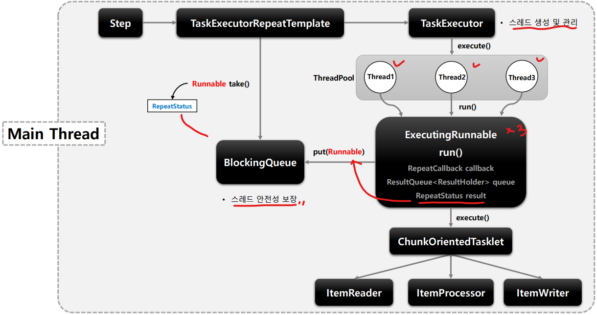

#### **Thread Models**

- 성능 향상과 대규모 데이터 작업을 위한 비동기 처리 및 Scadle out 기능을 제공한다.
- Local과 Remote 처리를 지원한다.

- **AsyncItemProcessor / AsyncItemWriter**
  - ItemProcessor에게 별도의 스레드가 할당 되는 것
- **Multi-threaded Step**
  - Step 내 chunk 구조인 ItemReader, ItemProcessor, ItemWriter 마다 여러 스레드가 할당되는 것
- **Remote Chunking**
  - 분산환경처럼 step 처리가 여러 프로세스로 분할되어 외부의 다른 서버로 전송되어 처리
- **Rarallel Steps**
  - Step 마다 스레드가 할당되어 여러개의 Step을 병렬로 실행하는 방법
- **Partitioning**
  - Master/Slave방식으로서 Master가 데이터를 파티셔닝 한 다음 각 파티션에게 스레드를 할당하여 Slave가 처리하는 방식


## AsyncItemProcessor / AsyncItemWriter

- Step 안에서 ItemProcessor가 비동기적으로 동작
- AsyncItemProcessor와 AsyncItemWriter가 함께 구성
- AsyncItemProcessor로 부터 AsyncItemWriter 가 받는 최종 결과값은 List<Future<T>> 타입 비동기 실행이 완료될때까지 대기
- spring-batch-integration 의존성 필요

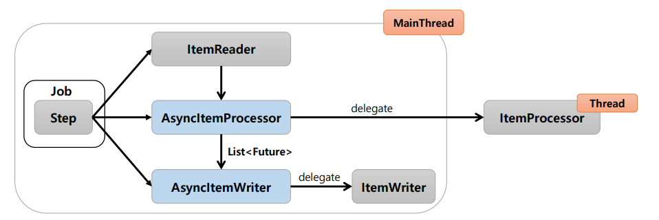

- AsyncItem은 item을 직접처리하지 않고 delegate한다.
  - 따라서 item을 직접 처리하는 역할은 ItemProcessor, ItemWriter가 진행한다.

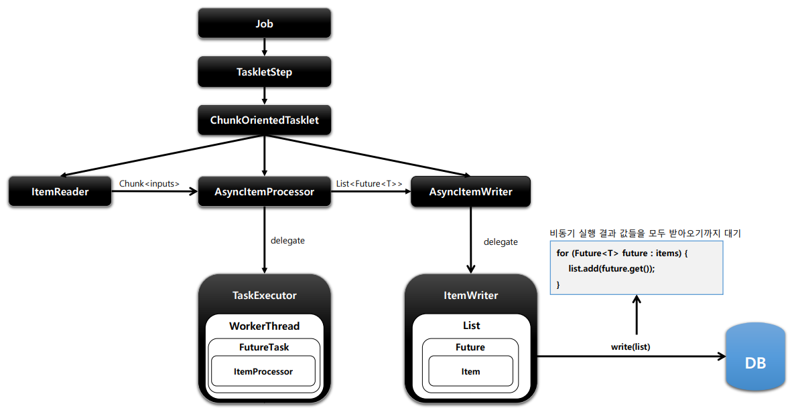


```java
public Step step() throws Exception{
    return stepBuilderFactory.get("step")
        .chunk(100)
        .reader(pagingItemReader())
        .processor(asyncItemProcessor()) // thread pool 개수만큼 스레드 생성/ 결과 = Future저장
        .writer(asyncItemWriter()) // 결과값 모두 완료까지 대기
        .build();    
}
```


## Multi-threaded Step

- Step 내에서 멀티 스레드로 Chunk 기반 처리가 이뤄진다.
- TaskExecutorRepeatTemplate이 반복자로 사용, 설정한 개수만큼의 스레드 생성

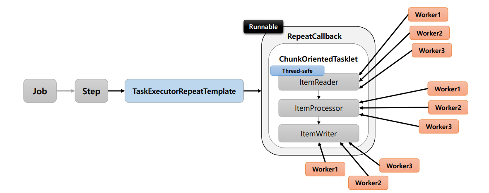

- TaskExecutorRepeatTamplate => Runnable을 실행
- ItemReader 또한 각각의 Thread로 읽어오게 된다. => Thread-safe가 보장되어야한다.
- Thread들간에 데이터는 공유되지 않는다.
  - 즉 각각의 스레드의 Data가 그대로 전달되게 된다.

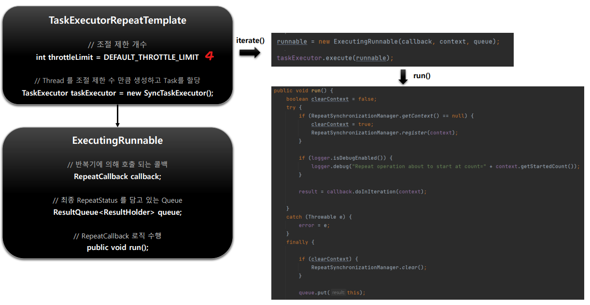


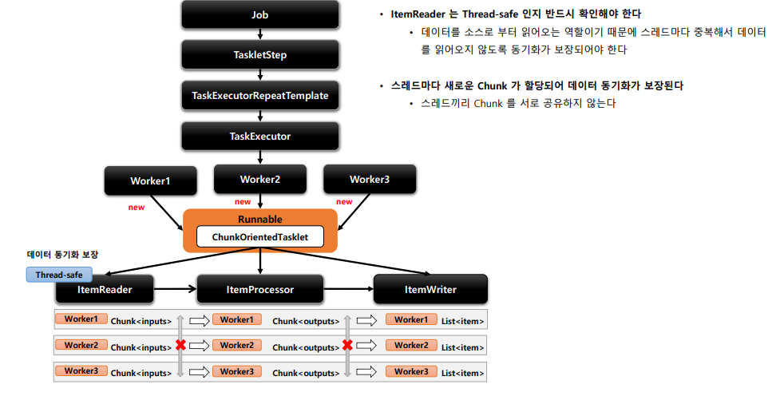

- ItemReader는 DB로 부터 Data를 읽어올 때 Thread-safe하지 않으면 중복된 값을 읽어올 수 있다.
- Thread마다 새로운 Chunk가 할당되어 데이터 동기화가 보장


## Parallel Steps

- SplitState 를 사용해서 여러 개의 Flow 들을 병렬적으로 실행하는 구조
- 실행이 다 완료된 이후 FlowExecutionStatus 결과들을 취합해서 다음 단계 결정
  - 최종 결과값을 FlowExecutionAggregator에게 결과를 준다.

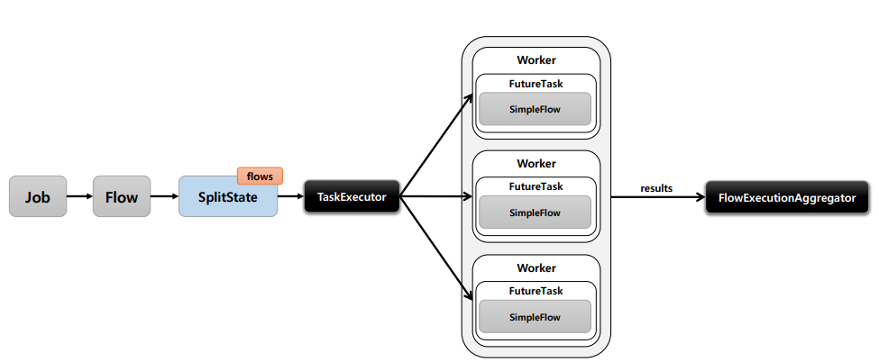


## Partitioning

- MasterStep이 SlaveStep을 실행
- SlaveStep은 각 스레드에 의해 독립적으로 실행
  - SlaveStep은 독립적인 StepExecution 파라미터 환경을 구성
  - SlaveStep은 ItemReader / ItemProcessor / ItemWriter등을 가지고 동작하며 작업을 독립적으로 병렬 처리
  - MasterStep = ParitionStep 
  - SalveStep = TaskletStep, FlowStep 등이 올 수 있다.
  - slaveStep을 복제해서 사용한다.


- Partition 기능을 수행하는 Step
- StepExecution의 정보를 StepExecutionAggregator가 모아서 최종 집계를 진행하게 된다.


- PartitionStep에 의해 호출된다.
- 스레드를 생성해서 WorkStep을 병렬로 실행하는 역할을 한다.
- StepExecution생성은 StepExecutionSPplitter와 Partitioner에게 위임한다. 
- WorkStep을 병렬로 실행하고 StepExecution이 최종 결과를 담는다. 이후 ParitionStep에게 반환하는 역할을 한다


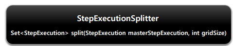

- StepExecution을 생성하는 역할 (grid size만큼 = thread 개수)
- ExecutionContext를 얻어서 StepExecution에 맵핑 
  - Partitioner에서 ExecutionContext를 얻음


- StepExecutionContext를 생성하는 역할 (grid size만큼 = thread 개수)
- ExecutionContext에 저장된 정보는 스레드 마다 독립적으로 참조 및 활용가능
- girdSize 만큼 Map에 (id, res) 값을 담아서 반환하는 것이 Paritioner의 역할이다.


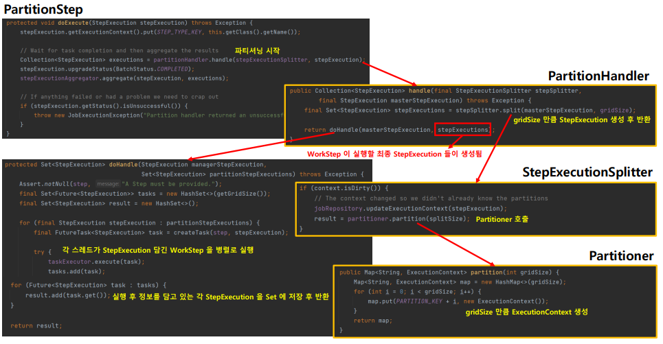

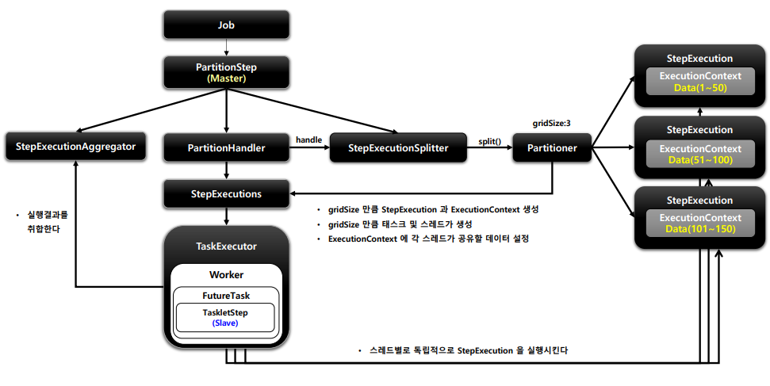

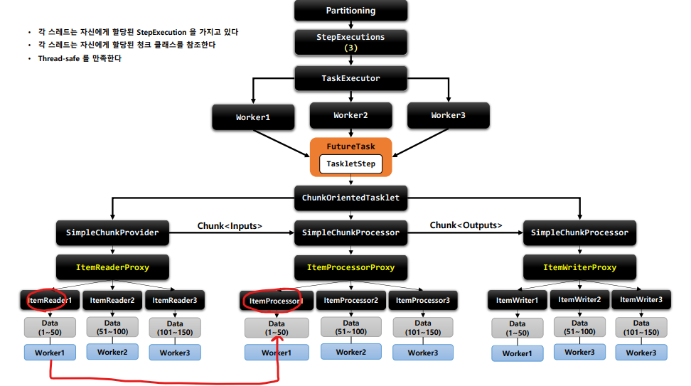

- Proxy로 미리 빈을 만들어 놓고 객체를 호출할 때 반환하게 된다.
