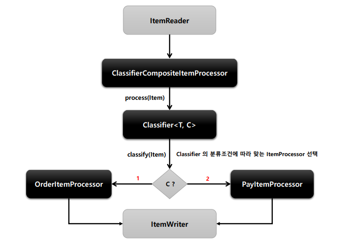

# ItemProcessor

> - CompositeItemProcessor
> - ClssifierComporitItemProcessor

## CompositeItemProcessor

#### **개념**

- ItemProcessor들을 Chaining하고 위임하면서 각 ItemProcessor를 실행시킨다.
- 이전 ItemProcessor 반환 값은 다음 ItemProcessor 값으로 연결

```java
// API
public ItemProcessor<? super String, String> itemProcessor(){
    List itemProcessor = new ArrayList();
    itemProcessor.add(new CustomItemProcessor()); // 로직 1
    itemProcessor.add(new CustomItemProcessor2()); // 로직 2
    
    return new CompositeItemProcessorBuilder<>()
        .delegates(itemProcessor) // chaining할 객체 설정
        .build();
}

```


## ClassifierCompotieItemProcessor 

- Classifier로 라우팅 패턴을 구현해서 ItemProcessor 구현체 중 하나를 호출하는 역할




```java
// Step 내용중 일부
...
.process(customItemProcessor())
.writer()
.build();

@Bean
public ItemProcessor<? super ProcessorInfo, ? extends ProcessorInfo> customItemProcessor(){
    
    // processor 객체 생성
    ClassifierCompositeItemProcessor<ProcessorInfo, ProcessorInfo> processor 
        = new ClassifierCompositeItemProcessor<>();
    
    // classifier 객체 생성
	ProcessorClassifier<ProcessorInfo, ItemProcessor<?,? extends ProcessorINfo>> classifier
        = new ProcessorClassifier<>();
    
	Map<Integer, ItemProcessor<ProcessorInfo, ProcessorInfo>> processorMap = new HashMap<>();
    
    // (id, 객체) -> id가 1이면 CustomItemProcessor1이 실행된다.
    processorMap.put(1, new CustomItemProcessor1());
    processorMap.put(2, new CustomItemProcessor2());
    processorMap.put(3, new CustomItemProcessor3());
	
    // set
   	classifier.setProcessorMap(processorMap);
    processor.setClassifier(classifier);
	
    return processor;
}

// 
public class ProcessorClassifier<C, T> implements Classifier<C, T> {
    
    // customItemProcessor에 있는 Map과 동일 (id, 객체)
    private Map<Integer, ItemProcessor<ProcessorInfo, ProcessorInfo>> processorMap 
        = new HashMap<>();
    
    // ProcessorInfo의 id값을 processorMap에서 넣어서 return 값을 뽑는다.
    // Map에 value값은 new CustomItemProcessor1,2,3 값
    @Override
    public T classify(C classifiable){
        return (T)processorMap.get(((ProcessorInfo)classifiable).getId());
    }
	
    public void setProcessorMap(
        Map<Integer, ItemProcessor<ProcessorInfo, ProcessorINfo>> processorMap){
        this.processorMap = processorMap;
    }
}

//123은 객체가 1, 2, 3 각각이라는 뜻 귀찮아서 하나로 합침
public class CustomItemProcessor123 implements ItemProcessor<ProcessorInfo, ProcessorInfo>{
    
    @Override
    public ProcessorInfo process(ProcessorInfo item) throws Exception{
	    sout("CustomItemProcessor123");        
        return item;
    }    
}
```


