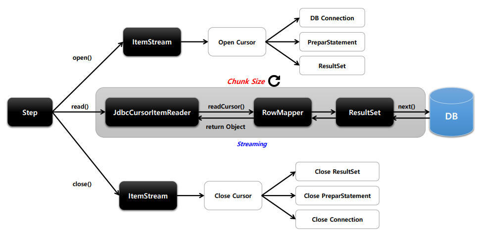
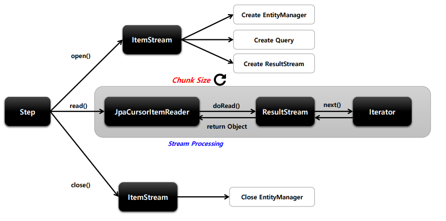
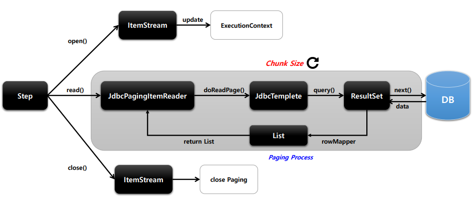
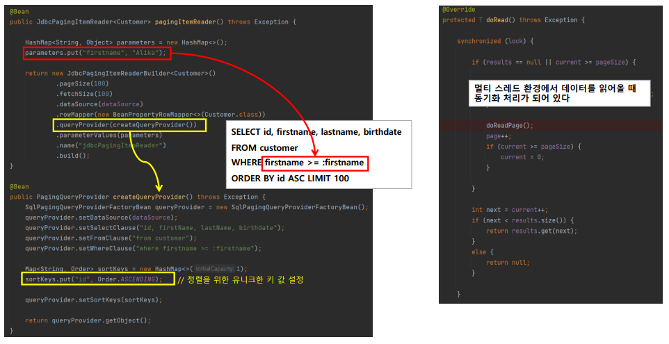

# ItemReader

## Cursor Based & Paging Based

#### **1. Cursor Based**

- JDBC  ResultSet의 기본 매커니즘 이용
- Streaming 방식
- ResultSet 이 open 될떄마다 next()메소드가 호출 DB 의 데이터가 반환 객체와 Mapping 됨
- DB Connection 연결 => 배치 처리 완료될따까지 데이터 읽어온다. 
  => DB와 Socket Timeout을 충분히 큰 값으로 설정 필요
- 모든 결과 메모리 할당 => 메모리 사용량이 많아진다.
- Connection 연결 유지시간 + 메모리 공간 => 적합할 수 있음


#### **2. Paging Based**

- Page Size 만큼 한번에 메모리로 가져옴
- Offset, Limit 사용
- 메모리 사용량이 적음


## JdbsCursorItemReader



```java
fetchSize는 ChunkSize와 동일하게 해준다.

@Bean
public JdbcCursorItemReader<Customer> cursorItemReader(){
    return new JdbcCursorItemReaderBuilder()
        	.name("JdbcCursorItemReader")
        	.fetchSize(10)
        	.sql(sql)
        	.beanRowMapper(Customer.class)
        	.queryArgument("jay", Type.VARCHAR)
        	.dataSource(dataSource)
        	.build();
}
```


## JpaCursorItemReader



```java
@Bean
public JpaCursorItemReader<Customr> cursorItemReader(){
	HasMap<String, Object> parameters = new HashMap();
    parameters.put("firstname", "jay");
    
    return new JpaCursorItemReaderBuilder()
        .name("JpaCursorItemReader")
        .queryString(sql)
        .entityManagerFactory(entityManagerFactory)
        .paramterValues(parameters)
        .build();
}
```


## JdbcPagignItemReader

- Paging 기본
- 조회할 때 마다 새로운 쿼리 실행
- 페이지마다 새로운 쿼리를 실행하기 때문에 결과 데이터의 순서가 보장되어야함
  - order by 구문을 작성해야한다.
- 멀티스레드 가능
-  PagingQueryProvider
  - ItemReader에게 제공
  - DB마다 페이징 정략이 달라서 필요






## ItemReaderAdapter


