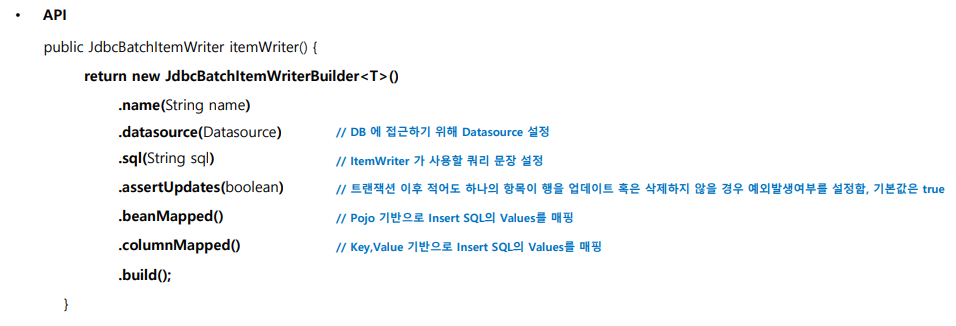
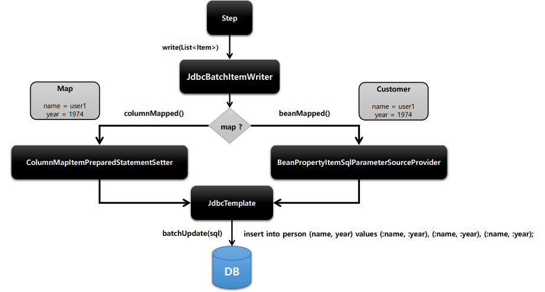
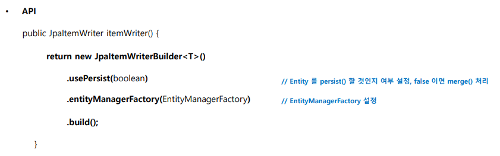
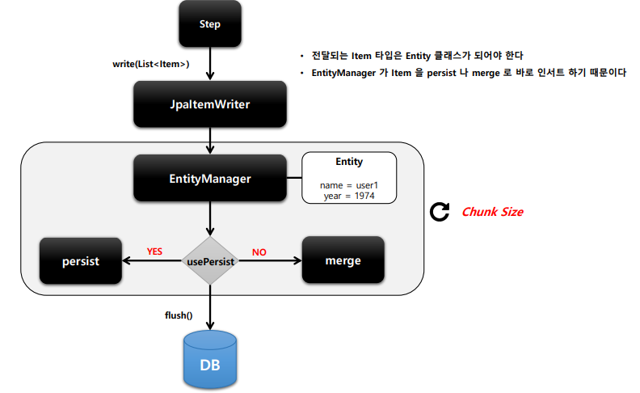

# ItemWriter

## JdbcBatchItemWriter

- bulk 방식으로 insert, update, delete 방식으로 처리한다.

## JpaItemWrieter

- ItemReader나 ItemProcessor로 부터 아이템을 전달 받을 떄는 Entity class 타입으로 받아야한다.

## ItemWriterAdapter

- 한번에 일괄처리를하는것이 아닌 한건씩 처리하게 된다.

