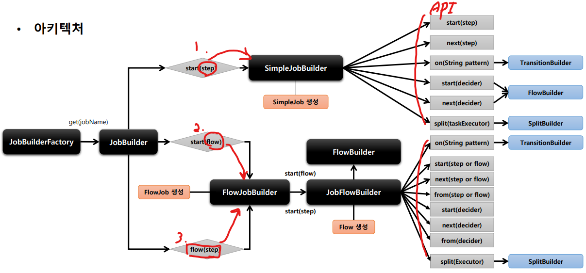
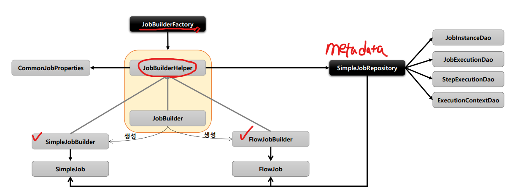

# 03_Job

> - 배치 초기화 설정
> - Job and Step
> - Job and Flow
> - @JobScope / @StepScope

## 01_배치 초기화 설정

#### **1. JobLauncherApplicationRunner**

- Spring Batch 작업을 시작하는 ApplicationRunner로서 BatchAutoConfiguration에서 생성된다.

- ApplicationRunner의 구현체로 어플리케이션이 정상적으로 구동되자마자 실행

- **빈에 등록된 모든 Job을 실행**

  - 빈에 등록되지 않으면 안시키며

  - **구동시키고 싶은 Job만 골라서 실행시킬 수 있음**

    

#### **2. BatchPrperties**

- Job이름, 스키마 초기화 설정, 테이블 Prefix등의 값을 설정할 수 있음

#### **3.Job 실행 옵션**

- 지정한 Batch Job만 실행하도록 할 수 있다.
- spring.batch.job.name: ${job.name:NONE}
- 어플리케션 실행시 Program arguments로 job이름을 입력한다.
  - -- job.name=helloJob,simpleJob (여러개 실행 할 수 있음)

## 02_Job and Step

> - JobBuilderFactory & JobBuilder
> - SimpleJob
> - StepBuilderFactory & StepBuilder
> - TaskletStep
> - JobStep

### 2-1) **JobBuilderFactory & JobBuilder**

1. 스프링 배치 
   => Job과 Step을 쉽게 생성 및 설정할 수 있도록 util 성격의 빌더 클래스들을 제공함
2. JobBuilderFactory
   - JobBuilder를 생성하는 책토리 클래스로서 get(String name) 메서드 제공
   - jobBuilderFactory.get("jobName")
     - jobName 은 스프링 배치가 Job을 실행시킬 때 참조하는 Job의 이름 
       => DB에도 똑같이 저장됨
3. JobBuilder
   - Job을 구성하는 설정 조건에 따라 두개의 하의 빌터 클래스 생성
   - SimpleJobBuilder
     - SimpleJob을 생성하는 Builder 클래스
     - Job 실행과 관련된 API 제공
   - FlowJobBuilder
     - FlowJob을 생성하는 Builder 
     - Flow실행과 관련된 여러 설정 API를 제공

- Job Configuration을 구성할 때 필요
- JobRepository는 빌더 클래스를 통해 Job객체에 전달되어 메타데이터를 기록

### 2-2) **SimpleJob**

#### **기본 개념**

- SimpleJob은 Step을 실행시키는 Job 구현체로 SimpleJobBuilder에 의해 생성
- Step을 순차적으로 실행

#### **API 소개**

- **.start(Step)**

  - 처음 실행 할 Step 설정
  - 최초 한번 설정
  - **SimpleJobBuilder 반환**

- **.next(Step)**

  - 다음 실행할 Step 설정
  - 횟수 제한 없음
  - 모든 next의 step이 종료되면 Job 종료

- **.incrementer(JobParameterIncrementer)**

  - JobParameter의 값을 자동으로 증가해주는 JobParameterIncrementer 설정
  - Job을 시작할 때마다 Parameter의 값이 변하기 때문에 Job을 계속 재시작하게끔 만들 수 있다.

- **.preventRestart(true)**

  - Job의 재시작 가능 여부 설정, (default : true)
  - Job이 어떠한 경우에도 재시작을 막아야할때 설정하는 것

- **.validator(JobParameterValidator)**

  - JobParameter를 실행하기 전에 올바른 구성이 되었는지 검증하는 JobParameterValidator 설정

- **.listener(JobExecutionListener)**

  - Job 라이프 사이클의 특정 시점에 콜백 제공받도록 JobExecutionListener 설정

    

- .build()

  - SimpleJob 생성

### **validator**

#### **기본 개념**

- Job 실행에 꼭 필요한 파라미터를 검증하는 용도
- 

### 2-3) **StepBuilderFactory** & StepBuilder

### 2-4) **TaskletStep**

### 2-5) **JobStep**

## Job and Flow

## @JobScope / @StepScope
