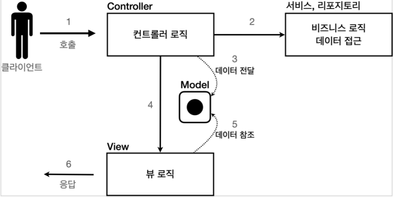

# 03_MVCpattern


## JSP

```jsp
<%@ page contentType="text/html;charset=UTF-8" language="java" %>
<%@ page import="hello.servlet.domain.member.Member" %>
<%@ page import="java.util.List" %>
<%@ page import="hello.servlet.domain.member.MemberRepository" %>
<%
    MemberRepository memberRepository = MemberRepository.getInstance();
    List<Member> members = memberRepository.findAll();
%>
<html>
    <head>
        <meta charset="UTF-8">
        <title>Title</title>
    </head>
    <body>
        <a href="/index.html">메인</a>
        <table>
            <thead>
                <th>id</th>
                <th>username</th>
                <th>age</th>
            </thead>
            <tbody>
                <%
                for (Member member : members) {
                    out.write("    <tr>");
                    out.write("        <td>" + member.getId() + "</td>");
                    out.write("        <td>" + member.getUsername() + "</td>");
                    out.write("        <td>" + member.getAge() + "</td>");
                    out.write("    </tr>");
                }
                %>
            </tbody>
        </table>

    </body>
</html>	
```

- JSP를 사용하기 위해 선언해야할 것

  - <%@ page contentType="text/html;charset=UTF-8" language="java" %>

    

- JSP import 방법

  - <%@ page import="hello.servlet.domain.member.Member" %>

  

- 선언 후 Java코드

  - 로직

  

- HTML작성

- url작성할 때 .jsp까지 적어줘야 동작하게 된다.

- **특징**

  - HTML을 중심으로 작성하게 된다.

  

- **한계**

  - HTML과 자바코드가 섞여있다.
  - 다양한 코드가 JSP에 노출되어 있다.
  - 유지보수가 정말 힘들어진다.


## MVC 패턴

### MVC 패턴이 나온 이유

- JSP,서블릿이 **너무 많은 역할**을 하게된다.
- **변경의 라이프 사이클** => 변경주기가 다르면 분리해야 유지보수하기 좋다
- **기능특화** => 각각의 담당한 역할이 다름


### MVC 패턴

- **Controller**

  - HTTP요청을 받아서 검증 => 비즈니스 로직 실행

  - 뷰에 전달할 결과 데이터를 조회해서 모델에 담는다

    

- **Model**

  - 뷰에 출력할 데이터를 담아둔다.

  - 화면을 렌더링하는 일에 집중한다.

    

- **View**

  - HTML을 생성하는 부분을 집중한다.




### MVC패턴 적용

```java
@WebServlet(name = "mvcMemberFormServlet", 
            urlPatterns = "/servlet-mvc/members/new-form")
public class MvcMemberFormServlet extends HttpServlet {

    @Override
    protected void service(HttpServletRequest request, HttpServletResponse 
							response) throws ServletException, IOException {

        String viewPath = "/WEB-INF/views/new-form.jsp";
        
        // Controller -> View이동
        RequestDispatcher dispatcher = request.getRequestDispatcher(viewPath); 
        
        // 서블릿에서 JSP호출
        dispatcher.forward(request, response); 
    }
}
```

- dispatcher.forward() : 

  - 다른 서블릿이나 JSP로 이동할 수 있는 기능이다. 서버 내부에서 다시 호출이 발생

    

- /WEB-INF

  -  이 경로안에 JSP가 있으면 외부에서 직접 JSP를 호출할 수 없다
  - 항상 컨트롤러를 통해서 JSP호출

- redirect vs forward
  - redirect : 실제 클라이언트(웹 브라우저)에 응답이 나갔다가, 클라이언트가 redirect 경로로 다시 요청 
  - forward : 는 서버 내부에서 일어나는 호출이기 때문에 클라이언트가 전혀 인지하지 못한다.


- controller
  - request.setAttribute를 이용해서 model을 사용한다.

```java
@Override
protected void service(HttpServletRequest request, HttpServletResponse response) throws ServletException, IOException {

    List<Member> members = memberRepository.findAll();
    request.setAttribute("members", members); // 이렇게 model에 값을 넣어둔다. 

    String viewPath = "/WEB-INF/views/members.jsp";
    RequestDispatcher dispatcher = request.getRequestDispatcher(viewPath);
    dispatcher.forward(request, response);
}
```


- for문 사용해서 뿌리기

```jsp
<c:forEach var="item" items="${members}">
    <tr>
        <td>${item.id}</td>
        <td>${item.username}</td>
        <td>${item.age}</td>
    </tr>
</c:forEach>
```


### MVC패턴의 한계

- MVC컨트롤러의 단점
  - **forward중복** => 똑같은 코드가 계속 반복된다.
  - **ViewPath중복**
    - /WEB-INF/views/
    - .jsp
    - jsp말고 다른걸 사용하게 되는 순간 모든 코드를 바꿔야한다.
  - **공통처리가 어려움**
    - 기능이 복잡해질수록 컨트롤러에서 공통으로 처리해야하는 부분이 점점 더 많이 증가할 것 => 공통처리해도 계속 호출해줘야함

**프론트 컨틀롤러 패턴**

- 문을 통하면 항상 패턴화된 코드들을 실행해주면 된다. 
- 문제를 깔끔하게 해결가능
- 스프링 MVC의 핵심도 바로 이 프론트 컨트롤러에 있다


