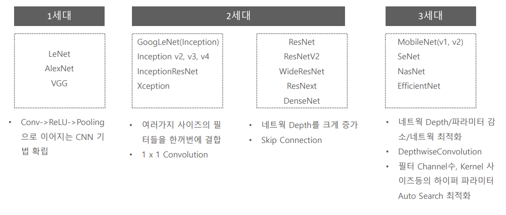
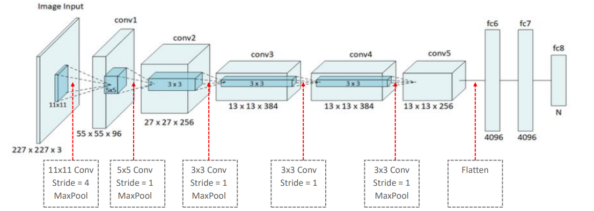

# AlexNet

##### History

특징 ==> 지금은 기본으로 사용하고 있음

- Activation함수로 ReLU함수를 첫 사용
-  Local Response Normalization(LRN) 사용
  - 우리는 batch Normalization을 사용할 것
- Data Augmentation적용(좌우 반전, Crop, PCA  변환 등)

- 지금은 사용하지 않는 11x11 Conv를 사용한다. stride = 4
- 논문에는 224x224로 나와있다 하지만 후대 사람들이 13x13이 나오려면 227x227이 맞다고 해서 바뀜
- 11x11, 5x5 사이즈의 큰 사이즈의 Kernel 적용. 이후 3x3 Kernel을 3번 이어서 적용
- 깊이가 깊지는 않지만 파라미터 수가 크게 된다.
- 많은 weight parameter 갯수로 인하여 컴퓨팅 연산량이 크게 증가 함. 이를 극복하기 위하여 병렬 GPU를 활용할 수 있도록 CNN  모델을 병렬화

