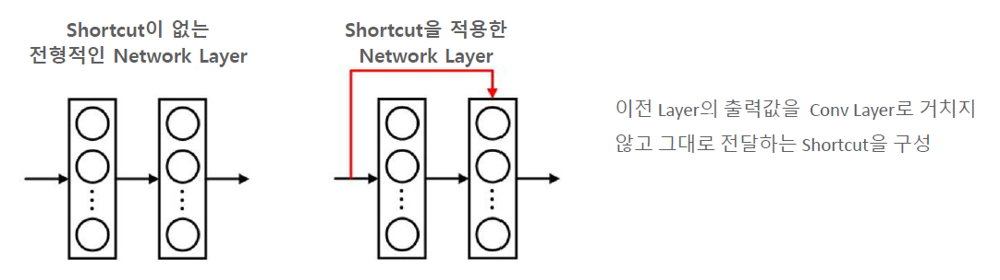
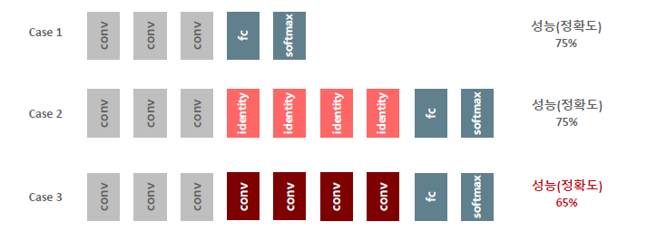
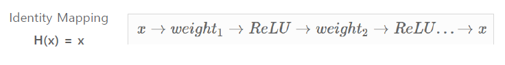
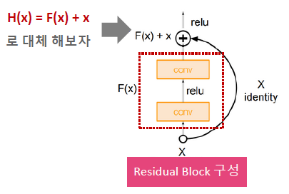
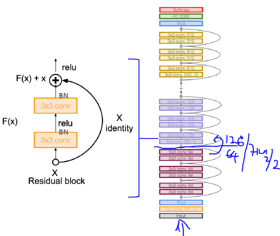
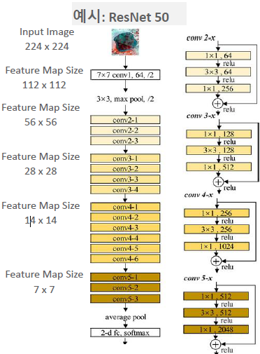

# ResNet

필요 개념

- Batch Normalization
- 

layer : 152

VGG이후 network 깊이가 깊어질 수록 오히려 성능이 저하되는 문제점이 있었다

- Vanishing Gradient문제
- 제대호 최적 loss감소가 되지 않음

주요특징

- Short cut
- Identity block

기본 아이디어

- 도대체 왜? conv layer를 늘리면 정확도가 낮아지는 거지??
  - 그럼 identity layer를 넣어보자 !! 그럼 정확도가 같아질 것이기 때문에

- 하지만 H(x)= x를 만들기가 쉽지 않음
  - 이유 : ReLU가 **비선형**이기 때문에 그에 알맞는 weight값을 그때그때 찾아주기 힘들기 때문

- 따라서 F(x)를 추가 하여 F(x)를 학습 시키게 된다.
  - 이것을 0으로 학습을 시켜 최종적인 값을 H(x)=x를 만족시켜준다.
  - 이렇게 학습시키는 것이 훨씬 쉽다
    - ReLU를 0으로 만드는 것이 간단하고
    - weight를 0으로 설정해줄 것이기 때문

- **F(x) = H(x)-x**를 최소화 할 수 이도록 구성
- Residual Learning :  F(x) 함수(Residual) 를 최소화 하는 학습
- **핵심**
  - 0으로 학습하면서 기존 CNN과 유사하게 입력값의 비선형적인 특성을 학습
  - 0으로 최적 수렴하는 것이 깊은 네트워크에서 최소 Loss최적화를 더 빠르게 수행

Identiry Block 구성

### ResNet 아키텍처

Batch Normalization에 대한 개념 확인해야 함

- Block 구성
  - 3x3 Conv => BN => ReLU => 3x3Conv => BN => + x => ReRLU

- Residual Block 내에 CNN커널
  - 1x1을 적용하지 않을 경우
    - 동일한 커널 크기
    - 동일한 Depth
  - ResNet50 기준 3,4 또는 6회 이후
    - 커널 크기 절반
    - Depth는 2배로 증가

깊은 Network(50/101/152) 에서 Block 구조

- 1x1 conv을 통한 Bottleneck layer를 이용하여 Parameter갯수를 효과적으로 줄임
  - 1x1 conv를 사용하는 이유
    - 차원 축소를 하기 위해서
    - 연산량이 감소
    - 파라미터 갯수 감소

FLOPs

- 1초에 연산량이 얼마만큼 되는지
- 연산을 많이하게 되면 학습시간이 오래하게 된다.
- 34layer에서 50으로 이동할때 FLOPs가 별 차이가 없다
  - 이유 : 1x1conv를 사용했기 때문에

