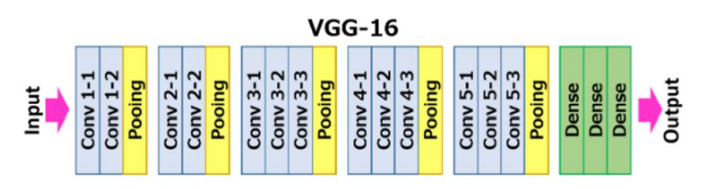
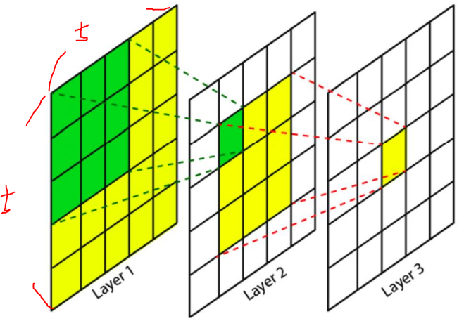
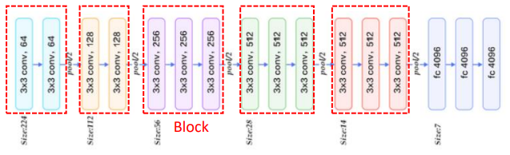

# VGGNet

- 네트워크 깊이와 모델 성능 영향에 집중
- Conv 사이즈 3x3으로 고정
  - 커널 사이즈가 크면 이미지 사이즈 축소가 급격하게 이루어짐
  - 더 깊은 층을 만들기 어려움
  - 파라미터 개수와 연산량도 더 많이 필요
- feature extract부분에서 conv가 많이 될 수록 성능이 좋아진다라는 의견이 많음

##### AlexNet이 남긴 화두

- 네트워크가 깊을수록 성능이 좋아진다는 것음 확인함
- 그럼 hyper parameter를 어떻게 설정할지가 관건
- kernel 크기를 키웠더니 깊은 네트워크를 만들수 없었음

#### VGG의 장점

- 단일화된 kenel 크기,padding, strides 값으로 단순한 네트워크 구성 ==> AlexNet보다 좋은 성능
- 11x11과 같은 큰 Receptive Field를 가진 kenel를 사용하지 않고도 3x3 kenel을 연속으로 적용
  - 즉 큰 Receptive Field를 가진 kenel하나 사용 X
  - 여러개의 3x3을 하는것이 더 뛰어난 Feature추출 효과를 냄
- 깊은 Network를 구성, but Parameter개수로 연산 성능 개선

#### kenel size와 Receptive Field

- 2개의 3x3 커널은 5x5 커널과 동일한 크기의 Feature map 생성
- Receptive Field: 입력(Image 또는 Feature map)에서 Feature를 만드는 영역의 기본 크기(Size)

- 연산 비교 (chennel = 1이라고 가정)
  - 5x5 : 파라미터 개수 25개 필요
  - 3x3 :  파라미터 개수 (3x3) * 2 = 18개 필요
  - 오히려 줄어들어음을 알 수 있음

- 따라서 파라미터 개수를 줄이고 ==> 채널수를 더 늘림 ==> 조금 더 풍부한 모델을 만듦

#### VGG 아키택처 구성

- block 내에서 동일한 크기, Filter 수
- 블럭이동이 있을때 
  - Filter(Chennel)은 2배로 늘림
  - feature map크기는 줄어듦 (224=>112)

