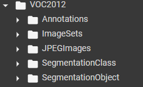
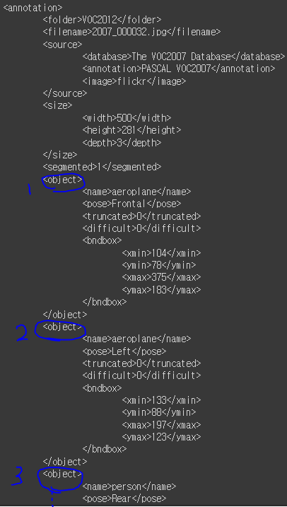

# 02_Dataset_of_OpenCV


## 1. 주요 데이터 셋 이해

##### 주요 데이터 셋

PASCAL VOC : 20개 카테고리 (XML Format) / 평이하다!

MS COCO : 80개 (json Format) / 이미지가 다양함 / 엄격

Google Open Images : 600개 (csv Format) / 


### PASCAL VOC

보통 PASCAL VOC 2012를 사용


##### Annotation이란?

- 박스를 쳐서 주는게 아님
- 그냥 좌표값,이름, 등등을 넣어서 준다는 뜻임


##### 구조





- 이렇게 여래개의 object들의 정보가 하나의 이미지 안에 담겨져 있다


### MS-coco Dataset소개

특징

- 80개 object category
- 300k 이미지, 1.5M object
- id가 빈경우가 있음

- bounding box
  - 우, 상, w, h 로 표시된다
  - float로 표현되어 있음  ==> 바꿔줘야함


- 왼쪽
  - 이미지 하나당 카테고리의 수
  - ex) 이미지 하나에 사람
- 오른쪽
  - 이미지 하나당 instance의 수
  - ex) 이미지 하나당 물체 수

PASCAL은 너무 쉽다! => 실제로 쓸 수없음 ==> MS COCO가 나옴


## Open CV개요

PIL : 처리 성능이 상대적으로 느림

Scikit Image : 사이파이 기반

OpenCV : C++기반이나 python도 지원


#### 주의할 점

##### imread()

- 이미지가 RGB형태가 아닌 ==> BGR형태로 로딩 ==> 즉 원본이미지와 다르게 나타난다

- 따라서 다시 변환시켜줘야함

  - ```python
    cv2.cvtColor( 이미지, cv2.COLOR_BGR2RGB) # bgr to rgb
    ```


##### imwrite()

- 다시 저장할땐 RGB로 바꿈

  

##### OpenCV Windows Frame interface

- OpenCV는 Windows 하고 바로 인터페이스를 한다

```python
cv2.imshow() # 윈도우 프레임에 보여줌

cv2.waitKey() # 키보드 입력이 있을 때까지 무한 대기
 
cv2.destroyAllWindows() # 화면의 윈도우 프레임 모두 종료

# 하지만 쥬피터에서 실습할때는 리눅스 x윈도우가 없기 때문에 쓸 수 없음
```


## open CV 영상처리 개요

- 비디오에 object detection을 어떻게 할지


##### VideoCapture

- `` cap = cv2.VideoCapture(video_input_path)``
- 영상 Frame 너비
  - cap.get(cv2.CAP_PROP_FRAME_WIDTH)
- 영상 Frame 너비
  - cap.get(cv2.CAP_PROP_FRAME_HEIGHT)
- 영상 FPS (1초에 프레임을 몇개??) ==> 많을수록 스무스하고 깨끗하게
  - cap.get(cv2.CAP_PROP_FPS)

```python
cv2.VideoWriter(output) # formatting


cap.read() #읽음
```


##### VideoWrite

- 까다로운 부분
  - VideoWrite는 wirte시 특정 포맷으로 동영상을 Encoding 할 수 있음


### Object Detection네트워크


##### 전체 흐름

- Region Proposal

  - Object가 있을만한 위치

  

- Feature Extractor Network

  - 이미지 classification

  - feature map 사이즈가 점점 작아질 수록 추상화 된다. ==> 핵심 특징을 가지게 된다. (1)

  - 주요 feature들을 뽑아내는 것 까지를 말한다

    

- Object Detection Network

  - class and bounding box를 제공하는 것
  - 별도의 네트워크로 되어 있음
  - Bounding box regression에 대해서 어떻게 할 것인지?
  - 스케일을 어떻게 맞출 것인지? 등등


(1) layer가 깊어질수록

When stacked on top of each other, convolutional layers can detect a hierarchy of visual patterns. For instance, the lower layers will produce feature maps for vertical and horizontal edges, corners, and other simple patterns. The next layers can detect more complex patterns such as grids and circles. As you move deeper into the network, the layers will detect complicated objects such as cars, houses, trees, and people.


### image Resolution FPS Detection성능 상관관계

- 높음 image Resolution => Detection성능 높아짐 ==> FPS (판단하는 속도) 작아짐 (배열크기가 큼)
- FPS 가 빨라야 하는 상황 ==>  Detection성능 낮아짐


