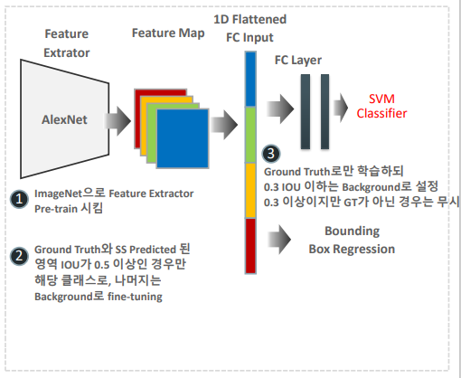
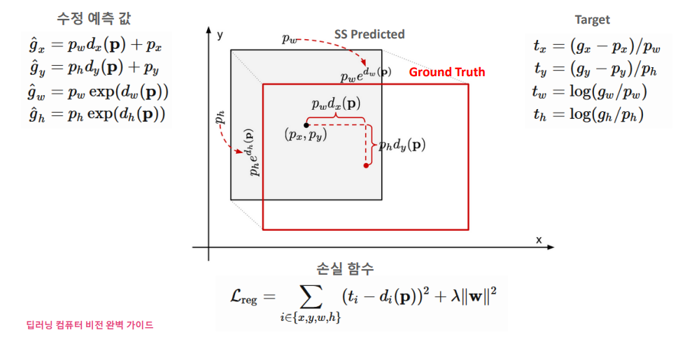

# 03_R-CNN

## Process

- stage1
- stage2

## stage1

- ##### Region Proposa( Selecticve Search )

  - 2000개의 object가 있을 법한 위치를 제안해준다
  - 즉 2000개의 이미지를 뽑은 것이다(다양한 크기에 사진들이 포함되어 있을 것임) = FPN?
  - 그 2000개를 동일한 사이즈로 맞춘다
    - 모델에 들어가려면 이미지의 사이즈가 동일해야하기 때문이다
    - FC(Fully Connected) : 사이즈가 몇인지 명시가 되어있어야 한다.
  - stage2 (CNN network)에 집어 넣는다

## stage2

##### 특이한 점

: 보통 FC layer를 거친 다음에 softmax를 넣는다

: R-CNN에서는 SVM으로 Classification을 진행한다. 

​	SVM을 쓴 이유? 해봤더니 좋아서

: 즉 딥러닝 모델을 FC layer까지라는 뜻 => feature extraction으로만 CNN을 활용한 부분

##### CNN Detection

- 2000개의 이미지에 대해서 학습을 시키게 되는 것이다
- 각각의 2000개의 이미지를 하나하나 크기를 동일하게 맞춘뒤에 conv Net에 집어넣게 되는것
- 즉 Conv Net가 2000번 일하게 되는 것이다.

- 그리고 Bounding box reg로 feature map( W와 같은 역할을 하는 것 )을 뽑아낸다

#### Process stage2

##### 1.  ImageNet으로 Feature Extractor Pre-train 시킨다

- 1000개의 class로 되어 있는 ImageNet 학습시킴
- 만약 PascalVOC라면 20개의 class로 학습을 시키게 될 것이다

##### 2. Pre-train 된 모델에다가 fine-tuning을 시킨다.

- GT(실제 박스위치) 와 SS predicted(예측 박스위치)의 겹치는 IOU가 0.5 이상인 경우?
  - 해당 클래스로 넘어간다.
- 겹치지 않아??
  - 그럼 background라고 fine-tuning을 시킨다.

##### 3. GT(실제값)으로만 학습을 시킨다

- 이렇게 뽑힌 Feature Map을 1차원으로 만들어준다 (이유가 뭐였지??)
- 이것을 또 SVM으로 학습을 시켜준다. (GT값으로만)
  - 0.3 IOU이하는 background로 설정  (별로 안겹치는거 배경으로 할 것임)
  - 0.3이상이지만 GT가 아닌 경우는 무시 ==> 학습대상에서 빼버린다는 뜻이다
    - 어느정도 겹치기는 하는데 실제값이 아니라면(정답이 아닌 것) 학습을 하지 않겠다!
    - 즉 NMS같이 겹쳐있는 다른 값들을 없앤다는 뜻이다.
  - 2000개 모든 것을 학습하는 것이 아닌 ==> 정답 위치에 있는 애들만 학습할 것임

### Bounding box Regression

- ##### Bounding box Regression란?

  - Predicted box와 ground truth box와의 차이를 줄여주 것

  - 이유: Selective search를 통해 찾은 박스 위치는 정확하지 않기 때문

    

- ##### 목표

  - Predicted box ~=  ground truth box

##### Predicted가 정답이려면 어떤 모양을 가지고 있어야 하나? 

1. Predicted의 중심값과 GT의 중심값이 가까울 수록 좋아야 한다. 
2. 너비의 값이 똑같아야 한다. (최대한 같아야 한다.)
   - 즉 d(P)값을 구해서 수정 시킨 g의 값이 정답이 되게 만들어야 한다는 뜻이다.
   - d(P)값을 학습시켜준다.
   - 손실 함수에 넣어준다
3. 높이의 값도 똑같아야 한다. (최대한 같아야 한다.)
   - 지수함수에 넣어주고 p값을 곱해준다.

##### 타겟 값 t

- t값이 최대한 작도록 만들어 주는 것이 목표다
- tx, xy
  - 뺐을 떄 큰 값이 나올때가 있기 때문에 pw로 나눠주는 것이다
- tw, th
  - 로그 값을 넣어준다.
  - g값이랑 p값이 같으면 ==>   g/p = 1
  - 그럼 log(1) = 0

##### 손실함수(box regression)

이 수식도 왜 이렇게 나왔는지 살펴보기

### 장단점

##### 장점

- 높은 Dtection 정확도

##### 단점

- 너무 느린 Detection시간과 복잡한 아키텍처 및 학습 프로세스
  - 2000개씩 생성된 region이미지를 CNN feature map 생성
  - 각기 따로 노는 구성 요소들
    - Selective search, CNN Feature extractor, SVM과 Bounding box regression으로 구성되어 복잡함
  - 한장에 50초 소요

##### 의의

- object detection 성능 입증
- Region Proposal 기반 성능 입증
- 수행시간을 줄이는 방향으로 연구방향이 흘러감 (복잡 ==> 단순)

