# 06_Faster_RCNN

- ##### object detection에 구성하는 모든 요소들을 딥러닝만으로 구성을 한 모델이다.

  - 이전에 네트워크에 들어 오지 못한 것(Fast RCNN에서)
    - SS해서 ROI를 하는 부분
  - 이 부분을 RPN으로 구성하였다.

  

- ##### Faster RCNN  = RPN + Fast RCNN

## Faster RCNN 구조

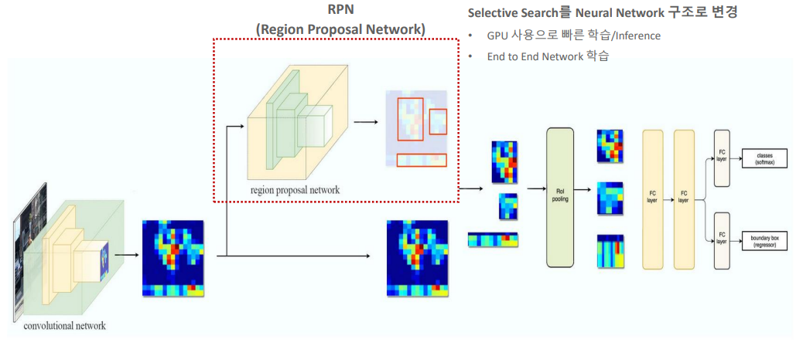

- Conv NN을 나오고 나서 두방향으로 들어감
- RPN에 들어간 모델에서 바로 이미지를 뽑아옴
- 그 후에 ROI Pooling을 넣게 됨

- 모든 구성이 Deep Learning으로 되어 있음 ==> 즉 RPN까지도 Backpropagation을 할 수 있음

## Anchor Box 구성

하고 싶은 것 ==> Selective search알고리즘을 따로 사용하고 싶지 않음

그러기 위해선 딥러닝 네트워크에 포함되는 무언가를 만들어야 함

하지만 가지고 있는 데이터 : pixel값, GT(실제) 값 뿐이다 ==> 따라서 새로운 개념이 필요함 ==> Anchor Box 

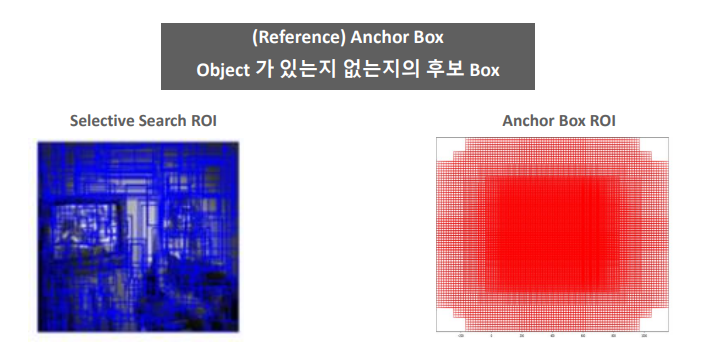

- 박스들을 포인트별로 촘촘하게 채워준다 (초반에는 그냥 기준점 밖에 없다)
  - 딥러닝을 데이터가 들어오면 ==> 그 데이터를 가지고 학습을 하면서 최적의 값을 찾아내는 것
  - 데이터를 넣어주게 되면 ==> Anchor Box에 학습을 시킬 수 있다 . (GT를 기반으로)
- 학습을 시키고 도드라지는 Anchor box를 가지고 Loss기반으로 학습을 시켜서 위치를 찾아내는 것이다.

## Anchor Box 구성

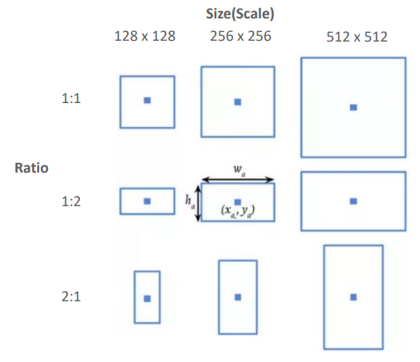

- 총 9개의 종류의 박스들을 사용한다. 
  - 서로 사이즈 다름 
    ( Feature map에 mapping을 하기 때문에 사이즈를 16으로 나눠줘야한다. )
    (16x16을 사용하기 때문에)
  - 서로 비율도 다름

#### 왜 서로 다른 box를 사용할까??

- object의 형태가 다양하기 때문이다.
  - 따라서 Anchor의 중심점을 기준으로 9개의 박스가 쳐지게 된다.
- ex1)
  - object들을 IOU로 찾게 된다.
  - 만약 정사각형만 있으면 사람을 Detection을 할 수 없기 때문이다
  - GT값과 예측값의 IOU가 작을 수 밖에 없기 때문에 

- ex2)
  - object가 위에 그림처럼 겹쳐 있다면 여러 비율이 필요할 것임

#### Anchor box는 feature map에 mapping을 시킨 것이다

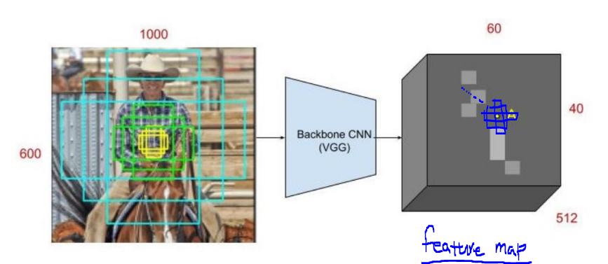

- 이미지에서 Feature map을 뽑아내고 거기에다가 Anchor Box를 mapping 시킨것이다.

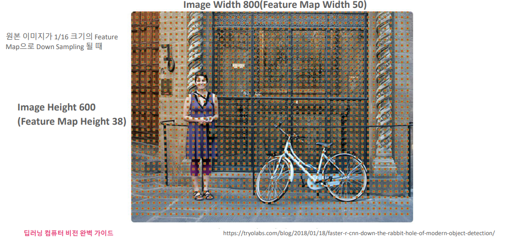

- (600, 800) 이미지가 있음
- 그것을 원본 이미지의 1/16 크기의 Feature map으로 Down Sampling 
  ==>  Feature map은 (38, 50) 으로 바뀐다.
- 그러면 가로로 50개의 grid 포인트가 촘촘히 생기고 세로로 38개의 grid point가 생기게 된다.
- grid point마다 9개의 Anchor box가 생긴다는 뜻이다. ( 빨강 박스쳐진것 처럼 )
- 38x50x9 = 17100 개 박스 생성

## RPN(Region Proposal Network)

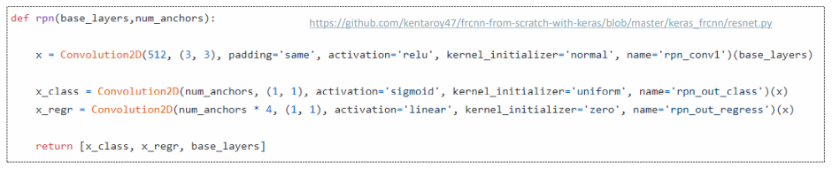

- ##### (40x50) : feature map

- ##### 3x3 Conv에 넣는다 

  - padding을 넣어서 사이즈 유지 시킴
  - 채널도 512개 그대로

- ##### 1x1 conv 1

  - 9개의 채널로 축소시킴 (앵커 박스의 수와 맞추기 위해서)
    - 의미: 
      - 40x50x9?
      - feature map 사이즈 40x50 짜리 point찍고 거기에 앵커박스 9개를 쳤음
      - 그것을 의미해 주기 위해서 9개로 축소 시킴
  - 바로 오브젝트인지 아닌지 확인
  - 즉 object인지 background인지 확인한다.

- ##### 1x1 conv 2

  - 4x9 Output channel
  - 4?
    - x1,y1,w,h
    - bounding box regression

##### 1x1 conv

- 무작정 차원을 줄인다고 좋은 것은 아니다
- 레이어에서 학습할 만큼은 남겨둔 적당한 차원이어야 한다.

##### 1x1 conv의 장점

- Feature map에 파라미터(차원)를 대폭적으로 줄임
  - 즉 차원 축소를 위한 것
- 모델에 성능에는 최소한으로 영향을 끼침

- 연산량 감소
- 비선형성

## RPN Bounding Box Regression

- GT와 예측 박스의 차이
- GT와 Anchor box의 차이
  - 이 둘이 최대한 비슷하다면 ==> 둘이 비슷한거 아님??
  - 이유:
    - GT와 앵커박스에서 Positive 를 찾았다는 뜻은 GT와 앵커박스와의 거리가 얼마 나지 않는다는 뜻이다
    - 따라서 GT와 예측 박스의 차이가 GT와 Anchor box의 차이와 비슷하다면 GT박스 근처 그리고 비슷한 박스라고 할 수 있다

- t : 예측        , x : 예측 x좌표
- t* : target,    x* : GT x좌표 

### Positive Anchor Box, Negative Anchor box

- IOU가 가장 높은  Anchor = Positive
- IOU > 0.7  Anchor =  Positive
- IOU  < 0.3 Anchor  = Negative 
  - object가 아닌것이라고 확실하게 말해줘야하기 때문에 Negative라고 표시를 해줌

-  0.3  <IOU <   0.7  그냥 학습도 안시킴 ==> 애매함
- 유의
  - 한 물체에 여러가지 anchor 박스의 IoU의 값이 0.7이상인 경우가 있을 수 있음
    즉 여러개 박스가 한물체에 대해서 동시에 정답이라고 외치는 경우가 있을 수 있음
  - positible sample자체가 존재하지 않을 수 있음
    따라서 가장 높은 IoU의 값을 채택할 필요가 있음

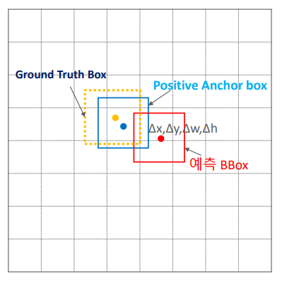

- GT와 예측 박스의 차이
- GT와 Anchor box의 차이 (이 두값은 고정된 값이다 )
  - 이 둘이 최대한 비슷하다면 ==> 둘이 비슷한거 아님??
  - 이유:
    - GT와 앵커박스에서 Positive 를 찾았다는 뜻은 GT와 앵커박스와의 거리가 얼마 나지 않는다는 뜻이다
    - 따라서 GT와 예측 박스의 차이가 GT와 Anchor box의 차이와 비슷하다면 GT박스 근처 그리고 비슷한 박스라고 할 수 있다

- k = 앵커박스의 개수
- 2k => classification
- 4k => 좌표값 2개 너비 높이

## RPN Loss function

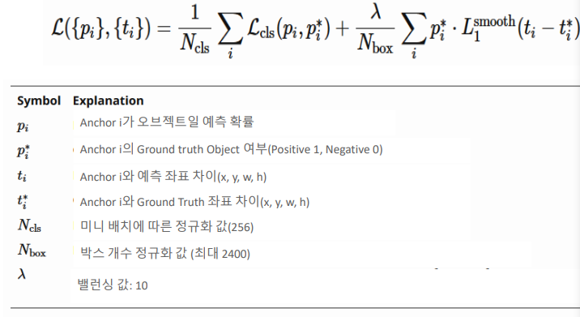

- Classification 부분
  - 예측값과 Positive인지 아닌지에 대해
  - Binary Cross Entropy

- Regression 부분
  - p* => Positive Anchor일 때 1 아닐때 0
    - 따라서 마지막 항 부분은 Positive Anchor일때만 살아 있을 수 있음 
    - 즉 Positive Anchor 일 때만 regression을 진행하겠다 라는 뜻이다.

- 정규화를 한 이유
  - 값이 너무 커질까봐 조절하기 위해서 정규화를 했다고 함

### 밸러스 맞추기

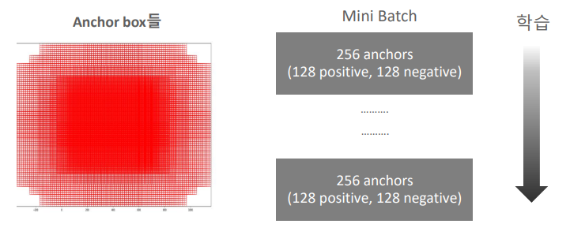

- object인 부분보다 배경인 부분이 훨씬 많다

  - 즉 Negative Anchor가 많이 있다라는 뜻이다.

- 그래서 이러한 밸러스를 맞춰주기 위해서 Positive의 개수와 Negative의 개수를 설정해준다

  - 모든 엥커에 대해서는 고려하지 않고 랜덤하게 256가지를 골라서 학습하게 된다.

  - positive anchor와 negative anchor의 비율이 1: 1정도로 가능하다면 될 수 있도록 한다.
    이상적으로 갯수를 맞춘다면 (128:128)가 나온다

  - 이 모델에 맞게 hyper parameter정보가 나와있으니 참고 할 것 (논문에서)

## Faster RCNN Training

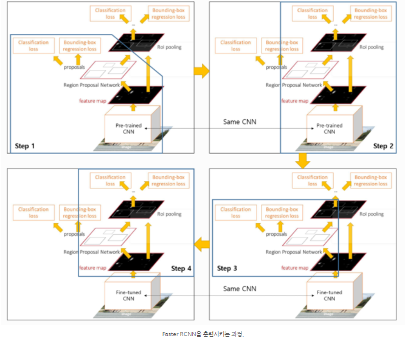

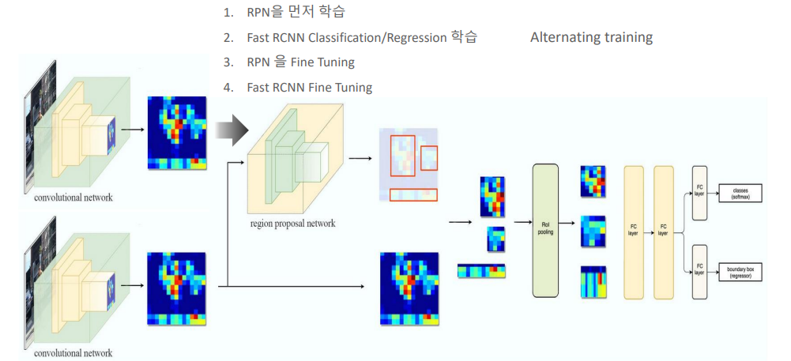

- RPN먼저 학습
- 그다음 뒷 부분 학습시킴
- 그다음 backpropagation으로 Fine Tuning 시킴
- 그다음 RCNN  Fine Tuning

논문

1. RPN 학습 >>( 전체 네트워크에 대해서 학습을 진행한다.)
2. RPN에서 추출한 proposal을 이용해서 Fast R CNN학습 
   2단계까지는 conv layers가 공유되지 않는다. 
3. RPN단계에서 포함되지 않는 conv layer를 완전히 고정한 상태로 RPN에 포함되어 있는 추가적인 conv에 대해서만 fine tunning을 하게 된다. ==> 2개의 과정을 share시킨다
4. conv layer는 완전히 고정한 상태로 Fast R CNN에서만 포함되어 있는 layer에 대해서만 학습을 진행하게 된다.

즉 같은 conv layer를 공유하고 통합된 network가 되게 된다. 

==> 4번만 반복해도 충분하다고 말함 ==> 많이 돌려도 딱히 많이 나아지지 않음

- 논문에서 anchor 박스가 20000을 만들었다면 각이미지당 6000개 정도의 anchor박스를 선택적으로 사용하게 된다.

- 클라스가 같은 중복된 박스들을 처내기 위해서 non-maximum suppression(NMS)를 사용하게된다. ==> 굉장히 많이 사용되는 방법 중 하나이다.
- 그리고 NMS를 위한 IoU= 0.7를 사용함 ==> anchor 박스 2000개로 줄음
- 6000개에서 2000개로 줄었다고 해서 NMS가 정확도에 영향을 주진 않았음
- NMS 이후에 top-N 개에 proposal regions만 사용된다.
- 즉 학습을 진행 할 떄 2000개 사용하더라도 실제 evolation을 진행할 때는 유동적으로 갯수를 정하게 된다.

