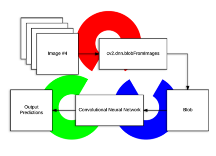

# 07_Object_Detection_with_OpenCV

## OpenCV DNN 장단점

장점

- 쉽게 inference 구현 가능
- open cv에서 computer vision 처리 API와 Deep learning을 쉽게 결합 할 수 있음

 단점

- GPU지원 기능이 약함
- 모델을 학습할 수 있는 방법을 제공하지 않으며 오직 inference만 가능
  - inference : 학습된 모델을 사용하서 입력에 대한 답을 추론하는 것
  - inference 속도: 정답을 추론하는 속도
- GPU(NVIDIA)가 지원되지 않아 타 프레임워크 대비 inference 속도가 크게 저하된다


## 타 Deep Learning Frame과 연동


- 가중치 모델 파일, 환경파일을 다운을 받고 나서 진행을 해야한다.
- tensorflow는 YOLO가 지원인 되지 않는다


### Tensorflow


[TensorFlow Object Detection API · opencv/opencv Wiki · GitHub](https://github.com/opencv/opencv/wiki/TensorFlow-Object-Detection-API)


## 수행 절차

1. 가중치 모델 파일과 환경 설정 파일을 로드하여 inference 네트웍 모델 설정
2. 입력 이미지를 Preprocessing 하여 네트뭑에 입력
3. inference 네트웍에서 output 추출
4. 추출된 output에서 detect 정보를 기반으로 원본 image위에 object detection 시각화 


### OpenCV blobFromImage() ??



- Image를 Preprecessing 수행하여 네트워크에 입력할 수 있게 제공한다. 
  - 이미지 사이즈 고정
  - 이미지 값 스케일링
  - bgr => rgb로 변경, 이미지를 crop할 수 있는 옵션 제공


- 1번째꺼 처럼 사용하지 않고  2번째꺼 swapRB=True를 하여 사용한다.

```python
Img_bgr = cv2.imread(‘원본image’)
Img_rgb = cv2.cvtColor(img_bgr, cv2.COLOR_BGR2RGB)
```

```python
Img_bgr = cv2.imread(‘원본image’)
cvNet.setInput(cv2.dnn.blobFromImage(
img_bgr, size=(300, 300), swapRB=True, crop=False))

```


## 알고리즘마다 다른 라벨번호 ()


