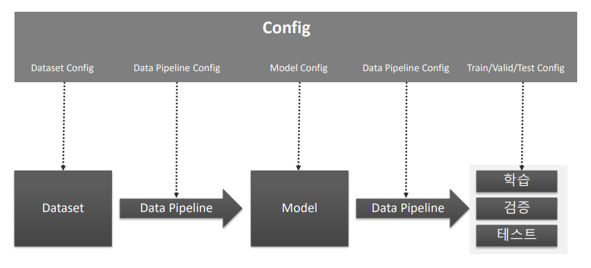
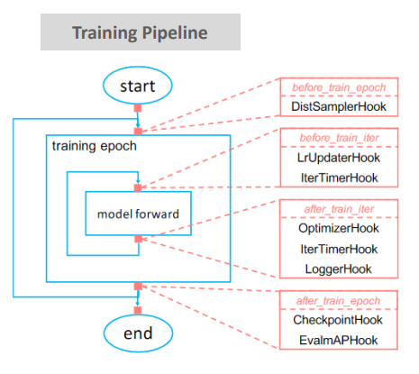
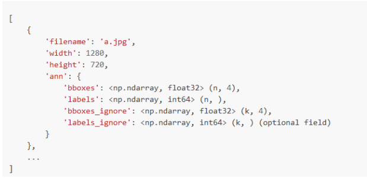
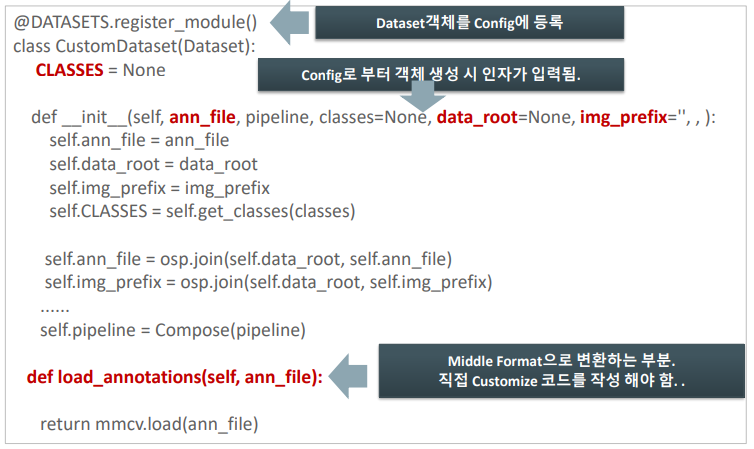

# 08_Faster_RCNN_실습1

##### 패키지를 고를 때 유의할 점

- backbone을 어떤것을 사용해서 object detection을 구현했는지
- 논문 또는 kaggle등 어떤것을 어떤 조합으로 주로 사용하는지를 확인하고 패키지를 고르는 것이 중요하다.

## MMDetection

- config 기반
- Pytorch 기반

#### 구성요소

#### Dataset

- 다양한 유형의 Dataset을 변환 클래스를 통해 지원한다.
- Dataset에 MMDetection이 받아드리기 쉽도록 transform해주어야 한다.
- custtom dataset과 coco dataset이 가장 쉽게 적용 될 수 있는 Dataset
  - 왜?
  - 다른 것들은 디렉토리 구조들을 다 맞춰줘야한다.

- - 

#### MMDetection Training Pipeline

- loop가 돌기 시작하면 중간에 멈출수 없음
- 따라서 callback함수 또는 hook을 걸게 된다. ==> 예를 들어 학습도중 성능이 더이상 나오지 않을 경우 등등

#### 정보 알아보기

#### Custom dataset

- 한개의 이미지에 대한 정보를 가진다
- 한 개 이미지 안에 여러개의 bbox가 있을 것 ==> bboxes에 n개의 정보가 들어 있고 , labels도 마찬가지
- MMDetection은 config기반으로 되어 있음
  - 즉 디버깅을 하기 어려움
  - 따라서 어떻게 돌아가는지 정확히 알고 있어야한다.

#### config와 데이터 셋의 상호작용

##### 생성자

- ann_file
- data_root
- img_prefix

##### osp.join(self.data_root, self.ann_file)

- os.path임 ==> C/content/Kittutiny , train.txt, ==> 이렇게 절대경로를 만들어 버린다.
- osp.join(self.data_root, self.img_prefix) 이것도 똑같음
- data_root는 ann_file위에 상위 폴더로 만들어 버린다.
- 그리고 조인을 하기위해서는
  - train.data_root=/content/kitti_tiny
  - train.img_prefix=‘training/image_2
  - kitti_tiny뒤에 슬래쉬(/) 가 있으면 안되고
  - ‘training/image_2 ==> 여기 앞에도 슬래시(/)가 있으면 안된다.

##### def load_annotations(self, ann_file):

- 여기서 ann_file은 ==> 위에 self.ann_file가 들어가게 된다.

##### 우리가 변환해야하는 부분 ==> def load_annotation

### Custom dataset 생성 주요로직

- data가 들어오면 그 source들을 middle form (json/ dictionary)같이 생긴 애들로 바꿔준다
- data root, ann_file, img_prefix ==> 이 3가지가 form으로 바꾸기 위해  중요한 paramater들이다

#### data root, ann_file, img_prefix

소스데이터 ==> train_dataset ==> model ==> learning

소스데이터 ==> validation ==> 검증용

소스데이터 ==> test==> 검증용

- 위와같은 식으로 내가 소스데이터로 3가지를 구분해주어야 한다.

- data root => 데이터
- ann_file => annotation
- img_prefix  ==> 이미지

