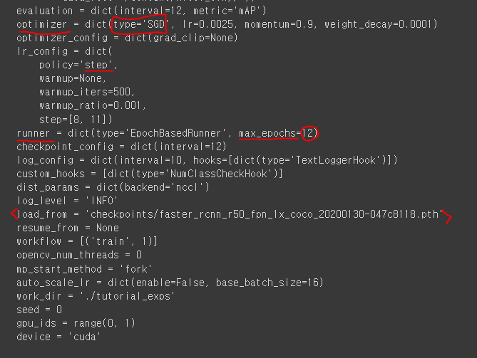

# 08_Faster_RCNN_practice2

### Config 대분류 및 주요 설정 내역

##### dataset

- train, val, test Dataset유형 , dataroot
- type, annfile, img_prefix, popeline

##### model

- model부분은 customizing 하기 애매함
- backbone
- neck
- dense head
- roi extractor
- roi head
-  ==> 최대한 이렇게 끼어맞추려고 노력한다.

##### schedule

- optimizer(Adam, SGD,Rmsprop) 유형 설정 (일단은 default로 쓰는 것이 좋음)
- learning-rate 설정
- learning-rate적용 정책 설정 
  - step : 진행될때마다 lr을 떨어뜨리면서 진행한다. (1epoch를 지날때 마다)
  - cyclic : 올라갔다가 떨어뜨리고 한다.
  - CosinAnnealing  : 둥글게 올라갔다가 떨어짐

- optimizer 설정

- policy  ==> step으로 설정
- 

##### run time

- 주로 hook(call back) 관련 설정
- 학습 중 checkpoint파일,  log 파일 생성을 위한 interval epochs수
  - ex) epoch 3번 돌았으면 check point해줘 등등

- runner => max epoch = 12 (epoch설정) (위 그림)
- load from ==> check point의 위치

## Data Pipeline

##### Pipeline

- 로딩
- 전처리
- formating

##### Resize

- img scale ==> 모델에 들어가서 맞추는 사이즈
- 비율을 유지 할지 안할지 결정

##### Normalization

(원본 이미지 - mean) / std

to_rgb = True : bgr로 넣지만 rgb로 변환을 하고 ==> 계산을 하겠다 라는 뜻

##### Random Filp

- 랜덤으로 좌우 반전을 시키는 것
- img, bbox등에 변화가 있음
  - 예를 들어 좌: 말 우: 사람 ==> 좌우 반전을 주면 우: 사람, 좌:말로 바뀌게 된다. ==> 따라서 bbox가 변함

##### Pad

- shape을 바꿀때 사진의 비율을 맞춰주고 싶다?
  - padding을 통해서 테두리 부분을 채워준다

##### Formatting ==> 모델에 들어가기 전에 한번 확인하는 용도

##### Collect

- [       ]  ==> 이 안에 있는 것을 모델에 집어 넣을께요!~ 하는 것

#### 만약 config를 보고 모르겠다면 mask rcnn 튜토리얼 보기 => 주석으로 남겨져 있기 때문에

