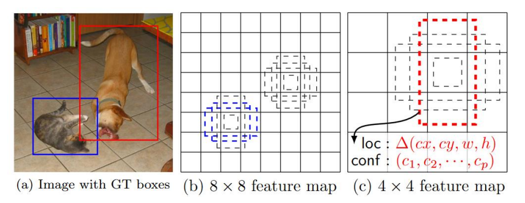
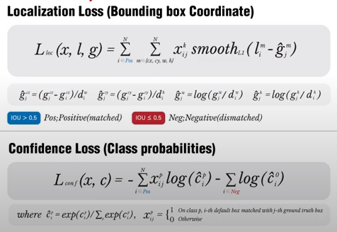
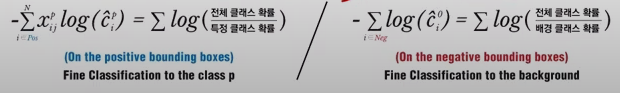
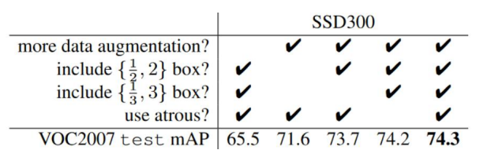

# 10_SSD

- single shot detection
- One stage detector
- 스피드와 정확도의 두마리의 토끼를 잡았다

#### 구성요소

- ##### Multi Scale Feature Layer + Default(Anchor) Box

## Multi Scale Feature Layer 

- 서로 다른 크기의 feature map들을 기반 ==> Object Detection 수행

  - 초반 feature map => 비교적 위치 정보들

  - 깊은 feature map => 핵심적인(추상적인) 이미지의 특징

    

- 윈도우 슬라이드를 고정시켜놓고 feature map의 크기에 따라 Detection을 수행하게 된다.

- 각각의 Detect한 것들을 모아서 Object Detection을 수행하고 결과를 낸다. 

### Anchor box를 활용한 OD

faster rcnn은 RPN으로 따로 object가 있을지 없을지를 bbox regressison과 classification을 진행

하지만 researcher들이 마지막에 bbox regression하고 classification을 또하는데 굳이 그럴 필요가 있을까?? 라는 의문 ==> 합치는 방향 ==>  1 stage object detection

- 활성화 된 부분들이 object일 확률이 높을 것이다
- 개별 anchor박스가 다음 정보를 가질 수 있도록 학습
  - anchor box와 겹치는 feature 맵 영역의 object 클래스 분류

- 5x5라고 한다면 픽셀별로 엥커 박스가 생길것임
- 각각의 Anchor box별로 정보를 가지게 된다.
  - object 유형 softmax 값
  - 좌표

### SSD Network 구성

classification은 맨끝에서 한번에 진행 ==> 모아둔 데이터를 기반으로(그 데이터는 엥커박스(모든 엥커박스가 아니라 matching이 된 anchor box들))

앵커박스의 정보를 학습시키는 방법

- 각각의 feature map을 3x3으로 연산을 하게 된다.
- 아니 언제 앵커박스를 학습시키는지 모르겠음 ==> 왜냐하면 3x3을 하게  되면 높이 너비가 줄어들기 때문에 38x38x4개의 앵커박스가 나올 수 없음
- 그렇다면 그전에 값들을 먼저 보내고 3x3conv를 하는 것인가??

입력

- 300 300 or 512 512 사이즈

중간

- 각각의 레이어에서 정보들이 Detections 로 넘어가게 된다
  - 각각의 레이어에서 object detection을 한다기보단 anchor box의 정보가 넘어가는 것
  - anchor box의 정보들이 학습이 됨 => object detection함

- 어떻게 anchor box의 정보를 학습시킬까?
  - 각각의 feature map으로 3x3conv 연산을 하게 된다.
- conv 3x3(4xClasses ) => 4개의 엥커박스가 있다는 뜻
  - 개별 앵커박스들이 정보를 채움
    - 클래스의 개수 + 백그라운드 + 좌표값
  - 만약 물체가 없으면?
    - 당연히 background class에다가 집어 넣을 것이다. 그 값을

마지막

- 8732개의 앵커박스가 마지막에 모이게 된다.
- 너무 많음
  - NMS로 박스의 개수를 줄이게 된다.
  - object별로

### Anchor 박스를 활용한 Convolution Predictor

=> bbox 왜 4개?? ==> anchor box가 4개이기 때문에 

- 38 x 38 feature map
- 3 x 3 conv로 feature을 뽑아낸다

- bbox에 대한 정보를 채워주게 된다. => (20개 class + bg 1개 object 확률 ) + 4개의 좌표

- b사진을 보면 2개의 값만 파랑색으로 표시되어 있음 ==> matching 이라고 함

- matching의 기준
  - IOU ( anchor box와 GT box ) > 0.5

- c사진은 ==> 4x4 feature map

- matching 되는 anchor box를 기준으로 classification하는 역할을 하는 것이다.

##### matching 전략

- bbox와 겹치는 IOU가 0.5이상인 Anchor box들의 classification 과 bbox regression을 최적화 학습 수행

- C헷 : 특정한 클래스일 확률 / 전체 클래스의 확률

  - 식에서는 - 값이 있으므로 분모분자가 바뀌게 된다.

- confidence loss

  - 분류에서 발생한 손실값

  - 정확성

    

- Location Loss

  - 테두리 상자 설정에 대한 손실 값

  - 하나의 물체에 대해서 bbox를 조절하는 것

  - 첫번째 그림: 박스안에 딱 맞게 있지 않음

  - 두번째 ===> 점차 맟워가짐 == 이런걸 confidence  loss를 통해서 맞추게 된다

    

### Performance

##### 여기서 point

- augmentation이 중요하다
  - 데이터의 양을 늘리는 방법
  - 인위적인 변화를 카해서 새로운 훈련데이터를 대량 확보하는 방법론

- feature map에 엥커박스를 적용하는 1-stage detector의 문제가 작은 object를 detect하는데 어려움이 있음 ==> 이것을 해결하기 위한 방법 ==> feature pyramid ==> 이것을 잘 적용한 모델 = RetinaNet

##### data augmentation(그냥 특이한거임)

- GT Object와 IOU가 0.1, 0.3, 0.5, 0.7, 0.9 가 될 수 있도록 ==> Object들의 Image를 잘라냄
- 잘라낸 이미지를 random하게 sampling
- 잘라낸 sample 이미지는 0.1 ~ 1사이로, aspect ratio는 1/2 ~ 2 사이로 크기를 맞춤

- 개별 sample 이미지를 다시 300x300 으로 고정. 그리고 그중 50%는 horizontal flip

==> 이런식으로 작은 object에 대한 성능을 올리는데 사용

