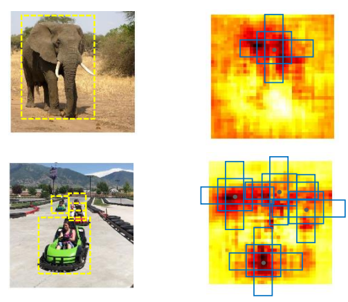
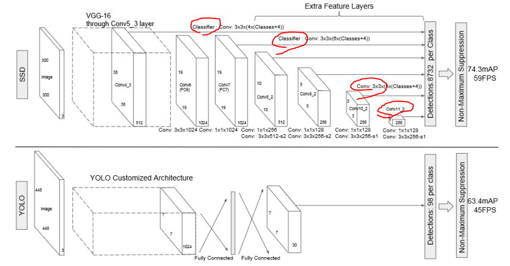
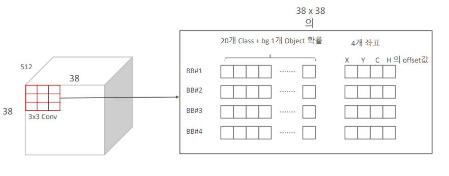

# 10_SSD

- single shot detection
- One stage detector
- 스피드와 정확도의 두마리의 토끼를 잡았다

#### 구성요소

- ##### Multi Scale Feature Layer + Default(Anchor) Box

## Multi Scale Feature Layer 

- 서로 다른 크기의 feature map들을 기반 ==> Object Detection 수행

  - 초반 feature map => 비교적 위치 정보들

  - 깊은 feature map => 핵심적인(추상적인) 이미지의 특징

    

- 윈도우 슬라이드를 고정시켜놓고 feature map의 크기에 따라 Detection을 수행하게 된다.

- 각각의 Detect한 것들을 모아서 Object Detection을 수행하고 결과를 낸다. 

### Anchor box를 활용한 OD

faster rcnn은 RPN으로 따로 object가 있을지 없을지를 bbox regressison과 classification을 진행

하지만 researcher들이 마지막에 bbox regression하고 classification을 또하는데 굳이 그럴 필요가 있을까?? 라는 의문 ==> 합치는 방향 ==>  1 stage object detection

- 활성화 된 부분들이 object일 확률이 높을 것이다
- 개별 anchor박스가 다음 정보를 가질 수 있도록 학습
  - anchor box와 겹치는 feature 맵 영역의 object 클래스 분류

- 5x5라고 한다면 픽셀별로 엥커 박스가 생길것임
- 각각의 Anchor box별로 정보를 가지게 된다.
  - object 유형 softmax 값
  - 좌표

### SSD Network 구성

입력

- 300 300 or 512 512 사이즈

중간

- 각각의 레이어에서 정보들이 Detections 로 넘어가게 된다
  - 각각의 레이어에서 object detection을 한다기보단 anchor box의 정보가 넘어가는 것
  - anchor box의 정보들이 학습이 됨 => object detection함

- 어떻게 anchor box의 정보를 학습시킬까?
  - 각각의 feature map으로 3x3conv 연산을 하게 된다.
- conv 3x3(4xClasses ) => 4개의 엥커박스가 있다는 뜻
  - 개별 앵커박스들이 정보를 채움
    - 클래스의 개수 + 백그라운드 + 좌표값

마지막

- 8732개의 앵커박스가 마지막에 모이게 된다.
- 너무 많음
  - NMS로 박스의 개수를 줄이게 된다.
  - object별로

### Anchor 박스를 활용한 Convolution Predictor

- 38 x 38 feature map
- 3 x 3 conv로 feature을 뽑아낸다

