# 11_YOLO

- YOLO : Real-Time Object Detection
  - You only look once

## YOLO 개요

- Retinanet : YOLO보다 작은 Object에 대해서 더 좋은 성능을 보이게 된다.
- Efficient Det : YOLO v-3보다 좋은 성능이 나오게 된다 (또한 하드웨어(GPU)의 성능도 향상)
-  YOLO v-4 : Efficient Det보다 좋고 빠른 성능을 보이게 된다.

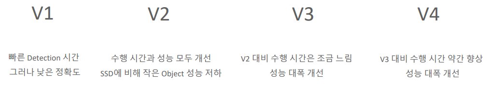

## YOLO v-1

다시 공부

- googlenet
- Confidence score = 오브젝트일 확률 * IOU값 ( 분류가 아님 물체일 확률임 )
- Loss

- 입력이미지를 s x s grid으로 나눔 => 각 grid의 cell이 하나의 object에 대한 detection 수행

  - 하나의 cell이 하나의 object만 detect 

  - => 즉 한 셀안에 여러개의 object들이 있으면 예측 못함

    

- 각 grid cell이 2개의 bbox 후보를 시반으로 object bounding box를 예측

### YOLO v-1 network 및 prediction

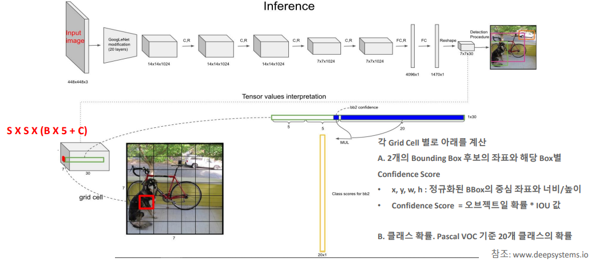

- googlenet을 사용

- 7x7x1024 를 dense하게 만든다 (classification를 하기 위해서)

- 마지막 7x7x30으로 만든다

  - 30?
  - 각 셀별로 30에 대한 정보를 가지고 있음
  - 5 , 5, 20 : (둘중에 하나 IOU높은 걸 뽑는다 ==> 그리고 클래스 확률을 짜게 된다.)
  - 개별 예측 bbox별로 정보를 5개(x, y, w, h + confidence Socre)(정규화된 값) 가지고 있음 (각 셀이 담당하는 예측 bbox = 2개씩)
  - Confidence score = 오브젝트일 확률 * IOU값 ( 분류가 아님 물체일 확률임 )
  - 20 : class id 20개

  

### YOLO v-1 Loss

1번째 식 (bbox 중심 x, y 좌표 Loss )

- S => grid cell
- B => bounding box
- 1 obj ==> 98개 (7x7x2 (7x7이미지 x 2개 bbox)) 
  ==> 98개 중 오브젝트 예측을 책임지는 bbox만 1 나머지는 0
  ==> 즉 오브젝트 예측을 책임지는 bbox만 계산할 것이다.

2번째 식(bbox 너비 w, 높이 h Loss)

- 제곱근이 들어가 있음 (작은 bbox와 큰 bbox일때의 편차를 줄이기 위해서 값을 줄임)=> 루트

3번째

	- 람다 :  책임지지 않는 애들도 책임이 있다고 말하는 것 (적당히 값을주어서 감소시킴)
	- 계산 대상(예측 바운딩 박스가)이 아닌데 계산을 해버림

- 뒤에 값이 필요한 이유
  - mAP를 계산하기 위해서
  - 즉 mAP에 object가 있을때와 없을 때의 값이 둘다 필요하다
  - 따라서 뒤에 값이 필요

- lambda 값 = 0.5
  - 즉 앞에 object가 있을 때 값보다 조금의 책임을 주게 된다.

4번째

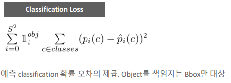

1stage의 전략? ==> 많이 예측을 하고 nms로 골라내자!

- 각 셀별로 예측을 하기 시작한다.
- NMS를 하기 시작한다.

NMS의 종류

- soft nms

  

#### 문제점

- 시간은 빠르나 detection 성능이 떨어짐

## YOLO v-2

- 왜 head 쪽만 업데이트를 시켰는지
- 

##### k-means clustering

- 각 군집이 하나의 중심을 가진다
- SSE를 최소화 하는 Partition을 찾는 것이 목표

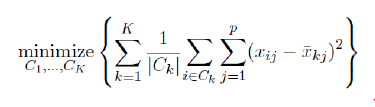

- k의 개수에 따라 결과가 달라짐
- 감으로 k를 찾을 것인가?? ==> Nope ==> 룰이 존재

- x축 = K , y축 = SSE
- K의 개수가 많아질 수록 하나씩 군집을 하는 것이기 때문에 ==> SSE는 0이 된다. ==> 오차라는 것이 존재하지 않기 때문에(차이)
- 그 중에서 완만하게 줄어드는 지점을 찾는다 = elbow point

##### Process

- Assignment 초기화
  - 각 데이터에 랜덤하게 K개중 하나의 군집을 할당
- Assignment 가 변하지 않을때 까지 다음을 반복
  - 각각의 군집에서 중심을 계산
  - 각 데이터에서 가장 가까운 중심에 해당하는 군집으로 Assignment 를 update

##### 한계점

- k개를 미리 정해줘야함
- 초기 Assignment에 따라서 결과가 달라진다.
- 각 군집의 크기, 밀도가 다르거나 구형이 아닌경우 어려움이 발생

##### YOLO v-1,2,3 비교

v1에서 anchor box가 아닌 이유

- anchor 박스는 고정된 사이즈를  가지고 있어야 한다.
- 하지만 v1에서는 각셀에서 prediction을 2개를 할 수 있던 것이었다.

v2

- anchor 박스를 설정 하는 방법 ==> k-means clustering을 사용
- 각 이미지 별로 object의 크기 object들이 어떤 크기로 생겼는지를 가지고 결정

### 

#### YOLO v-2 detection 시간 및 성능

#### YOLO v-2 특징

- Batch Normalization (cnn => b.n => ReLU)
- Head쪽만 w를 업데이트 하게 된다.
  - 즉 앞쪽의 것들은 freezen시켜서 w업데이트를 못하도록 한다.
  - 이유:
    - 앞에 backbone부분은 pretraining이 이미 되어 있다
    - 그렇기 때문에 굳이 backbone까지 학습을 시키지 않아도 된다.
    - 학습에 대한 추가
      - backbone부분을 왠만하면 안건들이는게 좋음
      - 왜냐하면 dataset들은 이미 정제된 데이터들로 학습이 되어있는 것
      - 하지만 내 data들은 보통 raw한 데이터임 ==> 그렇기 때문에 좋은 성능이 나오기 힘듦
      - ==> 즉 그냥 train을 하지않고 pretrain이 되어있는 것을 그대로 쓰는 것이 좋음
- 13x13 feature map기반 ==> 각 grid별로 5개의 anchor box에서 object detection
- 예측 bbox의 x,y좌표가 중심 cell내에서 벗어나지 않도록 **Direct Location Prediction** 적용
  - 벗어날때가 많았기 때문에 조정이 필요했음
- FC 사용 안하고 Fully conv로 변경하고 서로다른 크기의 image들로 네트워크 학습 
  - 사이즈를 고정시키고 싶지 않기 때문에
  - 그리고 Fully conv해도 성능이 나온다는 논문이 나왔음

#### 1개의 셀에서 여러개 object detection

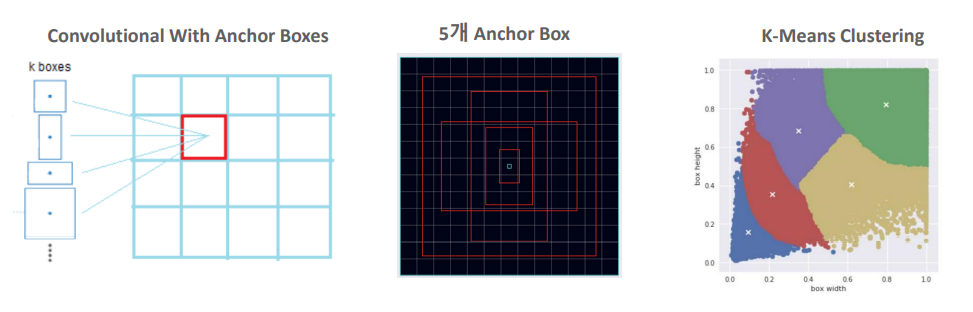

- 한 셀당 5개 anchor box를 사용
- K-means Clustering으로 5개의 군집화 분류를 진행함 
  ==> 그리고 이것에 맞게 anchor box의 크기를 정해주었다
- 그럼 언제 K-means Clustering을 해야하나? 
  - training을 시작하기 전에 해야 할 것 같음
  - 왜냐하면 anchor box의 크기는 고정이 되어 있어야하기 때문
  - 따라서 train을 시작하기 전에 clustering을 진행 ==> anchor box의 크기 결정

#### Output Feature Map 

##### depth = 125개

- detector 1 2 3 4 5 ==> anchor 1 2 3 4 5 : 1셀에 5개에 anchor가 있는 것
- 각 anchor 마다 depth 25갖는다
  - (좌표 4개 + Objectness score + class score (20개 pacal VOC이기 때문))
- 각 셀에 5개의 anchor가 있고 거기에 클라스 스코어랑 좌표값랑 배경을 통째로 가지고 있음

#### Direct Location Prediction

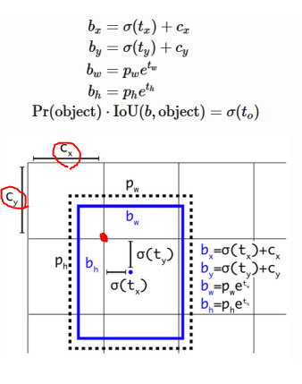

- ##### tx, ty => bbox 의 중심점 (셀의 중심이 아님)

  - 0~1사이의 시그모이드 값으로 조절한다.

  - 이유 : center 좌표가 cell 중심을 너무 벗어나지 못하게 하기 위해서

    

- ##### pw, ph => anchor box 의 너비 높이

- ##### confidence score

  - Pr(object) * IoU(b, object) = 시그모이드(t0)

#### Passthrough module을 통한 fine grained feature (요즘 안쓰임)

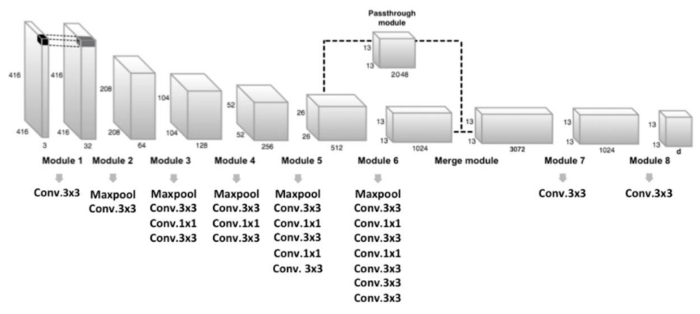

- F.M => F.M => F.M => F.M => 이런식으로 가다보면 ==> 마지막 FM쯤에는 굉장히 추상적인 Feature map이 나오게 된다
  - 이렇게 되면 ==> 큰 object에게는 유리함
  - 하지만 ==> 작은 object들에게는 불리함
    - ssd(각각에 feature map에서 뽑아냈음)
  - 26 x26x512 에서 그냥 reshape을 시켜버린다. ==> 13x13x2048
  - 그리고 더해줌 
  - 13x13x(1024+2048)

#### Darknet 19 backbone

- 병목 기법을 사용
- FC 로 하지 않고 Conv layer를 사용함

## YOLO v-3

- Feature Pyramid Network를 적용시킴
- YOLO v-2 와 YOLO v-3의 큰 차이점 ==> FPN
- Darknet 53 사용
- 13x13  //  26x26  //  52x52 (output deature map 크기 (depth 제외))
- Softax가 아닌 Sigmoid기반의 logistic classifier로 개별 object의 Muti labels 예측

##### Feature Pyramid Network

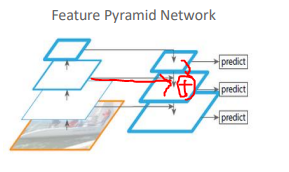

- 사이즈를 줄이면서 feature를 뽑아 놓고 top-down을 할때 두개를 합쳐버린다.
- 그리고나서  predict를 진행한다.

- 효과 
  - 탑 쪽에 있는 feature맵의 추상적인 부분과 아랫쪽에 있는 상세한 feature map이 합쳐지게 된다.
  - 하지만 크기가 다름 ==> 따라서 작은 feature map을 up-sampling을 해주게 된다. ==> 그리고 합침

#### YOLO v3 모델 아키텍처

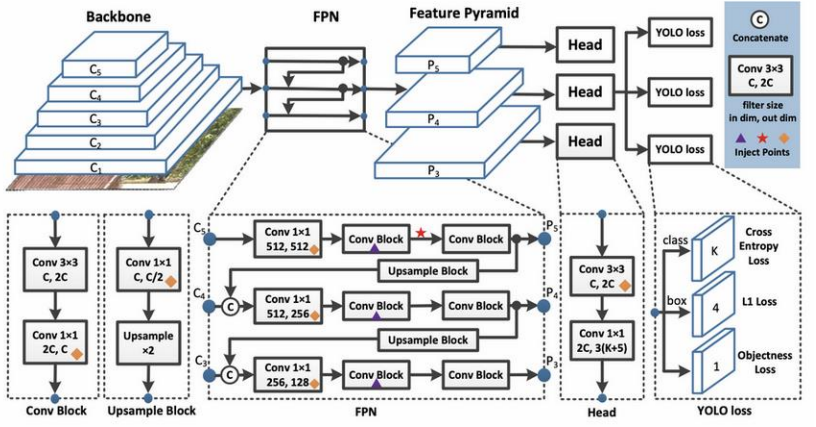

- p5 : 13x13
- p4 : 26x26
- p3 : 52x52

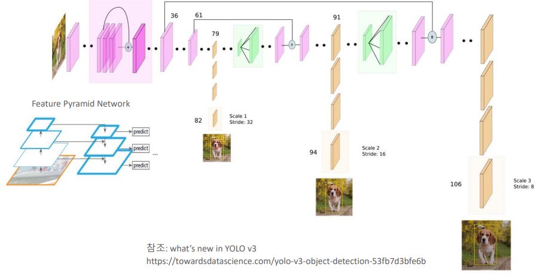

번호

- layer 번호임

앞부분

- ResNet에서 사용하던 

##### 첫번째

- 13 13
- 초록색 ==> upsampling ==> 26 26
-   \*   :  합침  => 26짜리 하고

##### 두번째 

- 26 26 
- 첫번째와 똑같이 진행

##### 세번째 

- 52 52
- 첫번째와 똑같이 진행

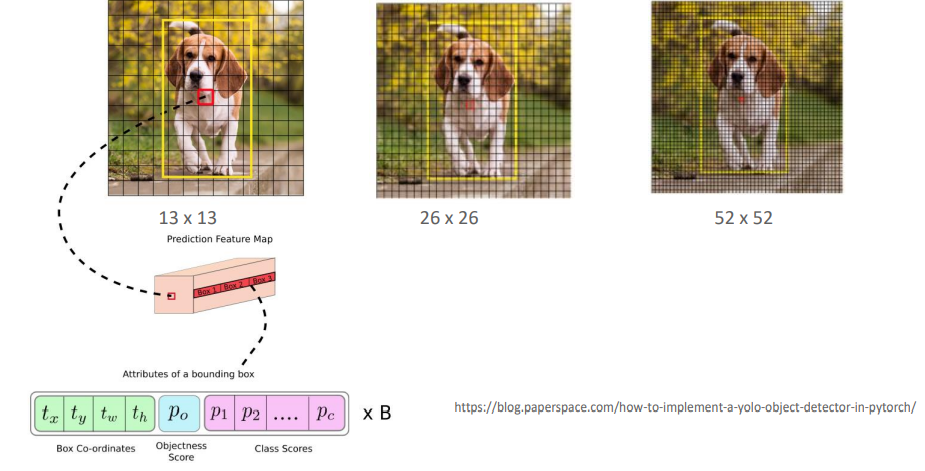

- box1, box2, box3 을 더해준다. 
- 각 box당 (좌표, objectness score, class score를 포함 하고 있음)
- 13x13은 비교적 큰 오브젝트를 ==> 갈수록 작은 오브젝트를 위함
- 뽑아내는 output 정보들이 많게 된다.

#### Darknet-53

- 53개 layer가 존재
- BFLOP/s : 초당 연산 속도  ( Billion floating-point operations )
- ResNet과 비등한 성능을 보여주게 되었음

#### Training

- multi-scale training,
- lots of data augmentation
- batch normalization
- Darknet 사용

#### Muti Labels

일반적으로 하는 얘기

- softmax보다 logistic(binary)로 하는 것이 성능이 조금 더 낫다 라는 얘기가 많음

woman인지 아닌지

person인지 아닌지

cat인지 아닌지를 하나하나 다 적용을 시킨것이다

class가 20개면 20개 다 적용시킨 것이다.

#### 성능

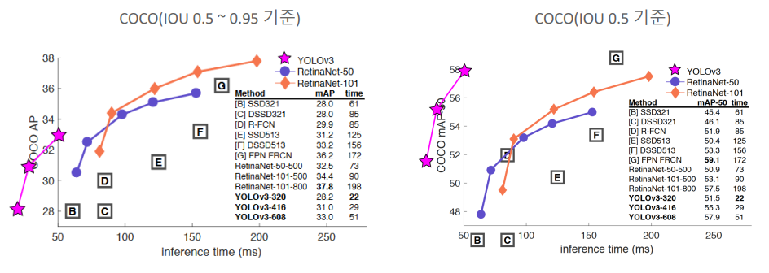

#### 구현시 유의사항

##### 3개의 Output Feature Map 에서 직접 Object Detection정보 추출

- 다크넷의 고유한 layer Id

- 82, 94, 106에서 결과를 각각 추출을 해야한다.

- 사용자가 직접 NMS로 최종결과 필터링 해야함

  

##### darknet site에서 가져오면 된다.

- ` cv2.dnn.readNetDarknet (config파일, weight파일)`

- config파일 먼저 들어가야함

##### coco 데이터 셋으로 할 때

- 85개의 정보를 추출해 내어야 한다.
  - (좌표4개, objectness, class score(80개) ) ==> coco data가 80개이기 때문

##### 절차

### 대량의 이미지 학습 시 메모리 문제 발생

cnn을 할떄 object detection에 대해서 조금더 주의 할 점

- cnn 이미지를 학습시키려면 ==> 배열(tensor)로 변환 시켜야 한다.
- Batch size를 정해서 한번에 보내줌 ==> 메모리 하드웨어가 버티질 못함

이래서 나온 방법

#### Python Generator

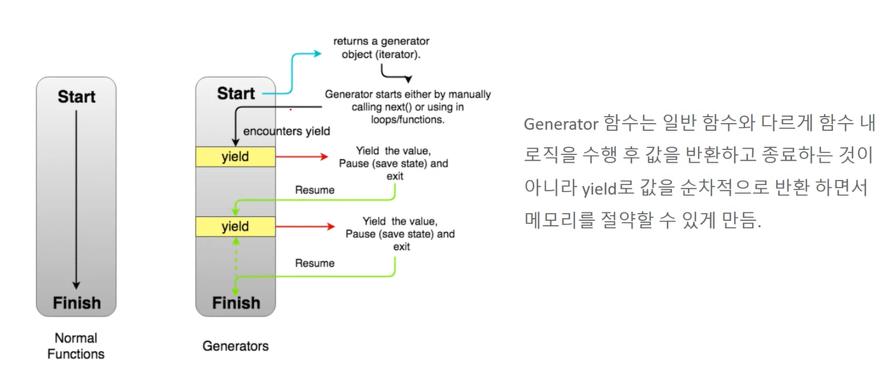

##### def A (왼쪽)

- 함수 수행이 끝나면 return 값을 caller에게 해주게 된다.
- 문제
  - if => return 값이 10만개 정도가 된다? 
    => 너무 큼 => caller에게 가면 한꺼번에 처리해야할 값들이 너무 많음

##### gen A (오른쪽)

- caller를 호출
- caller가 yield를 만남
  - 1000개(일정한 수 만큼만) 정도만 caller에게 반환을 해준다.
  - caller는 1000개만 일을 하게 된다.
- 또 yield를 만남 ==> 반복

#### Keras fit_generator()를 이용한 학습

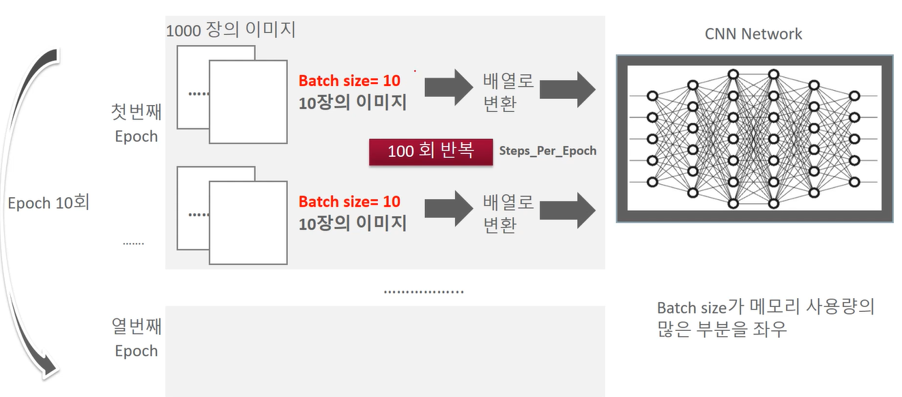

- 1epoch에 1000장의 이미지를 학습 시켜야함
  - 그럼 batch size 10으로 잡아서 10장의 이미지를 집어 넣음
  - 그것을 100회 반복시킴
  - batch size 를 100으로 늘린다고 해서 빨라지지 않음
  - 왜냐하면 batch size 또한 하드웨어의 제약을 받기 때문이다.
  - 그럼 batch size를 어떻게 정할것인가??
    - 하드웨어에 따라 다르다

##### Data Generator

##### Object Detection 모델에서 CPU와 GPU의 역할

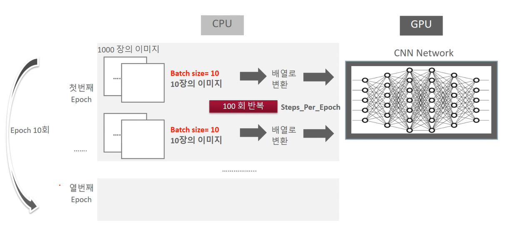

- CPU 4코어, GPU P100, batch size => 4~8이 적합한듯?

