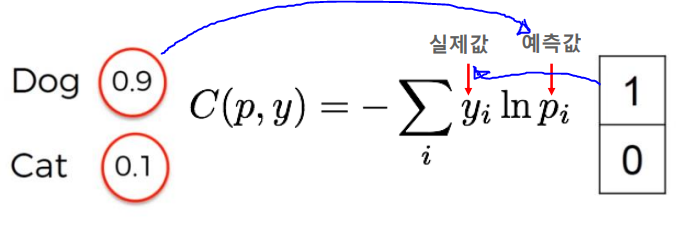
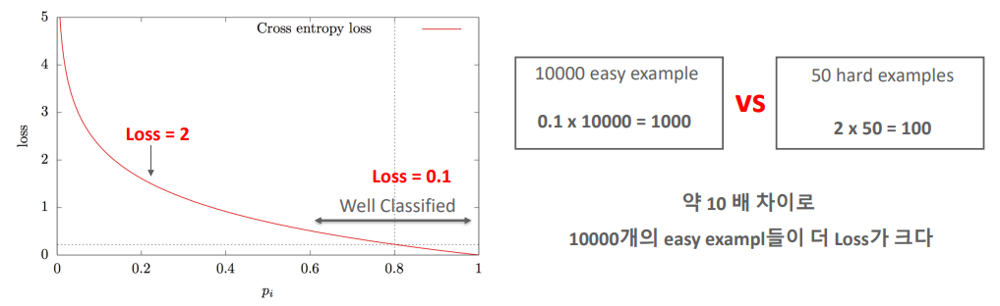
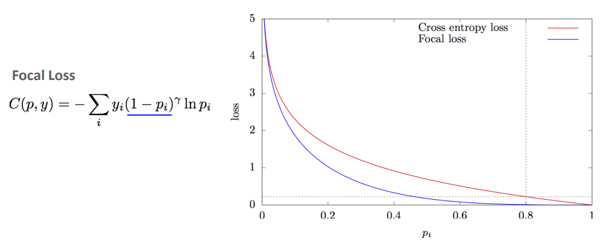
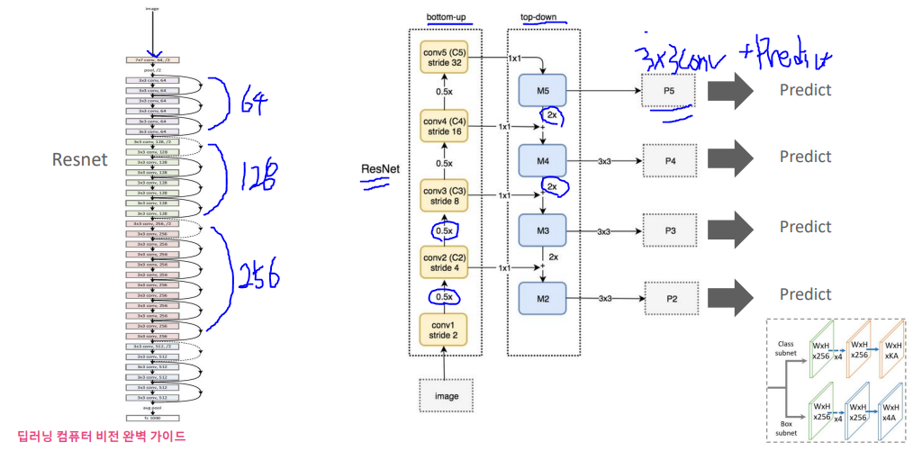
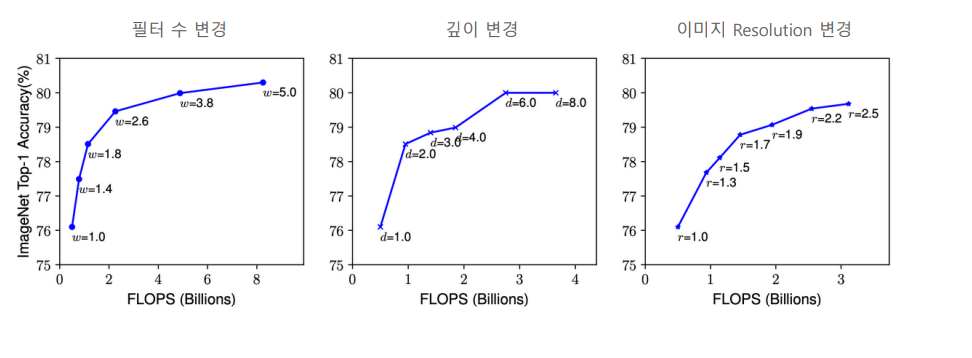
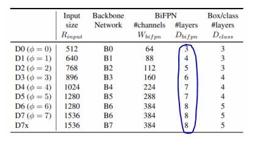
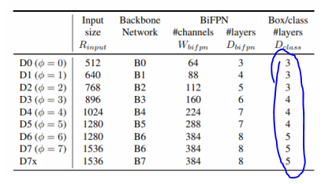
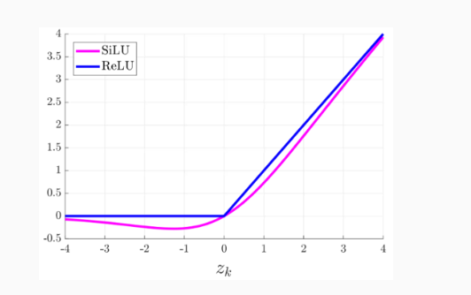
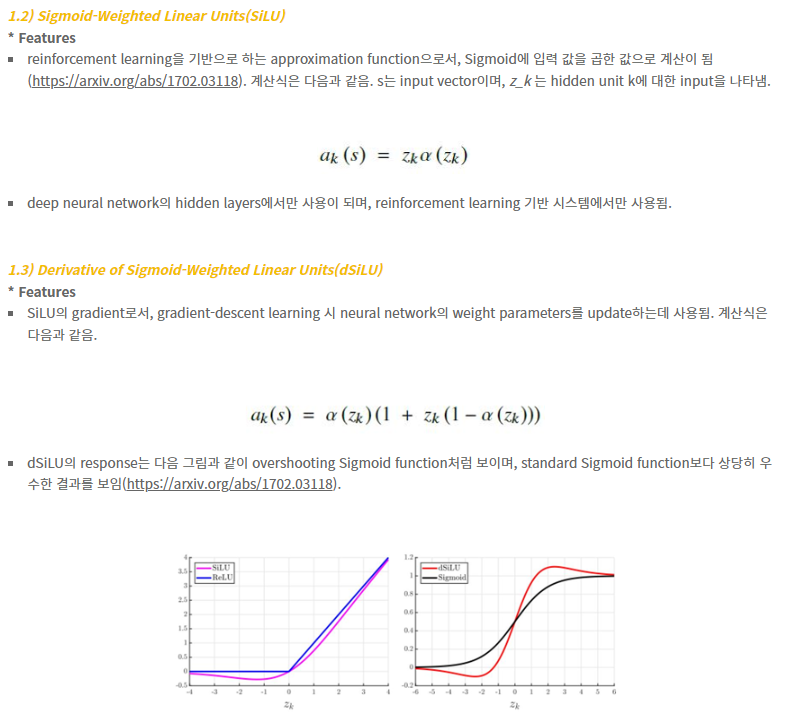

# 13_RetinaNet

- facebook
- 성능 저하 문제가 있었음
- YOLO나 SSD보다 느림 그러나 Faster RCNN보다 빠름
- Focal Loss + Feature Pyramid Network

## Focal Loss

#### Cross Entropy의 변형

### Object Detection의 Class imbalance이슈

#### Class imbalance란?

https://techblog-history-younghunjo1.tistory.com/74

- 어떤 데이터에서 각 클래스가 갖고 있는 데이터의 양의 차이가 큰 경우
  - 왜 균형이 필요한가?
  - 소수의 의견에 귀를 기울이기 위해서

**2가지 방법**

1. **Weight balancing**
   - Train 데이터에서 각 loss를 계산할 때 **특정 클래스에 대해서는 더 큰 loss를 계산해주는 것**
   - 클래스의 비율에 대해 가중치를 두는 방법
     - 두 개의 클래스 비율 ==> 1:9 이면  가중치를 9:1로 해줌으로써 전체 클래스의 loss에 비슷하게 기여하도록 하는 것
   - Focal loss

2. **Oversampling & Undersampling**

   

**Under sampling**

- 양을 줄여버린 파란색 데이터들은 양이 많았던 원본 파란색 데이터의 대표성을 잘 지니고 있어야 하는 것이 중요

**Oversampling**

- 주황색 데이터의 양을 늘려줄 때 원본 주황색 데이터를 **복사하는 개념**이기 때문에 **양이 늘어난 주황색 데이터는 양이 적었던 주황색 원본 데이터의 성질과 동일**

#### Class imbalance란? (deep learning에서)

- 대부분의 영역이 background가 차지 하고 있음
- 1stage 경우 anchor box를 사용 ==> 힌트 x ==> 다 쏴줘야함 ==> 즉 anchor box가 굉장히 많음
  - 대부분의 굉장히 많은 anchor들이 background에 치중 되게 된다.

- 상대적으로 매우 적은 foreground(Positive) example들 = 매우 유용한 정보

#### 문제점

Easy Example  :  찾기 쉬운 대상들 => background나 크고 선명한 object

Hard Example : 찾기 어려운 대상들 , 작고 불분명한 object

- ##### 2 stage같은 경우 

  - : RPN에서 object가 있을만한 곳을 높은 확률 순으로 필터링을 먼저 수행할 수 있음
  - 300개만 보내~ 이런것이 가능 => 이렇게 하더라도 성능에 영향을 많이 끼치지 않음

- ##### 1 stage : 

  - Region Proposal과 Detection을 같이 수행함
  - 매우 많은 object 후보들에 대해서 Detection을 수행해야 한다.
  - class imbalance로 인한 성능 저하 영향이 큼

##### Cross entropy의 문제점

- 실제 값과 예측 값의 차이를 줄이기 위한 엔트로피

- easy example의 loss가 작아도 수가 너무 많기 때문에  합치면 hard example보다 Loss가 더 크게 된다
- 불확실한 object들을 개선하는 방향성으로 학습 X
- 이미 높은 예측 확률을 가진 easy example (배경, 확실한 object)들에 대해서 더 정확한 예측을 하기 위해 학습이 진행된다.

##### 해결방안

- 동적으로 Cross entropy를 조절할 방법을 찾자
- Cross entropy의 가중치를 부여하는 것이다.

Ex)

- 예측값 : 0.99 => 즉 굉장히 확실하다 라는 의미
- 그럼 1 - 0.99 = 0.01 ==> 그리고 감마승을 해준다 ==>  값이 굉장히 줄어들게 된다.
- 원래 가지고 있던 cross entropy값에 곱해지게 된다.
- 즉 확실하면 loss값을 그냥 더 줄여준다 ==> 이렇게 하면 많은 값들(background)가 모여도 전체 loss값이 작게 유지하기 때문에 이쪽에 신경을 덜 쓰게 된다. ==> 그럼 hard example의 loss값이 더 클 것이기 때문에 hard example의 loss값을 줄이는 방향으로 학습을 할 것이다.
- 예측하기 쉬운 example에는 0에 가까운 loss를 부여하고, 예측하기 어려운 negative example에는 기존보다 높은 loss를 부여합니다. 

##### Focal loss와 Cross Entropy의 loss값 비교

일반적으로

- gamma  =2
- alpha값 = 0.25

## FPN

##### Feature Pyramid Network

- 이미지를 줄이는 방식 = computing 시간, detecting시간이 너무 오래걸림 => 사용하지 않음
- feature map을 이용해서 predict하는 방식이 일반적
  - 너무 최상위 => 위치적인 특성을 잃어버림 ==> 정확도 떨어짐
- 따라서 각 level에 있는 feature들을 뽑아내서 합침

- 3x3 conv로 끄집어 낸다
- 각 개별 포인트마다 9개의 anchor 박스를 가지고 있음 (anchor 박스 기반)
- 

3x3conv를 추가적으로 하는 이유??

- 두개를 합치면 혼돈되어서 자신만에 특징을 잃어버리는 문제가 발생함(aliasing effect)
- 그것을 희석하기 위해서 3x3을 해줌

#### anchor box

- 9개의 anchor box가 P2 ~ P5의 개별 Layer의 개별 포인트에 다 찍여 있음
- 3개의 서로 다른 크기와 3개의 서로 다른 스케일을 가짐. 
  - aspect ratio={1:2, 1:1, 2:1}, size={2의 0승 ,2 1/3승,2의 2/3승}을 사용하여 총 9개의 anchor를 할당합니다. 
- 약 100K 의 anchor box들 
  - anchor를 기반으로 prediction하게 되는 것
  - anchor 박스가 많을 수 있는 이유는 imbalance문제에서 background부분을 조절 했기 때문에 anchor box를 많이 만들어도 된다.
- 개별 anchor box는 Classification을 위한 K개의 클래스 확률값과 Bounding box regression을 위한 4개 좌표 값을 가짐. (똑같음)

## EfficientDet

- width, resolution은 2배가 되면 FLOPS는 4배가 된다. ==> 그래서 제곱을 곱함 ??

- EfficientDet Compound Scaling에서 cost란??

- depth에서 7788 으로 고정 => 왜?

- SILU

- scale jittering

- soft NMS

  

- Scalable and Efficient Object Detection

- back bone : Efficient Net을 사용
- BiFPN Layer : FPN을 진화시킴

##### 주요 기법

- BiFPN
- Compound Scaling

- 적은 연산 수, 적은 파라미터 수
- 높은 AP

### BiFPN  (Bi-directional FPN)

두가지 중요 요소

- Cross Scale Connection
- Weight Feature Fusion

#### Cross Scale Connection

##### PANet

- 내려오면서 합친 것을 다시 올린다. 

  - 낮은 level에 있던 추상화도 높은 level의 추상화에 합쳐보자

    

##### NAS-FPN 

- Nas search(강화학습)를 이용해서 구한 모델
- 하지만 왜 이런 구조를 띄는지 설명이 불가하다 (explainable하지 않다)

##### BiFPN

- 첫번째와 마지막이 존재하지 않음
  - 이유
    - 사실상 첫번째와 마지막은 합쳐지는 것이 아니라 그냥 있는 것임
    - 있을 필요가 없다고 판단하고 제거
    - 따라서 p7에서 바로 밑으로 내려가서 합치게 된다.
- 원본 feature map에서 fusion을 하면 어떨까??
  - 마지막 부분에서 input이 3개가 된다.

#### Weighted Feature Fusion

**idea**

- 서로 다른 resolution(feature map size)를 가지는 input feature map들은 Output feature map을 생성하는 기여도가 다를 것
  - p7과 p6가 서로 가른 기여도를 가지고 있을 듯? ==> weight다르게 주는게 맞다 아님??
- 따라서 다른 가중치를 부여하여 합쳐질 수 있어야 함

특징

1. 가중치 값은 정해진 것이 아님 ==> 학습시켜서 도출된 것임
   - 일정한 계수만 곱하면 된다 하지만 그 계수를 학습함
2. Fast normalized fusion
   - softmax로 0~1사이 값 만들기 ==>
     -  시간이 너무 오래 걸림 그래서 다르게 normalizing시킴
     - 미분이 너무 오래걸려서
   - 입실론 : 분모가 0이 되는 것을 막기위한 작은 값
   - 모든 가중치 값으로 나눔
   - 이것을 하는이유 : 가중치값이 너무 커질 수 있기 때문에 

- 성능 향상
  - parameters 가 줄어든 이유 : Separable Convolution을 적용했기 때문
  - Separable Convolution?????

### EfficientNet 개요

- back bone

- 이미지(Resolution), 필터 수 (Width), 네트웨크 깊이(Depth)
  - 이것들을 따로따로 최적화를 한다면 최적의 모델을 구축할 수 없겠다
  - 그래서 좋은 조합을 찾아야한다.
  - Compound Scaling

- 각각의 최적화된 포인트

#### 개별 Scaling ==> 성능 비교

- 모든 요소가 일정 구간 이상으로는 더이상 많이 늘어나지 않는다

#### 최적 Scaling 도출 기반 식

- 최초의 승수는 1로 고정 => grid search 기반으로 a,b,r값을 찾아낸다
  - EfficientNetB0 :  a=1.2, b=1.1, r=1.15가 나옴
- a,b,r을 고정하고 승수를 증가시켜가면서 Scale up 구성 
  - 이렇게 하면 함께 증가하고 함께 감소하게 된다. => 따로따로가 아님
- 알파 * 베터 제곱 * 감마 제곱 == 2로 고정
  - width(필터 수), resolution(이미지)은 2배가 되면 FLOPS는 4배가 된다. ==> 그래서 제곱을 곱함
  - 사진을 생각하면서 넓이이기 때문에 4배가 늘어남

- 각각 필요한 경우에 따라 b0 ~ b7을 선택

### EfficientDet Compound Scaling

##### 성능을 높이는 방법 (net)

- 거대한 Back bone
- 여러겹의 복잡한 FPN
- 큰 입력 이미지의 크기
  - 이유: 이미지를 키우면 작은 object들도(커지기 때문에) 잘 캐치할 수 있다

==> 하지만 이런 개별적인 부분들에 집중하는 것은 **비효율적**이다.

EfficientDet 에서도 Backbone, BiFPN, Prediction layer, 입력이미지 크기를 Scaling 기반으로 최적결합

#### backbone network

- EfficientNet B0~B6로 Scaling 그대로 적용

#### BiFPN network

##### depth

- Depth는 기본적으로 layer의 개수를 의미

- Depth는 BiFPN 기본 반복 block을 3개로 설정하고 Scaling 적용 (3개 layer)

- 기본으로 repeatition을 3번을 반복한다는 뜻
- d6부터는 8로 고정???

##### width

- 채널수

##### Box/class layer

##### 입력이미지 크기

##### 기타 요소(SILU?, scale jittering? , soft NMS?)

- activation : SILU(Sigmoid Linear Unit)
  - 
  - 
  - 
  - 논문에 따르면 2차원에서 확인했을 때, linear 또는 ReLU보다 훨씬 부드러운 형태를 가집니다.
  - 

- loss : Focal Loss

  

- Augmentation: horizontal flip, scale jittering

  - Standard Scale Jittering (SSJ) **resizes and crops(잘라내기) an image with a resize range of 0.8 to 1.25 of the original image size**. 

  -  The resize range in Large Scale Jittering (LSJ) is from 0.1 to 2.0 of the original image size.

  - If images are made smaller than their original size, then the images are padded with gray pixel values.

    

- NMS : soft NMS

  - hard NMS : bbox가 있으면 이 중에서 가장 크게 겹치는 것 빼고 나머지를 다 제거
  - soft NMS : 
    - 만약 object 주변에 여러 object들이 겹쳐있다면??
    - hard NMS에서는 다 지워버리게 된다.

##### 성능평가

Efficient Det의 약점

- small object를 잡기 위해서 여러기법을 사용
- 근데 작은 object에 대해서 성능이 잘안나옴 ㅋㅋ

