# 15_Segmentation-Mask_RCNN

##### Semantic Segmentation vs Instance Segmentation

- Semantic Segmentation
  - 동일 클래스에 대해서 합쳐진다.
- Instance Segmentation
  - 개별 object별로 masking 정보가 씌워지게 된다.
  - mask RCNN

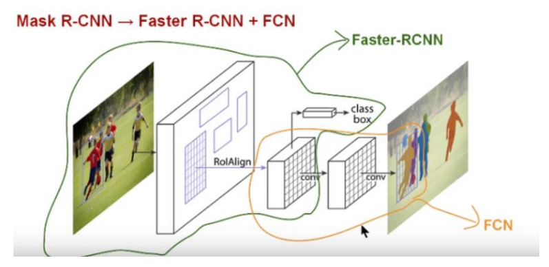

Mask RCNN

- Faster RCNN + FCN

## 1. Semantic Segmentation

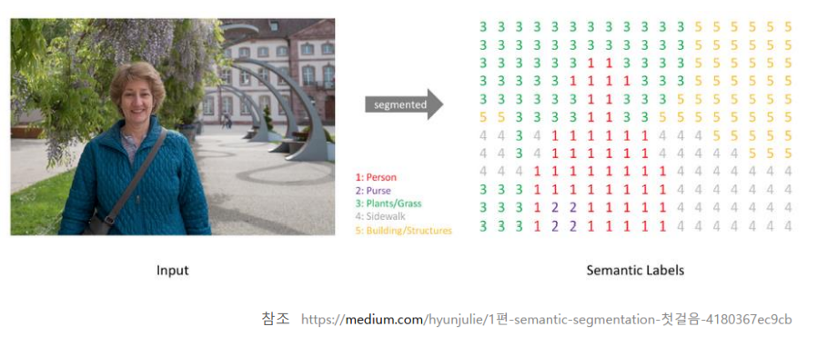

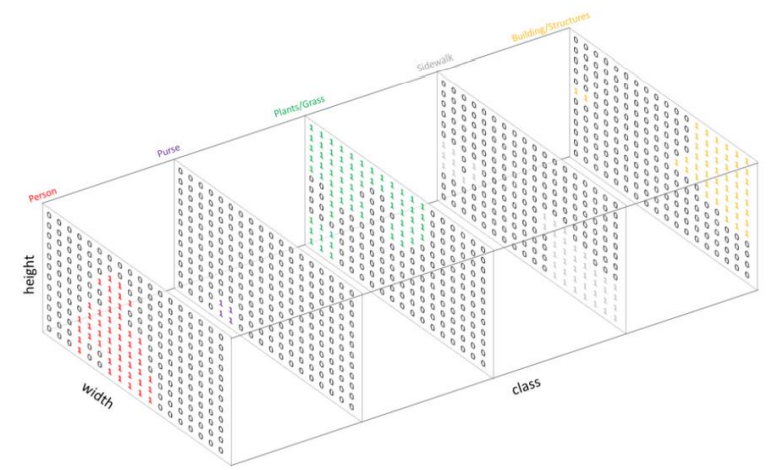

Pixel Wise Classification

- 픽셀 단위로 각각의 어느 클래스인지 분류를 시켜준다.
- 위 그림은 단지 이해를 돕기위한 그림이다.

## Encoder-Decoder Model

원본 이미지를 Convolution으로 차원 축소(Dimension Reduction)하여 응축된 정보를 가지고, 이를 다시 복원하면서 필요한 정보를 학습 • 이렇게 학습된 정보를 기반으로 Segmentation 수행

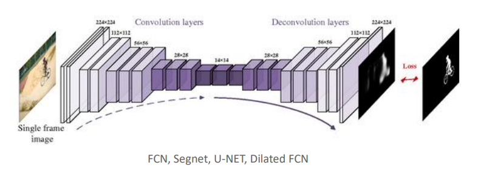

재창조, 재해석

##### Encoder : 

- 압축을 시켜서 추상적인 정보를 뽑아내는 것

##### Decoder : 

- 압축이 된 추상적인 정보를 원본이미지와 비슷하게 사이즈를 늘려나가면서 거기에 숨겨진 히든 vector들을 찾는 것
- 원본 이미지를 똑같이 복사하는 것이 아님
- 압축이 된 추상적인 정보를 기반으로 원본 이미지에서는 찾을 수 없었던 특성들을 찾아내는 것

## FCN

- Fully Convolutional Network for Semantic Segmentation

Fully Connected Layer vs Fully Convolutional layer

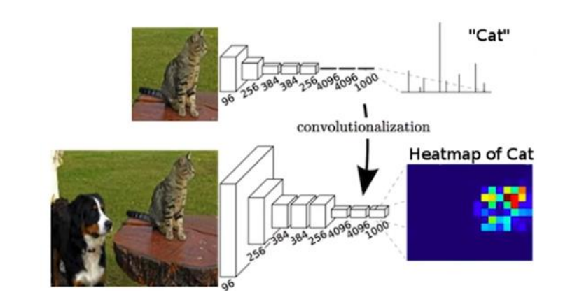

- **Fully Connected Layer**

  - 마지막에 flatten을 하고 ( 1차원 )

  - image net이기 때문에 class가 1000개가 필요

  - 따라서 마지막 layer에 1000개의 클래스가 존재

    

- **Fully Convolutional layer**

  - 마지막 4096이 conv block이 된다.
  - depth가 1000개가 되게 된다.
  - 각각의 feature map에서 ==> map상에 cat일 확률(0~1)이 적혀있음 (grid by grid)
  - 픽셀이라고 말하지 않는 이유는 실제 이미지 사이즈가 아니기 때문에 grid라는 용어를 사용

#### FCN Down sampling과 Upsampling

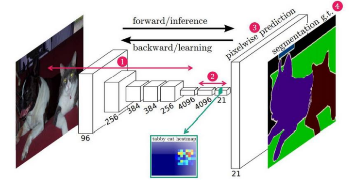

문제점

- 7x7를 바로 upsampling을 하게 되면 원본이 가지고 있던 많은 정보들이 뭉그러지게 된다.

#### Feature Map을 혼합하여 Pixel Wise Prediction

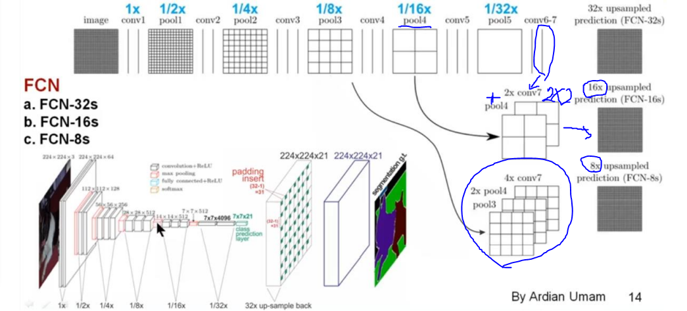

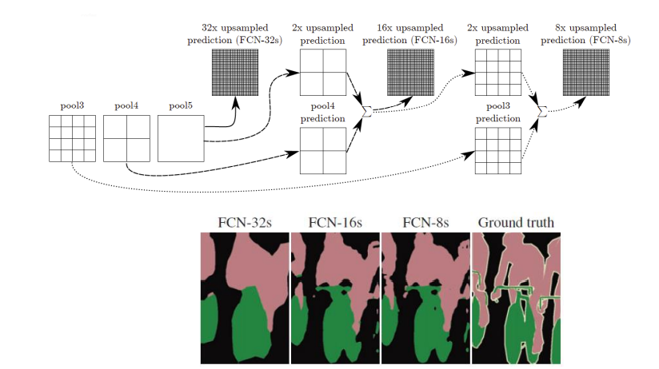

16x

- conv 7를 가져와서 upsampling을 한다 x2 ==> 2x2
- 그리고 pool4를 가져와서 합친다
- 그것을 x16 upsampling을 시킨다

8x

- 상대적으로 위치 정보를 더 많이 가지고 있는 4x4짜리도 계산해준다
- conv 7 ==> x4
- pool4 ==> x2
- pool3 ==> 이렇게 3개를 합침

성능 비교

- 보통 FCN 8s를 사용한다.

## Mask RCNN

- Faster RCNN + FCN
  - ROI-Align
  - 기존 Bounding box regression과 Classification 에 Binary Mask Prediction 추가
  - 비교적 빠른 Detection 시간과 높은 정확도
  - 직관적이고 상대적으로 쉬운 구현
- classification 자체는 C부분에서 해준다 ==> box를 이용해서
- 그럼 이제 box안에서 masking이냐 아니냐를 판별해주게 된다.(Binary Mask Prediction)
- 그냥 FCN보다 

### Mask RCNN 구조

=> 그럼 segmentation할때 박스정보를 언제주는 거임?

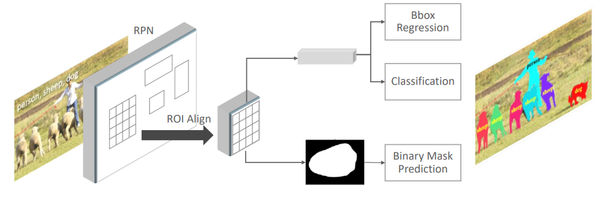

- RPN
- ROI Align
  - 

##### ROI Pooling의 문제점

문제점 1

- box로 표현 되면 조금 크기가 벗어나도 되었다 => 하지만 pixel단위로 맞춰야함 ==> 정확해야함
- 그래서 ROI Pooling이 가능했음
  -  ROI Pooling은 20x20을 7x7로 pooling을 할때 소수점으로 떨어지게 됨
  - 따라서 그 값을 뭉뚱그려서 정수로 표현했음
  - 하지만 segmentation같은 경우에는 값이 조금더 정확해야한다.
  - 따라서 ROI pooling을 쓸 수없음 ==> 따라서 ROI Align이 나오게 되었음

문제점2

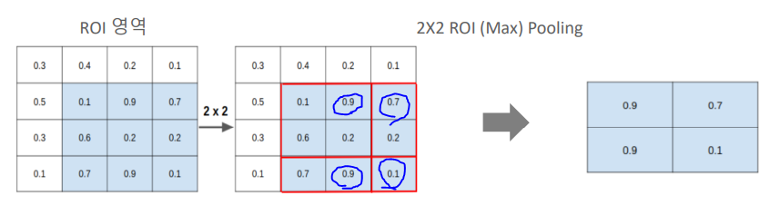

- 2x2를 통해서 pooling을 하게 되면 완전히 정확히 골고루 특징을 뽑아낼 수 없다
- 균등한 사이즈가 아니기 때문에 정확한 영역을 추정하는데 문제가 발생하게 된다.

#### ROI-Align

Bilinear Interpolation을 이용한 ROI-Align

: 가상의 소수점까지 생각한 grid를 생각하자

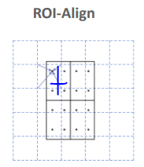

- ROI를 소수점 그대로 매핑하고 ROI의 개별 Grid 에 4개 의 point를 균등하게 배열

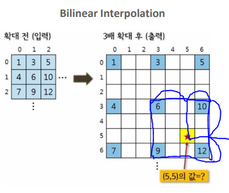

- 개별 point에서 가장 가까운 feature map Grid를 고려 하면서 포인트를 Weighted Sum 으로 계산
  - Weighted Sum : 
    - 확대하면 화질이 깨짐 ==> 그럼 다시 보정을 해서 화질을 좋게 만듦
    - 다시 확대 ==> 다시 보정
  - 각 포인트가 얼마나 떨어져 있는지 거리비율을 감안해서 계산을 하게 된다. 
    - 보간법을 이용해서
    - 그렇게 비어있는 값들을 하나씩 채우게 된다

- 개별 포인트들의 대한 값을 구했음 ==>  계산된 포인트를 기반으로 Max Pooling 수행
  - 가장 가까운 grid에 있는 포인트들을 찾음
  - 여기에 해당되는 point들을 중간에 있는 점에 맞게 거리를 계산해서 값을 넣어준다
  - 즉 위에서 봤던 Weighted Sum을 거꾸로 하는 느낌이라고 보면 된다.

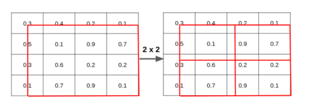

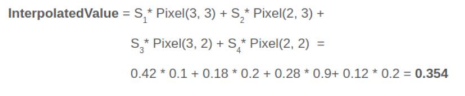

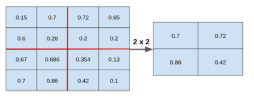

- 소수점으로 그냥 mapping
- 2x2로 자름
- point 찍음
- weighted sum 반대로 진행
- max pooling

성능

#### Feature Extractor

- ResNet + Feature Pyramid Network

#### Mask RCNN Loss Function

- 1번쨰 2번재 ==> Faster RCNN Loss function
- 거기서 Loss mask까지 추가됨

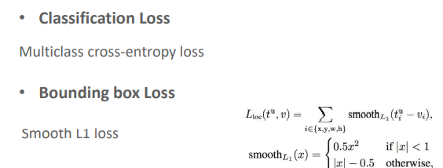

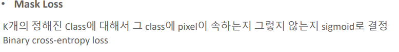

- Mask Loss가 할일
  - classification은 사실 그전에 다 이루어 진다 => 그럼 mask가 할일은?
  - bbox안에 영역에서 masking이 해당 class(이전에 정해졌던)에 포함이 되는지 안되는지만 알려주면 된다.
  - 그것을 sigmoid로 결정하게 된다. (binary cross entropy loss)

- 이 mask부분에서는 어떤 class에 속하는지는 알 필요 없음
- 그냥 주어진 답에 분류만 해주면 된다.

