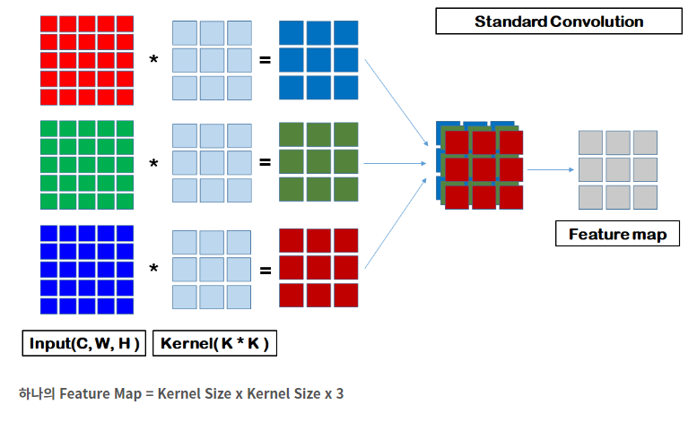

# 99_Separable Convolution이란?

- ResNet에서 bottle neck부분(https://coding-yoon.tistory.com/116)
-  Convolution의 Parameters을 계산
- 알아보고 다시 오기

## 1. Standard CNN

https://coding-yoon.tistory.com/122

기본적으로 하나의 Convolution을 통과하면 하나의 Feature Map(Activation Map)이 생성됩니다. 

- **Kernel Size x Kernel Size ??x Input Channel(입력 이미지 개수)의** Parameter가 필요합니다.

## 2. Depth-wise Conv

- Depth-wise Convolution은 Standard와 달리 하나로 합치지 않는다
- 즉 RGB가 각각 feature map이 된다.  따라서 아래식과 같이 3을 곱해주지 않음

- **Feature Map = Kernel Size x Kernel Size**

- Depth-wise Convolution에서 연산량이 Input Channel 만큼 연산량이 줄어든다

## 3. Separable Conv

Separable Convolution은 Point-wise Convolution 입니다.

Point-wise Convolution는 1x1 Convolution입니다. 

**1x1 Convolution은 두 가지 특성을 가지고 있습니다 .**

**(1) 공간적인 특성을 가지고 있지 않다.**

**(2) 연산량이 가장 적게 필요로 하기 때문에, Feature Map 개수를 조절할 때 사용된다.** 

## 4. Depth-wise Separable Convolution

