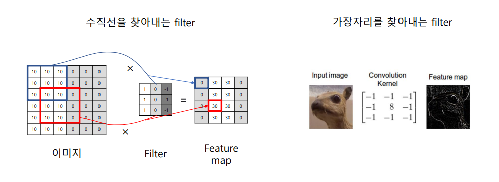
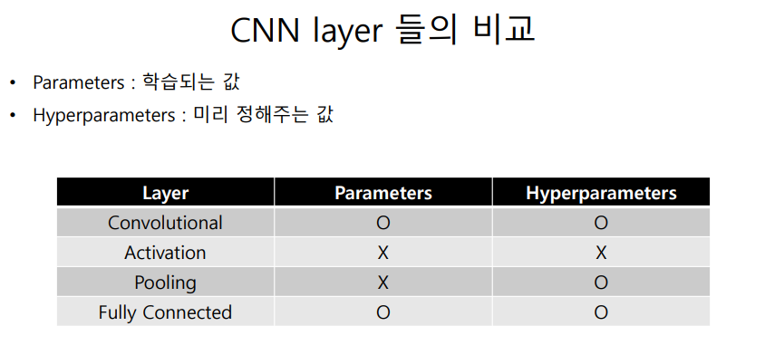

# chapter 6

- 패턴을 찾는 것
- 

Conv

- 하나의 함수와 또다른 함수를 반전 이동한 값을 곱한 다음, 구간에 대해 적분하여 새로운 함수를 구하는 수학 연산자이다.

- f를 가만히, g를 t축으로 뒤집음 ==> 평행하게 움직일때 두함수가 얼마나 비슷한지 계산하는 연산자
- 

- f, g의 값은 t만큼 g를 옮겨다 놨을때 ==> f와 g가 얼마나 유사한지를 나타내는 값이다

ex) 

10(백) , 0(흑) ==> 그럼 중간에 선을 찾아내기 위해서는 10과 0사이의 값을 찾아내야한다.

그것을 찾기위한 것이 filter임 ==> 이런식으로 filter값을 학습시켜서 특징을 찾아내는 것이 목표

- 주요포인트 : filter하나당 feature map하나

- 이미지 filter인 경우 conv가 아니라 비슷하 연산인 corss-correlation을 계산하는 경우도 많다.

## CNN 구조

- pooling layer
  - feature map의 크기를 줄여서 계산량을 줄이고 overfitting을 억제하는 layer

#### conv layer

- low level feature
  - 갖다 대보면 비슷한 것들
- high level feature
  - 복잡한 특징들
- 둘다 중요하기 때문에 high level이 더 중요하다고 생각하지 말자

#### pooling layer

- feature map의 spatial size를 줄이는 layer
  - spatial size : 가로세로의 크기
  - channel 사이즈라고 하면 feature map의 개수임 따라서 가로세로의 크기를 콕 집어서 얘기할때 헷갈릴 수 있음 ==> 따라서 spatial size 라는 단어를 사용
- 보통 연속되는 conv layer사이에 반복적으로 들어가게 된다.
- 새로운 정보를 만들어 내는 것이 아님 ==> 입력값을 주어진 feature map을 공간적으로 요약하는 역할

- 데이터의 양이 너무 많음
  - 따라서 모든 데이터를 다 이용하고 안고 가려면 감당이 되지 않음
  - 따라서 요약을 해주는 것이다. 
  - overfitting에 빠질 위험 또한 있음

- max pooling

  - 이것이 왜 작동을 할까 ??
  - feature map에서 값이 크다는 것 = 해당 위치에서 많이 activate되었다는 뜻
    - 직 그 영역에서 그 가장 활성화된 activation이 그 특징일 가능성이 가장 크다! 라는 뜻

  - 가장 많이 사용하느 값
    - 2x2 크기 filter에 2stride를 적용하는 것
    - 75%의 feature 값을 줄일수 있게 된다.
    - 이렇게 하면 중복이나 누락없이 데이터를 잘 요약하게 된다.

#### Receptive field

- 큰 사각형의 정보가 layer3에서 하나에 pixel에 모든 정보를 포함하고 있다
  - layer1 부분이 Receptive field가 되게 된다.

- layer가 지날수록 여역이 커지게 된다 => 왜냐하면 포함하고 있는 정보들이 많기 때문
  - 복잡한 그림을 가지게 된다.

#### MLP와 CNN의 비교

- parameter 수
  - 이미지는 많은 데이터를 가지고 있음
  - 따라서 MLP로 계산을 하려고 하면 굉장히 많은 데이터를 계산해야 함
  - 그리고 이미지에서 모든 정보가 굉장히 중요한 정보를 담고 있는 것이 아니기 때문에 비효율 적이다.
- Local connectivity
  - 주변과 연결성을 잘 파악하는 것에 의미가 있음
  - 즉 이미지에서 주변 정보가 중요하지 저 멀리 있는 pixel값이 중요하지 않음
- 이미지 크기
  - MLP : 학습될 때 사용된 이미지의 크기와 정확히 같은 크기의 입력값만 사용가능
  - CNN : Sliding window 형태의 filter를 학습했기 때문에 크기 달라져도 상관 없음

#### 

