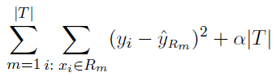
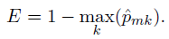
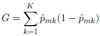
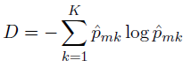
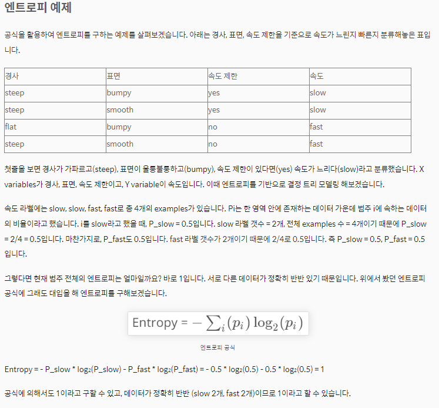
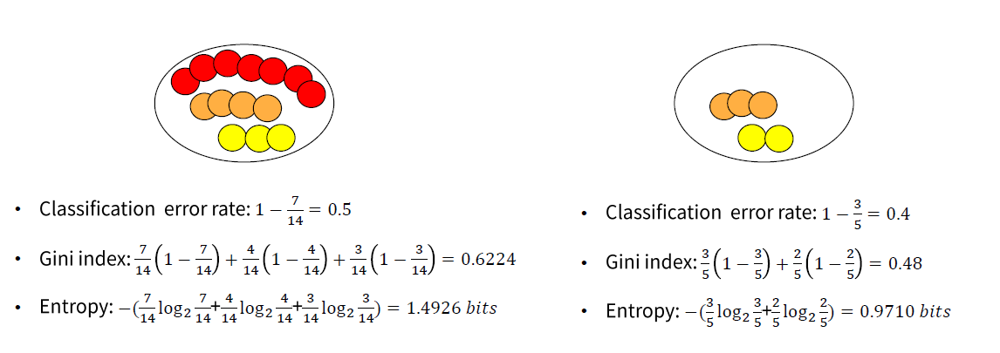
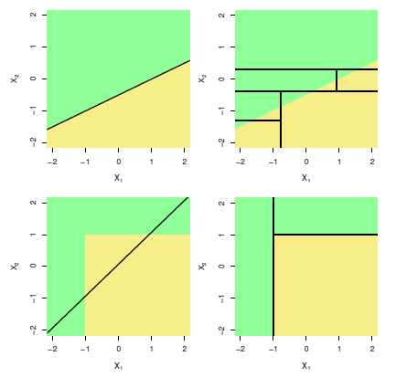
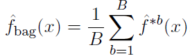
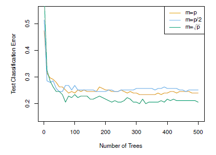
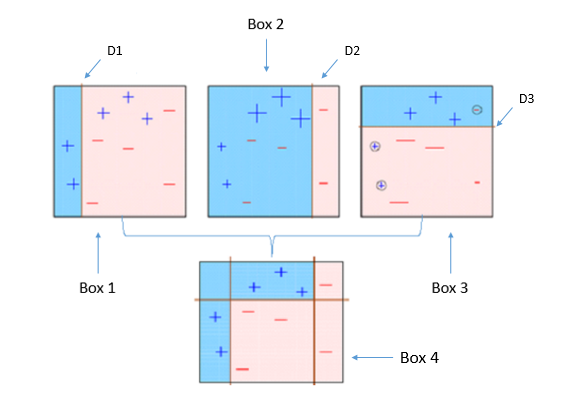

## Socar

## Decision Tree

- 이런식으로 루트에서 t1보다 작으면 왼쪽 크면 오른쪽 이런식으로 결정을 하면서 split이 되게 된다.
- explainabe하고 모델이 단순하기 때문에 현업에서 많이 사용하게 된다.
- Regression과 Classification 모두에 적용이 가능하다

## Regression Tree

- Hit와 Years와의 관계이고 color는 연봉이다

결정트리

- 여기서 중요한 요소는 years라는 것을 알수 있음
  -  왜냐하면 years가 4.5년이하가 되면 hit를 많이 했다고 하더라도 급여가 낮은 것을 볼 수 있음
  - 따라서 급여를 결정할 때 years가 더 중요한 즉 상위 node에 있다는 것을 알 수 있다.
- 경력이 있고 난 뒤 부터 hit가 영향을 끼치게 된다.
- 문제를 너무 단순화 한다. ==> 하지만 시각화, 해석, 설명하기 쉽다.

### how to make Regression tree?

- 예측 공간을 J개의 겹치지 않은 영역으로 나눈다
  - J개의 영역으로 어떻게 분할 
  - 편의를 위해서 Box들로 분할하게 된다. (예측변수에 따라서 모양이 바뀜, 1: 선 2: 사각 3: 박스...)
  - 그리고 SSE(Sum of squared errors)의 합을 최소화하는 box를 찾는 것을 목표로 함
  -  SSE(Sum of squared errors) ==> mean squred와 비슷 ==> 하지만 n으로 나누지 않음
- 각 영역 안에는 training data이 평균을 통해 예측값을 반환하다. 

### top down,greedy 접근법 ( Recucive Binary Splitting )

- 모든 가능한 box를 고려하는 것은 불가능하다.
- 따라서 사용하는 방법

##### top down

- root노드 부터차례대로 binary split하겠다는 뜻

##### greedy

- 당장 single step이후의 SSE를 최소화하는 split을 찾는다
  - 즉 알고리즘에서 그냥 for문 돌려서 전꺼랑 비교해서 하는 방법과 비슷한거 같음

- 각 internal node에서 매번 아래의 SSE를 최소화하는 분할점(어디를 나눌지)과 예측변수를 찾는다

#### stopping point

- ##### stopping point??

  - 조건을 줘서 중간에 split을 끝나게 하는 point이다.

  - ex) 
    min_sample_split = 10이면 한 노드에 10개의 데이터가 있다면 그 노드는 더 이상 분기를 하지 않습니다

    

##### stopping point를 주는 이유

- overfitting을 막기 위해서
- 이런 조건이 없이 계속 split(분할)하게 되면 leaf 노드가 하나가 하나의 데이터를 가질때까지 split을 하게 됨 ==> 즉 더이상 분할이 안될때 까지 분할을 하게 됨 ==> 이렇게 되면  SSE를 최소화하는데 좋아 보임 ==> 하지만 overfitting을 하게 된다. 따라서 stoppnit point를 주게된다.
- 위의 박스처럼 굉장히 많은 박스가 생성되게 되고 하나의 박스에 하나의 데이터를 가지게 될 수 있음

- 작은 트리가 variance도 적고 설명력이 좋다.

#### Pruning a Tree

- 큰 tree T0를 만든 다음 그 다음에 가지치기 하는 방법을 사용함
- cost  comlexity pruning
  - 목표
    - tree크기 작게 만들고 SSE를 낮추는것이 목표

- 원래 트리에서 leaf노드 몇개를 쳐냄 = T
- 그리고 거기에서 SSE + 알파*T를 함
- 그리고 거기서 가장 값이 적은 서브트리 T를 찾음

##### 알파

- 알파가 커지면 ==> 뒷항의 크기가 커짐 ==> T의 숫자를 줄이는 것이 더 크리티컬 함
- 알파가 작아지면 ==>  SSE를 줄이는 것이 더 중요해진다.
- 알파는 cross validation을 통해서 결정하게 된다.

#### Tree 알고리즘

1. Resursive binary splitting을 이용해서 큰 Tree를 만듬 ==> stop point 잡음
2. cost complexity pruning을 통해서 가지치기를 함
3. 알파를 찾기 위해서 k-fold cross validation을 통해 알파값을 찾는다
   - k개의 부분집합을 만든다
   - k번째 그룹을 제외한 트레이닝 데이터에 대해 1 2를 적용한다.
   - k번쨰 그룹의 데이터에 대해 SSE를 계산한다.
   - SSE를 평균내어 validation error를 계산하고 이를 가장 적게 하는 알파를 고른다
4. 골라진 알파로 계산해서 subtree를 반환한다.

## Classification Tree

- class를 예측하는 것만 다르고 regression과 유사
- leaf node에서 training data중에서 가장 많이 등장하는 class가 예측 class가 된다.

ex) leaf node에서 training data중에서 가장 많이 등장하는 class가 예측 class가 된다.

- 식당 웨이팅 해? 말아?
  - 연한 것: yes
  - 진한 것: no

- None(식당에 사람이 없음)에 No 가 많음 ==>안감
- some에 yes가 많음 ==> 감
- Full에 No가 많음 ==> 안감

#### split의 조건

##### classification error rate

- p값 = > m번째 영역안에 k번째 클라스의 개수
- 즉 p01 => None 영역에서 yes인 클라스의 개수 ==> 0 
- 가장 높은 비율의 클라스를 가져와서 1을 뺴주겠다는 뜻이다.
- 즉 (1 - 정답일 경우의 수) ==> 즉 오류를 범하게 될 확률

#### 불순도

- 불순도란 : 한 region이 얼마나 많은 클라스들이 있나를 나타내는 말 ==> 즉 하나의 클라스만 있는 것이 아니라 여러 class들이 섞여 있다는 뜻이다.
- 그리고 그것을 수치로 나타내는 것이 Gini index, Entropy라고 할 수 있다.

##### Gini index

- 좋은 split이란??
  - 한 region에 한 클래스의 비율이 높게 되면 좋은 split이라고 할 수 있음
  - ex) 위 사진에서 0, 1번쨰
- 안좋은 split이란
  - 한 region안에 여러개의 클래스가 섞여있는 것
  - 2번쨰 region

- K개의 모든 클라스를 고려하게 되기 떄문에 split을 할때 좋게 된다.
  - 왜냐하면 좋은 split을 하기 위해서는 다른 class가 얼마나 있는지 알고 거기서 나눠 줘야하기 때문에 K개의 모든 클라스를 고려해야 좋은 split을 할 수 있는 조건이 될 수 있다.

##### Entropy

https://bkshin.tistory.com/entry/%EB%A8%B8%EC%8B%A0%EB%9F%AC%EB%8B%9D-4-%EA%B2%B0%EC%A0%95-%ED%8A%B8%EB%A6%ACDecision-Tree

화이트 보드로 정리하기 !!!!!

##### 결론 : spllit을 할때 Entropy나  Gini index가 작은 값을 고른다 : 왜?? 값이 작다는 뜻은 불순도가 작다는 뜻이다 즉 값이 작을 수록 pure하다고 할 수 있기 때문에 작은 값을 먼저 골라서 분류를 해준다

가지치기 : 최종 예측의 정확도를 위해서classification error rate를 주로 사용

왼쪽 보다 오른쪽의 값이 작다는 것을 알 수 있음 ==> 즉 오른쪽 스플릿된 region이 split이 잘 됐다는 것을 알 수 있음

### Linear vs Decision모델

Linear 한것을 Boundary가 linaer할 때 더 잘 찾고 아닐때는 Decision모델이 더 잘 boundary를 잘 찾게 된다. 

### Decision tree의 단점

- 정확도가 좋지 못함 = overfitting에 취약
- 인풋 데이터의 작은 변화가 있으면 결과에 큰 영향을 끼치게 된다.
- 여러개의 decision tree를 종합하는 방법을 이용하여 극복이 가능하다

## Ensemble

##### 정의

- 여러개의 building block 모델들을 결합해 하나의 강력한 모델을 만드는 것

  

##### 목적

- decision tree의 overfitting을 줄이기 위함

### Bagging

- Bootstrap aggregation
  - 표준편차나 관심 값을 구하기 어려울때 사용된다.
- idea
  - 여러개의 트리의 결과를 평균함 ==> 그리고 이것을 최종 예측으로 사용 ==> 그럼 variance를 줄일 수 있지않을까?? 

- Bootstrapping
  - 데이터 셋에서 랜덤으로 데이터를 뽑아옴 , 근데 중복해서 뽑아와도 됨

##### Bagging

- Bootstrap으로 생성되 sample data sets각각으로 모델을 만듦 => 그냥 랜덤으로 값 뽑아와서 학습 시킴
- 그런 다음 모델의 평균값으로 예측하는 방법
- 즉 여러개를 뽑아서 각각을 다 트리로 만들고 그것을 평균값을 내버림
- 이렇게 bagging을 사용하면 트리 모델 하나를 만들어 예측하는 것보다 퍼포먼스가 좋아진다.
- 그리고 variance가 줄어드는 효과가 있다.

##### OOB error estimation

- out of bag  : 중복된 것을 뽑으면 1/3정도는 한번도 뽑히지 않음, 그것을 OOB라고 함
- 이를 활용해서 validation error를 계산할 수 있음 (그냥 데이터를 다른 곳에 활용할 수 있다고 보면 될꺼 같음)

##### Variable importance Measure

ex)

- Bagging을 이용하면 explainable이 줄어든다 => 트리를 많이 만들고 => 거기에 평균값을 내기 때문에 결과에 대해서 설명하기 힘든것이 사실
- SSE를 통해서 예측변수들의 중요도를 확인하는 방법을 사용 = Variable importance Measure
  - 모든 tree에 대해서 각 예측변수의 split으로 인하여 오차가 얼마나 줄어들었는지 확인
  - 그리고 평균값을 취함 ==> 그리고 정렬 ==> 어떤 것이 얼마나 중요한지에 대한 지표가 됨
  - 그래프에서 Thai가 중요하다는 것을 알 수 있음

### Random Forests

##### 이전 모델의 문제

- bootstarpped된 데이터 셋 => 중복으로 뽑힘 => 겹친 데이터가 많음 => 독립적이지 못함
  - 즉 서로서로 비슷한 값을 내놓을 확률이 높다는 뜻이다.
  - 독립변수가 아니기 떄문에 함부로 variance를 줄일 수 없음 ==> 따라서 variance감소 효과가 작게 된다. 

##### Random Forests을 쓰는 이유

- 데이터 셋이 서로 관련되어 있는 것을 줄여주기 위해서 ==> 독립변수로 사용할 수있게끔 하기 위해서

##### 방법

- split을 진행 할 때마다 전체 예측변수 중 랜덤하게 변수를 뽑고 이들만 고려하여 split을 진행한다.
- 즉 전체 P개 중 M(m=sqrt.p를 사용)개만 후보군을 잡겠다는 뜻
- 이렇게 하면 P개 중에 random하게 m개를 뽑아서 트리를 만들어 줌
- 따라서 비슷한 트리가 나오지 않음 ==> 독립적인 트리가 만들어짐

### Boosting

- 약한 학습 결과를 합쳐 강한 학습 결과를 만드는 방법
  - box1 학습
  - box2 학습(틀린 값부분에 가중치를 둬서)
  - 반복
  - 그리고 3개를 합침 => box4

- 이전까지 학습한 트리들의 정보를 이용하여 순차적으로 트리를 학습시킨다.
- 전체 데이터 셋을 사용하긴 하는데 예측한 데이터에 집중하여 반복 학습을 시킨다.

dfsd

