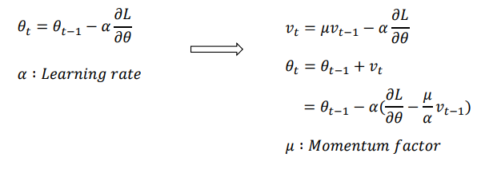

# socar4

## Backward pass

##### 용어

Entropy

- 엔트로피는 `불확실성의 척도`입니다. 정보이론에서의 엔트로피는 `불확실성`을 나타내며, 엔트로피가 높다는 것은 정보가 많고, 확률이 낮다는 것을 의미합니다.

불확실성이라는 것은 **어떤 데이터가 나올지 예측하기 어려운 경우**라고 받아들이는 것이 더 직관적입니다. 예시를 통해 보는 것이 가장 좋습니다.

- 동전을 던졌을때 ==> 확률1/2

$$
H(x)= -\left( \frac{1}{2} log{\frac{1}{2}} + \frac{1}{2} log{\frac{1}{2}} \right)
$$

- 주사위를 던졌을때 ==> 확률1/6

$$
H(x)= - \left( \frac{1}{6} log{\frac{1}{6}} + \frac{1}{6} log{\frac{1}{6}} + \frac{1}{6} log{\frac{1}{6}} + \frac{1}{6} log{\frac{1}{6}} + \frac{1}{6} log{\frac{1}{6}} + \frac{1}{6} log{\frac{1}{6}} \right)
$$

동전의 엔트로피 값은 약 0.693, 주사위의 엔트로피 값은 1.79 정도로 **주사위의 엔트로피 값이 더 높다**는 것을 알 수 있습니다. 즉, 무엇이 나올지 알기 어려운 주사위의 경우가 엔트로피가 더 높은 것이죠.
$$
H(x)=−\sum_{i=1}^{n} p(x_i) log{p(x_i)}
$$

$$
H(x)=\sum_{i=1}^{n} p(x_i) \left( -log{p(x_i)} \right)
$$

- x값이 커지게 되면 -log값은 기하급수적으로 커짐
- 이때 x가 작아진것보다 log x 가 커지는 것이 훨씬 크기 때문에 전체값은 증가하게 된다.

##### 공꺼내기

다른 예시를 통해서 이해를 좀 더 돕겠습니다.

- 전체 공이 100개이다. 공 하나만 빨간색이고, 나머지는 모두 검은색이다.
- 전체 공이 100개이다. 공 50개는 빨간색이고, 나머지는 모두 검은색이다.

위의 경우에는 직관적으로 **첫 번째 사례에서 검은 색이 나올 확률이 높으니 불확실성이 적겠군** 이라고 생각할 수 있습니다. 실제로 엔트로피를 계산하면 후자가 훨씬 크게 나옵니다.

cross entropy
$$
H_p (q)=−\sum_{i=1}^{n} q(x_i) log  {p(x_i)}
$$

- 실제 q값을 모르는 상태에서 p값을 구하는 것 ==> cross entropy
- 따라서 p를 통하여 q값을 예측하는 것

### Back Propagation

- loss function을 통해서 해당 MLP가 얼마나 작동하고 있는지를 표현

  

Partial Derivative

- 편미분은 함수의 변화량을 얘기할 때 어느 방향 변화량인지 이야기를 해주어야 한다.
- 1변수 함수일경우 ==> 그냥 그 변수의 증감
- 다변수일때는 x1 은 증가하는 방향 x2는 감소방향 x3 그대로? 그럼 이런 표현을 다 해주어야 한다.

chain rule

- u의 모든 성분(u1,u2, ...... )으로 거쳐갈 수 있음
- 따라서 모든 성분이 받은 영향을 다 더해줘야함 ==> 다 더해줘야함 ==> 위에 식같이 됨

#### Common Variable

#### pytorch에서 tensor 값

- forward를 진행할 때 backward에서 미분값을 위해서 값을 저장을 시켜줘야한다..
- 이떄 pytorch에서 tensor로 바꾸면 forward를 진행할 때 값을 저장시켜주기때문에 가능
- 따라서 np.array를 사용하지 않고 tensor를 사용하게 되는 것이다.

#### Last layer의 Backward pass

##### softmax나오는 식

- 두번째
  - 모든 loss값을 더한다
- 세번째
  -  cross entropy 식
- 네번쨰
  - softmax는 원핫 인코딩을 마지막에 사용하기 떄문에
  - 하나의 값 뺴고는 나머지는 다 0값으로 나오게 된다.
  - 따라서 하나의 값만 나오고 앞에 실제 값도 1값이기 때문에 이런 식이 나오게 됨
- 다섯번쨰
  - 이것일 확률/ 전체 확률

- 첫번째 항
  - 실제로 

### Optimizer

일반적인 ML

- closed form solution
  - 데이터와 함수, 데이터와 objective(목적) ==> 최적화하는 solution을 바로 구할 수 있는 경우가 많음

DL

- iterative한 방법을 통해서 solution을 구하게 된다.
  - 파라미터의 개수도 너무 많고 이것을 한번에 처리할 수 있는 방법이 없기 때문에
  - 대표적인 예) gradient descent
  - 차원이 3차원정도가 아닌 굉장히 깊은 차원을 다루게 된다
  - 이때 하나의 값이 다른 파라미터에 어떤 영향(하나하나)을 끼치는지는 알수 없음

Parameter space in Deep Learning

- 실제 deep learning 모델의 parameter space는 차원이 굉장히 큼
- globa optimal point를 찾는 것은 불가능
- 따라서 단지 saddle points을 피하고 loca minimal를 찾는데 목표를 함
  - saddle point가 굉장히 많음 (말 안장처럼 생긴 3차원 그래프 모양)
  - 한쪽으로는 감소하고 한쪽으로는 증가하기 때문에 피해야함
- 일반적으로 loca minima들은 비슷한 함수 값을 가짐

#### Stochasitic Gradient Descent SGD

- 본인지점에 가장 빠른 감소방향만 찾음
- 거기에 lr을 곱함

- 따라서 한번에 가운데로 가는 것이 아니라 왔다갔다 하면서 가게 된다.
  

#### Momentum

- gradient가 빠르게 변하는 것을 막으면서 update유도 ( 방향을 확확바꾸지 않는다 ) 

#### AdaGrad

각각의 parameter별로 optimizer가 파라미터를 얼만큼 업데이트를 기억해주는 것

- 전에 많이 업데이트를 해주었다면 다음에는 업데이트를 덜 해주게 된다.
- 위에 알고리즘 같은 경우는 lr값이 일정한 반면 Ada같은 경우에는 그렇지 않는 것이 특징이다.

#### RMSprop

- momentum을 적용하는 이유
  - 최근에 history들만 기억을 하겠다라는 것
  - 너무 먼 과거의 gradient의 효과는 줄이겠다

#### Adam

RMSprop과 momentum의 조합

- b1 = 0.9 , b2 = 0.999를 일반적으로 사용한다. 
  - 따라서 이렇게 되면 초기값에대한 영향을 크게 받게된다.
  - 이를 막기위해서 bias correction이라는 기법을 사용한다.

- bias correction이라는 기법을 통해 각 momentum이 초반에 불안정하게 작동하는 것을 막음

- m은 gradient의 스케일, s는 gradient의 제곱의 스케일을 가진다.
- 분모 ==> 방향을 정해주는 느낌, 값을 정해주는 느낌이 아님

- 실제 adam의 업데이트는 gradient가 방향만을 정해주는 느낌이다(다른 것들과 조금 다름)
  - learning step크기로 거의 업데이트를 진행하게 된다.
  - 따라서 그만큼 learning rate가 더 중요해진다.

#### Learning Rate Scheduling

- parameter가 학습이 진행될 수록 최적 값으로 다가가게 된다.
  - learning rate을 점점 줄여 더 정확한 수렴을 시도하게 된다.
  - adaptive learning rate의 개념이 없는 SGD와 momentum method에서 중요
  - AdaGrad, RMSProp, Adam에서 추가적으로 많이 사용하게 된다.
- Linear decay
- step decay
- exponential decay
- 1/t decay

#### Parameter Initialization

- 초기값 설정 또한 중요

  - Xavier initialization

  - He initialization

## Regularization

#### Norm Regularizations

- L1 norm이나 L2 norm을 포함시켜 loss function 모델 parameter에 대한 restriction하는 것
  - ML에서 많이 사용된다\
  - DL에서는 많이 사용안됨

#### Early Stopping

- validation loss가 증가하는 시점이 온다
  - overfitting이 일어나는 구나
- 성능 향상이 더 이상 나타나지 않을 때 학습을 멈춤
- validation 성능이 한참동안 오르지 않다가 갑자기 오르는 경우가 있어서 주의해야한다.
  - 데이터에 noise가 많아서 그러기도 함
  - 일반적인 분포와 다른 경우가 많아서 이런일이 벌어지게 된디.

#### Ensemble Methods

- deep learning 모델들은 다양한 hyper-parameter를 조절할 뿐만 아니라 다양한 이유에 의해 randomness가 포함
  - 이로인해 같은 데이터로 학습을 진행하여도 모두 다른 모델이 학습 ==> 성능에 도움을 줌
  - 일반적으로 2% 정도 성능 향상을 기대

- 성능을 최대한 끌어내야할 상황에서는 항상 사용하는 기법이다.

#### dropout

- batch normalization을 사용하면서 drop out을 잘 사용하지 않는다.
- 앙상블 효과를 내기 위해서 사용한다.
  - 딥러닝같은 경우에는 모델을 각각 학습시키기에는 시간이 너무 많이 들기 때문이다.
- 역수로 해서 output을 키워주는 것이 일반적이다 왜냐하면 절반만(p=0.5)학습하는것이기 때문

## Batch Normalization(알아보기)

- 여러번 학습해도 비슷한 성능이 나오게 보장해주는 척도
- 학습속도에 굉장히 많은 영향을 준 알고리즘
- 보통 activation function이 적용되기 전에 사용

