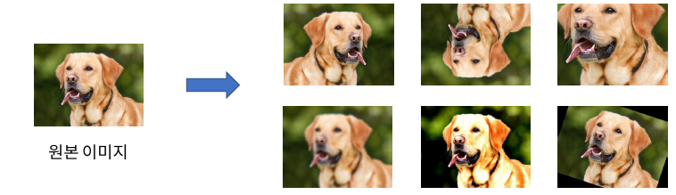
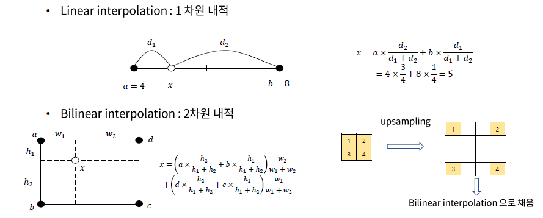

# socar7

중점을 둬야 할 점

- deep learning engineers가 단순히 숫자만 바꾸는 것이 아니라 어떤식으로 모델을 다루고 설계하는지에 대해 배워보자

## 1. CNN모델

- imageNet Challenge에서 좋은 성능을 보인 모델들

### 1-1 AlexNet

- gpu를 사용
- ReLU사용
- Data augmentation활용
- drop out도입

Data Augmentation

- 사람은 쉽게 개라는 것을 판별할 수 있지만 픽셀값이 굉장히 달라질 수 있게 된다.
- 조심해야하는 부분
  - 6을 회전시켜 9처럼 보이게 만들고 이 label을 6이라고 주게 된다면 오히려 역효과가 날 수 있다 따라서 이런 부분에 대해서는 조심해 주어야한다.

### 1-2 VGGNet

- layer 총 19개
- 144M parameters
- CNN을 많이 쌓으니깐 성능이 좋아짐
- Conv filter 3x3

Conv filter 3x3만 사용한 이유??

- 많은 conv layer를 쌓을 때 이득이 있기 때문이다
  - parameters 수 측면에서 이득
    - 
    - 위 :
      -  3x3을 두번 통과한 모습
      - 마지막 한칸에 receptive field는 5x5짜리(첫번째에 노랑색 부분까지)가 한칸으로 압축되어 있음
      - 파라미터 수 : c x c x 3 x 3 x 2 => 18c^2
    - 아래 : 
      - 5x5를 한번 통과한 모습
      - 마지막도 똑같이 5x5가 한칸으로 압축되어 있음
      - 파라미터 수 : c x c x 5 x 5 x 2 => 25c^2
    - paremeter 수가 많으면??
      - overfitting의 위험
      - 연산 시간 증가
      - 어차피 layers를 많이 쌓을 것이기 때문에 3x3으로 많이 쌓아서 연산을 줄이겠다는 전략
  - activation을 더 많이 넣을 수 있음
    - nonlinarity activation는 input-ouput mapping에서 표현력을 높이는 역할을 하게 된다.
    - 따라서 activation을 더 많이 줌으로써 표현력을 늘리는 역할을 할 수 있다고 볼 수 있다.
  - 기본적으로 3x3 conv, stride = 1, padding = 1
    - 이렇게 하면 layer 크기를 똑같이 맞출 수 있음
    - 기본형태

### 1-3 ResNet

무작정 conv layer를 많이 쌓는다고 성능이 향상되지 않음

- skip connection이용
- 152layers 1001layer까지 확장

- 20layer 짜리가 50layer보다 성능이 좋음
  - 이유
  - gradinent vanishing or exploding현상 때문
  - exploding : 기울기가 비정상적으로 커짐으로써 발산해 버리는 현상

- layer를 많이 쌓으면서 발생하는 문제들이었다 (vanishing or exploding)
  - 바로 이전 layer들로 부터만 입력값을 받게 된다.
  - 종속적인 layer 간의 연결이 너무 길어지게 되면서 발생하는 문제들
  - 따라서 이런 문제를 해결하기 위해서 layer들 간의 skip connection이라는 것을 만들었다.

##### Residual Block

layer들이 deep해지면 학습이 잘 안되었던 이유 => 이전 layer들에게서만 입력을 받았었기 때문이다. 

-  중간에 layer를 skip하게 된다 (skip connection)

- 통계학 : input 값 - ouput값 ==> residual이라고 한다. 

- H(x) = F(x) + x 
  - x : 입력값
  -  H(x) : 출력값
  - H(x) - x = F(x) ==> residual
  - 실제로 학습시켜야 할 부분 = F(x)

어떻게 학습에 도움이 될까?? = identity function

identity function : input output이 같은 함수 

H(x) 값이 identity function이었다?

- 즉 입력값이 x이고 output값도 x값이다. ==> 그렇게 만들기 위해선?

- F(x)를 0으로 만들어버리게 된다면? ==> 목표를 달성하게 된다. 
- 의미 : 즉 skip connection => 이전 layer의 영향 없이 그 전에 값을 그대로 가져올 수 있다라는 뜻이다. (그림은 직관적인 이해 , 식: 어떻게 영향을 안받게 하도록 식을 구현 했는지)

- 단순히 한단계 전만 skip하는 것이 아니라 더 전의 layer를 skip할 수 있다는 것을 보여준 그림이다.

##### bottlenet block

1x1conv를 활용해서 학습 parameter수와 연산량을 줄이는 구조 (주로 Resnet 50이상의 큰 모델에서 사용)

**1x1conv의 의미**

- spatial한 정보를 유지

- channel의 개수를 늘리거나 줄이는데에 사용하게 된다. (데이터 차원 압축같은 느낌)

1. 1x1로 256-d => 64-d로 차원을 축소
2. 3x3 conv를 진행함
3. 1x1로 64-d => 256-d로 차원 확장

- 의미
  - 3x3 conv는 계산량이 많음 => spatial한 정보(크기, 공간)는 차원을 축소해서 얻음
  - 하지만 평소에는 큰 채널수를 이용해서 표현력을 늘리겠다는 것
    - 채널수가 많다? => 차원이 크다? => 표현력이 크다(다양한 특징과 정보를 가지고 있을 것이기 때문)

- parameter 수 비교
  - 2×(𝑐×𝑐×3×3)=18c^2 (일반적)
  - (4𝑐×𝑐×1×1)+(𝑐×𝑐×3×3)+(𝑐×4𝑐×1×1)=17c^2 (bottlenet 사용)
  - parameter 수도 더 낮게 나오게 된다

CNN의 발전 특징들

- 어떻게 더 많은 layer들을 쌓아서 인공신경망의 힘을 끌어낼까?

  

## Object Detection

- pretrained 된 CNN을 backbone network로 주로 사용함
  - tesk에 finetuning을 해서 사용하기도 함 => tansfer learning

Faster RCNN

- Fast RCNN = 2.3초 중에서 2가 selective search라는 점을 알게 되었음
- 따라서 

## Autoencode, upsampling

#### Semantic Segmentation

- 모든 pixel에 대한 classification
- pixel개수 만큼 cnn돌리면 너무 비효율적
- 따라서 한번에 여러 pixel에 대한 결과를 얻을 수 있으면 좋겠음 
  ==> encoder - decoder

#### encoder - decoder

- encoder (cnn같이 특징을 뽑아내는 역할)
  - : feature의 크기를 줄이는 역할
  - 입력데이터에서 의미있는 feature를 추출하는 네트워크
- decoder
  - 주로 feature의 크기를 늘리는 역할
  - feature로부터 원하는 결과 값을 생성하는 네트워크
  - latent feature을 가지고 이미지 크기의 output을 만들어 버린다면??
    - 한번에 segmentation을 만들수 있지 않을까? 하는 아이디어
- latent feature
  - encoder에 의해 압축된 입력 데이터의 feature

### Autoencoder

- 입출력이 같은 구조를 가진 인공 신경망

Autoencoder의 학습

- encoder에서 이미지의 적절한 feature를 뽑아냄
- 그 feature에서 다시 원본 이미지를 복원해낸다.
- 학습시키는 label은 따로 주어지는것이 아님 
  - 입력이미지 그 자체를 타겟으로 사용하게 된다.
  - ouput이미지와 원본이미지간의 차이를 loss function을 이용해서 학습시키게 되는 것

어디에 쓰이게 될까? (pca에 대해 알아보기)

- label이 없이도 입력데이터 feature를 추출할 수 있음
- feature차원 축소 - 중요한 정보만 살리기

#### CNN에서 Decoder의 upsampling하는 방법

- spatial한 정보도 키워주고 channel값도 키워주어야한다.
- 방법
  - 학습 parameter가 없는 경우
    - Bilinear interpolation
  - 학습 parameter가 있는 경우
    - Trnsposed convolution(Deconvolution)

#### Bilinear interpolation

#### Transposed Convolution

- 위 기법과 마찬가지로 spatial한 특징을 유지한다는 특징을 가지고 있음

- convolution하는 것을 거꾸로 하는 느낌
- 정보를 하나의 셀로 축소시키는 것이 아니라 하나의 셀을 늘리는 것임
- output크기 =(𝑑𝑖𝑛−1)×𝑠𝑡𝑟𝑖𝑑𝑒+1−2×𝑝𝑎𝑑+𝑑𝑖𝑙𝑎𝑡𝑖𝑜𝑛×(𝑘−1)
  - 𝑑𝑖𝑙𝑎𝑡𝑖𝑜𝑛??

