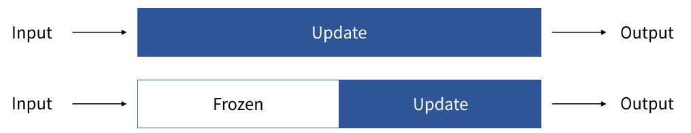
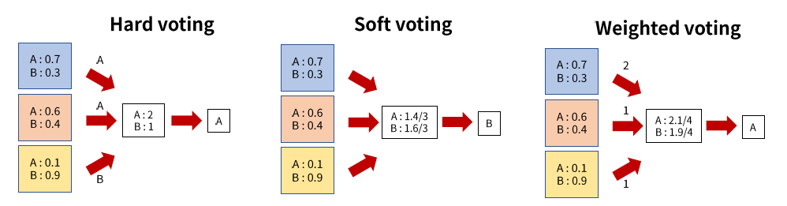
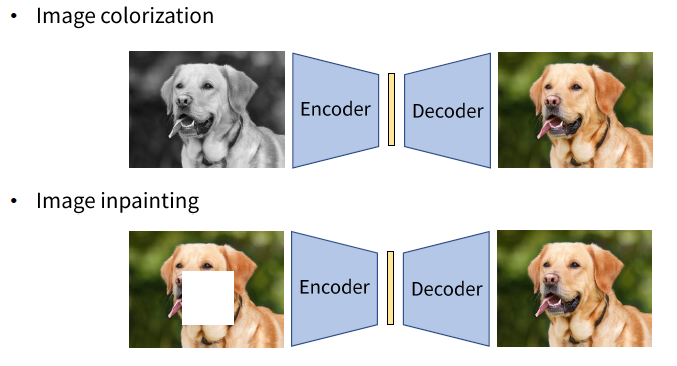
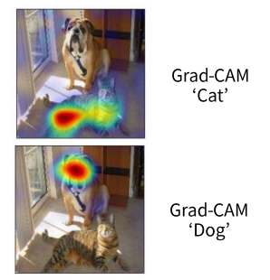
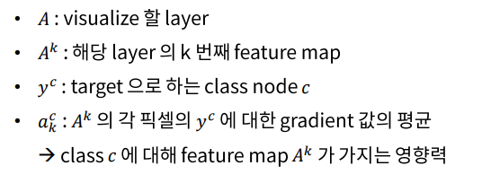
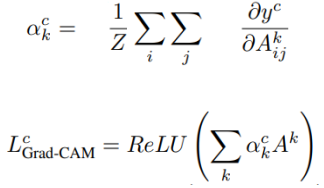
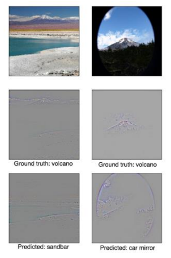
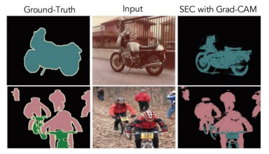

# socar8

## 1. transder learning/Ensemble learning

이미 학습된 딥러닝 모델을 적극적으로 활용해야함

- cost
  - 많은 학습 데이터 셋
  - 많은 계산
  - 오랜 시간

==> 따라서 이미 학습 된 모델을 적극적으로 활용해야한다.

### Fine Tuning

사용

- 현재 사용하는 모델이 기존의 학습된 모델이 다루던 문제와 연관이 있을 때 사용한다.
  -  obejct detection, segmentation ==> backbone으로 CNN모델을 사용
- 다루는 문제가 같음 ==> but ouput이 기존과 다를 경우
  - 같은 classification이지만 다른 class의 개수
- 다루는 문제가 같지만, 데이터 세시의 분초가 기존과 다를 경우
  - 시뮬레이션에서 학습시킨 모델을 현실 데이터에 적용할때
  - 시뮬 (게임속 그래픽 자전거 등등) ==> 현실에서는 그래픽과 조금 다름

 

주의

- 파라미터를 너무 크게 update하게 되면 정보가 소실되게 된다. 
  - 따라서 기존 모델에 학습시키던 learning rate의 1/10정도로 사용

fine-tuning을 적용하는 방법

- 모델 전체를 업데이트
  - 새 데이터 셋이 충분히 많고, 데이터의 분포가 기존과 다를 경우
- 앞부분은 고정, 뒷부분만 업데이트
  - 새 데이터 셋이 작거나 데이터의 분포가 기존과 유사할 경우
  - 고정 시키는 것을 == Freezen 이라고 함
  - 어디까지 Freezen 할지는 그때마다 다르게 됨 (그럼 어떤 기준으로 정해야 할까?)
    - 어디까지 freezen할지 ==> 엔지니어의 역량
  - ex) CNN conv layer부분은 freeze ==> fc layer부분만 update 등등

### Ensemble Method

모델들의 예측을 합지는 방법 ==> 성능이 약간? 더 나아지게 된다. ==> 약간의 성능을 올리는 것이 필요할때 사용하게 된다.

- Hard voting

  - 각각의 예측에서 가장 높은 class를 뽑아냄

  - 즉 각각 voting을 하고 다수결로 결과를 도출해 내게 됨

    

- Soft voting

  - 각각의 예측에서 확률 값을 합하는 방법

  - 즉 A의 확률 ==> 0.7+0.6+0.1 / 3 이런식으로 확률을 계산하게 된다.

    

- Weighted voting

  - 각 모델별로 가중치를 주는 것이다.
  - ex) A ==> 0.7*2 + 0.6*1 + 0.1*1 = 2.1/4 이런식으로 가중치를 포함한 확률계산을 하게 된다.
  - 보통은 정확도가 높은 모델에 가중치를 많이 주게 된다.

- 가중치 또한 학습해서 구할 수 있음
  - 모델 ouput들을 모아서 fc layer에 통과시킴
  - 각 모델들을 freeze하고  fc layer만 업데이트 하면 됨

모델의 종류

- 같은 모델을 여러개 사용 하는 경우
  -  AlexNet1,  AlexNet2,  AlexNet3 인런식으로 사용
  - 하지만 모델이 같은 것이지 parameter수 등까지 똑같은 것이 아님
  - 인공 신경망의 랜덤성을 활용하는 것이다.
    - 랜덤성이 어디서 생김??
      - parameter들을 random하게 initialize하는게 어떤 값인지에 따라 달라짐
      - 학습시에 batch smaple들이 랜덤한 순서로 들어옴 ==> 업데이트되는 gradient 값 또한 랜덤하게 조금씩 달라지게 된다. 

- 같은 문제를 푸는 여러 모델을 사용
  - AlexNet + VGG + ResNet 이런식으로 다른 모델들을 모아서 사용하게 된다. 

## Self-supervised Learning

label이 없는 데이터에 대해 스스로 supervision을 줘서 supervised learning처럼 학습하는 방법

pretask? task? supercvision? downstream task?

#### 과정

- 사용자가 직접 만든 task인 pretext task를 정의
- label이 없는 데이터를 변형 ==> pretask를 학습할 수 있는 sueprvision을 생성
  - supervision : input과 label짝을 만들어주는 것
  - 약간의 processing으로 supervision을 만들수 있도록 pretext task를 정의
- 생성된 supervision으로 pretext task에 대해 학습
- 학습된 모델을 downstream task로 trasder learning

#### self supervised learning의 예시

#### 1. autoencoder 

**pretext task : Denoising**

- 원본이미지를 흐리게 만드는 등 noising이 낀 상태의 사진으로 처리를 하는 것

**supervision**

- input과 label(target)짝을 만들어주는 것

- noisy(input)한 이미지와 원본이미지(label)

#### 2. Exemplar

- seed image가 존재 => 다양한 방법으로 변형시킴 ==> crop, color변형, rotation 등등

- 변형된 이미지를 input으로 넣음
- 그 이미지들이 seed이미지에서 온게 맞는지 판별해 내는 모델

#### 3.relative patch location

- 기준이 되는 하나의 이미지 존재 ( 파랑색 )
- 옆에 빨강색 점선 이미지가 어느 위치에 존재하는지 알아 맞추는 것

#### self-supervised learning을 이용한 Transfer Learning 

이렇게 학습된 모델을 어디서 사용하게 될까?

- 이들은 transfer learning으로 써먹기 위해서 이러한 모델을 만드는 것
  -  transfer learning :
    - pretrained된 모델을 써먹는 것
    - self supervised learning을 통해서 학습시킨 모델 ==> pretrained network로 사용
  - downstream task로써 사용
    - what is downstream task??
      - feature를 통해서 구체적으로 풀고 싶은 task
      - obeject detection, segmentation과 같은 같이 구체적으로 문제를 푸는 것
- Pretext task를 학습하면서 데이터에서 유의미한 feature들을 뽑을 수 있게 되었다고 생각
  - ex) autoencoder같은 경우 ==> latent feature가 중요한 feature로 뽑히게 된다. 

진짜로 좋은 feature extractor가 됐는지 어떻게 확인??

- self-supervised로 pretrained ==> freeze시킴 ==> label이 있는 데이터에 대해 학습하여 성능을 측정

- 만약 해당 self-supervised learning이 성공적으로 feature를 뽑아내도록 학습했나면??
- 그렇다면 실제로 label이 없는 데이터에 대해서도 같은 방식으로 그렇게 feature extractor로 가능 ==> 적은 양의 데이터를 통해서 추가적인 학습을 통해서 의미있게 사용이 가능하다.

## Grad-CAM

CNN 딥러닝 모델의 예측 설명

예측을 해석해야하는 이유는??

==> 안정성 문제,  ==> 하지만 아직 명쾌하게 예측하는 해석방법은 없다

#### Grad-CAM

Gradient-weighted class Activation Mapping ( Grad-CAM )

인공신경망을 시각적으로 설명하는 기법

- node에 대해서 영향을 많이 준 feature들이 activation된 위치에 표시함

원리

gradient

 : class C node에 대해서 feature map A^k의 픽셀이 가지는 영향력을 뜻함

a_k^c 

: 평균 값은 ==> 그 feature map에서 찾고자 하는 feature가 class node와 얼마나 연관이 있나

  그 영향력을 나타내는 값이라고 해석됨

- 각 픽셀에서 그 위치의 feature map들의 activation 값들을 a_k^c 라는 가중치를 주어서 더한 값이다
- 즉 픽셀의 위치에서 c에 대해서 영향력을 많이 가지는 feature의 값이 클수록 (activate 됐을수록) 해당 위치의 grad-cam값이 커지는 구조

==> 위 사진 처럼 개 얼굴이 나타나는 feature들이 있었을 것임 ==> 그래서 개 얼굴에 많이 표시가 나게 되었음

응용

- 학습된 CNN의 layer에 따른 feature 분석
- CNN의 예측이 틀린 원인 분석
  - 위 사진을 보면 GT : volcano ==> 하지만 답이 틀림
  - 답은 틀렸지만 그럴싸한 오답을 내고 있음
  - 따라서 이런 분석을 통해서 이 모델이 학습이 안되는 것인지 아니면 제대로 되고 있지만 틀릴수 밖에 없었는지?(그럴싸한 오답을 내고 있는지)를 사람이 판단 할 수 있다.
- high level로 갈수록 더 좋은 activation이 가능해진다.

데이터 셋의 bias 파악

- 처음 grad-cam ==> 예측을 제대로 하지 못함 ==> 이유? ==> activation들이 여자인지 아닌지 즉 얼굴이나 머리길이 등을 통해서 학습하고 있었음
- 문제? ==> 의사 data중에서 남여 비율이 달랐음 ==> 비율을 맞춰주고 다시 train함 ==> 잘 예측 함

- Weakly-supervised locallization/ segmentation에 활용
  - Grad-CAM을 함 ==> activation된 부분을 spatial한 정보들을 알게 됨 ==> 그것을 이용해서 sementic segmentation을 함 ==> expensive한 segmentation label 대신에 classification label만으로도 segmentation을 할 수 있음

