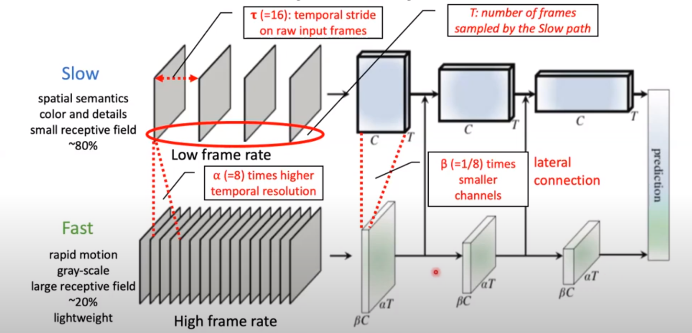
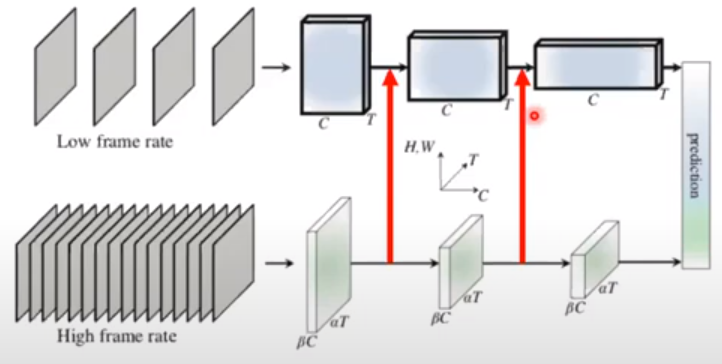
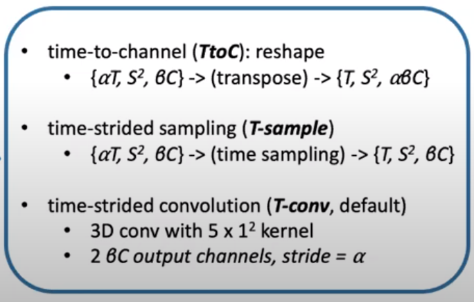
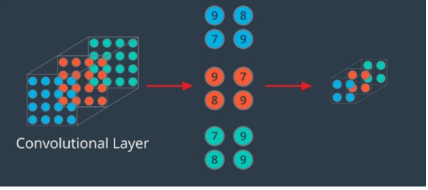

# SlowFast 리뷰

https://github.com/facebookresearch/SlowFast

slowpath와 fast path를 각각 다른 시점으로 봐야한다.

slow : 80%

fast : 20%

정도를 차지한다.


**Slow pathway**

- Low frame rate

- Capturing spatial semantics : 공간에 대한 정보를 가지고 있음
  
  - color정보, 디테일한 정보들


**Fast pathway**

- high frame rate

- Capturing motion information : 움직임에 대한 정보를 가지고 있음
  
  - 채널수를 줄이게 된다.
  
  - 흑백정보만 있으면 된다.
  
  - 이유 : 디테일한 정보는 slow path에서 얻기 때문


slow path

- 뒷 쪽 부분 : resnet임

- 앞 쪽 부분 : 프레임을 띄엄띄엄 넣어주게 된다. ( 많은 프레임을 넣지 않음 )


fast path

- 뒷 쪽 부분 : 유사한 resnet 50를 사용함 => 하지만 실제 디테일은 많이 다름

- 앞 쪽 부분 : 조밀하게 많은 프레임을 넣게 됨
  
  - 당연히 motion을 인식하는 것이기 때문에 많은 프레임이 요구된다.

- 하지만 디테일한 부분이 필요하지 않음
  
  - 따라서 많은 채널이 필요하지 않음 ==> 많은 정보가 있지 않아도 된다
  
  - 또한 gray scale로 했을떄 computation을 줄일 수 있음


#### 두 네트워크간의 연결



- fast path에서 slow path쪽으로 정보를 전달해준다.
  
  - compaction 하는 형식으로 정보를 전달해준다.

- hyperparameter
  
  - **tau**
    
    - slow path에서 띄엄띄엄 있는 간격을 나타냄
  
  - **T** : Number of frames smapled bu the slow path
    
    - slow path에서 전체 길이
  
  - **alpha**
    
    - times higher temporal resolution
    
    - 즉 알파 배 만큼 frame rate이 높다라는 것을 표현하는 것
    
    - 예를 들어 알파가 8이고 slow path에서 4장의 frame이 들어갔다면 fast path같은 경우에는 32장의 frame이 들어가게 된다.
  
  - **beta**
    
    - times smaller channels
    
    - beta값이 작으면 channels 수가 작아지게 되고 계산량이 작아지게 된다.
      
      - 전체에서 20%정도의 계산량을 차지한다.


#### 구현


slow path나 fast path 둘다 resnet 50구조를 띄고 있다

- conv

- pooling

- residual block이 4개가 있음

오렌지 색 : 채널 수가 감소한 것을 보여주는 부분

초록 색  : frame수가 증가한 모습을 보여주는 부분


Dimension : { T S^2, C }

stride : { temporal, spatial^2 }

backbone : ResNet-50


#### Lateral Connections



- 중간중간에 연결을 하면 accuracy가 높아진다는 것을 알게 되었음

- 하지만 모든 부분에 넣어줄 수 없음

- 언제 연결?
  
  - residual block이 끝나는 지점마다 연결을 해주게 된다.

- Unidirectional(한쪽 방향으로만)로 연결해주게 된다.
  
  - bidirection(양방향)과 별차이가 없었다고 한다.


- Global average pooling on each pathway output
  
  - 각각의 path는 resnet이 끝나게 되면 Global average pooling 진행
  
  - concatenation : 데이터 결합
  
  - FC classifier layer


- feature shape
  
  - Slow path {T(시간), S^2(spatial도메인) , C(채널)}
  
  - fast path {aT(시간), S^2(spatial도메인) , bC(채널)}
    
    - T를 a의 곱만큼 늘리고 b만큼 줄이게 된다
    
    - 이때 slow path와 fast path의 shape이 맞지 않게 되고 concatenation을 바로 해줄 수가 없음
    
    - 따라서 shape을 바꿔주어야 함


###### shape 변경 3가지 방법

1. transpose를 잘해서 값을 맞춰주는 경우

2. T의 알파만큼 띄어져 있는 값들을 따로 뽑아내어서 값을 맞춘 뒤 결합

3. 3D conv를 간단하게 하는 경우
   
   - stride를 알바간격으로 3D conv를 진행
   
   - 결과로 나온 채널수가 있으면 그것을 slow path에 붙여주게 된다.




방법

- image Net을 미리 train할 필요가 없음

- 바로 Kinetics를 사용하면 됨

- not local network


###### Global average pooling이란?

max pooling일 경우




Global average pooling일 경우


- 목적
  
  -  **GAP의 목적은 feature를 1차원 벡터로 만들기 위함**

- 방법
  
  - 같은 채널 (같은 색)의 feature들을 모두 평균을 낸 다음에 채널의 갯수(색의 개수) 만큼 원소를 가지는 벡터로 만든다
  
  - 이런 방식으로 GAP는 (height, width, chnnel)  형태의 feature => (channel)형태로 간단하게 만들어 버린다.

- 사용하는 이유
  
  - CNN + FC(Fully Connected) Layer에서 classifier인 **FC Layer를 없애기 위한 방법으로 도입**
  
  - FC layer는 마지막 feature와 matrix곱을 하여 feature 전체를 연산의 대상으로 삼는다. 즉, feature가 이미지 전체를 함축하고 있다고 가정하면 이미지 전체를 보고 출력을 만들어 내는 것
    
    - 이 같은 경우에 파라미터의 수가 증가
    
    - feature o전체를 matrix연산 => 위치에 대한 정보가 사라짐
    
    - 사이즈가 고정되어야 함
  
  - GAP는 어떤 크기의 feature 라도 같은 채널의 값들을 하나의 평균값으로 대체
    
    - 어떤 사이즈의 입력이 들어와도 상관없음
    
    - (H,W,C) => (1,1,C) 크기로 줄어드는 연산임, 즉 파라미터가 추가되지 않음으로 학습 측면에서도 유리함
    
    - FC layer만틈 파라미터의 개수가 폭발적으로 증가하지 않기때문에 overfitting 측면에서 유리하다
    
    - 따라서 GAP 연산 결과 1차원 벡터가 됨 => 최종 출력에 FC layer대신 사용할 수 있다.

```python
import torch
import torch.nn.functional as F

x = torch.randn((256, 96, 128, 128)).cuda()

F.avg_pool2d(x, x.size()[2:])
F.adaptive_avg_pool2d(x, (1, 1))
torch.mean(x.view(x.size(0), x.size(1), -1), dim=2)
```


결과 - Kinetics-600


