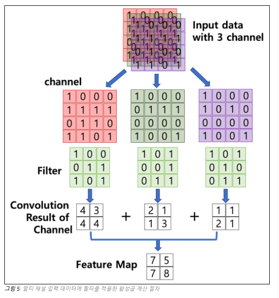
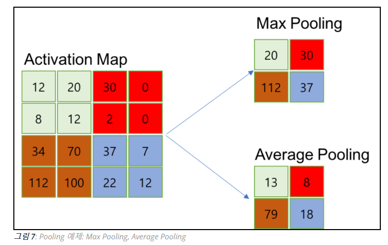

# Terms for DL

- 논문 읽는 법

### fine tuning

언제 사용함?

- 승용차를 인식하는데 학습되어 있는 것들을 트럭을 인식할때 등등에서 사용한다.
- 더 많은 시간들을 save 할 수 있다.

어떻게 사용함?

1. 비슷한 모델 importing하기2
   
2. out layer 제거하기 (이전 모델에 대하여 굉장히 specific 하기 때문에)
   (전모델 : 차인지 아닌지// 이번모델: 트럭인지 아닌지가 궁금 그래서 삭제)
3. 선택
   모델 추가 or 제거 해줘야할 수도 있음
   필요한 데이터에 따라서 추가 삭제 해줘야할 때 
   ===> freezing layer 을 해줘야함 ==> layer얼려서 수정 안하게 함
   weights를 새로운 모델을 새로운 데이터로 트레이닝 할때 update하지 않음
4. 새로운 데이터로 모델을 training하는 것

- 인풋 레이어들은 수정할 필요가 있음 ==> 새로운 데이터로 트레이닝
- weights는 가만히 냅둠

### network?

- 디바이스를 서로 연결시켜주는 것
- 컴퓨터 네트워크: 정보와 하드웨어 데이터 소프트웨어 등을 서로 공유, 의사소통하게끔 연결하는 그룹

### superpixel?

- 비슷한 벨류들 끼리 그룹화를 시킴으로써 복잡도를 줄이는 것
- 이유: 분석을 더욱 간단하게 하기 위해서

### downstream in networking

- 네트워크 서비스 제공자에서 고객에서 보내는 데이터를 의미한다
- 예를 들어 다운로드와 같은 것을 의미한다

### fully convolutional network(FCN)

### enumerate

- 열거하다

### scale of an image?

- 이미지를 resizing하는 것
- When scaling a raster graphics image, a new image with a higher or lower number of pixels must be generated. In the case of decreasing the pixel number (scaling down) this usually results in a visible quality loss.
- 픽셀수를 낮출 경우에는 퀄리티가 안좋아진다

###  raster:

- 컴퓨터에서 화상 정보를 표현하는 한 가지 방법. 
- 이미지를 2차원 배열 형태의 픽셀로 구성하고, 이 점들의 모습을 조합, 일정한 간격의 픽셀들로 하나의 화상 정보를 표현하는 것이다.
- 즉 한 줄에서 연속된 픽셀들의 집합을 래스터라고 한다

#### initialize

- 변수에 대한 프로그램 중에서 그것을 사용하기 위해서 초기값을 세팅하는 것
- 

### CNN

- 구성:
  - conv layer => pooling => conv layer2 => pooling 을 겹겹히 쌓는 구조이다.
  - conv layer :  (필수)
    - 입력데이터에 필터를 적용
    - 활성화 함수를 적용
  - pooling: (선택)
  - Fully Connected layer:
    - cnn 마지막부분에 이미지 분류를 위한 Fully Connected레이어가 추가
  - Flatten layer
    - 이미지의 특징을 추출하는 부분과 이미지를 분류하는 부분사이(classification)에 이미지형태의 데이터를 배열 형태로 만드는 레이어가 추가

#### 1.1 합성곱, Convolution

이렇게 추출해 오는 것을 합성곱이라고 한다.

이렇게 추출해 온 결과 = Feature map이라고 불린다.

#### 1.2 필터(Filter) = Kernel & Stride

- 커널 사이즈르 정해서 feature map을 만들게 된다
- stride는 몇칸씩 이동하는지를 말하게 된다.

- 채널이 여러개인 경우
  - 각 채널을 순회하면서 conv를 계산하게 된다. ==> feature map을 만듬
  - 각채널의 conv map을 합산 ==> 1개의 feature map을 만들게 된다.
- Activation map
  -  Feature map행렬에 활성함수를 적용한 결과이다. 
  - layer의 최종 출력 결과는 Activation map이다.

#### 1.3 Pooling layer

- Actvation map이 나온 뒤에 pooling을 진행하게 된다.
- Pooling 레이어를 통과하면 행렬의 크기 감소
- Pooling 레이어를 통해서 채널 수 변경 없음

### Translation-Invariant VS Translation Equivariance

Translation Equivariance

- 인풋에 변화가 있으면 아웃풋에도 변화생긴단 소리임
  - 즉 위치가 이동을 하면 계산 결과의 위치도 같이 변함
  - 이미지 내에 물체의 위치가 변해도 변화한 곳에 같은 값을 내게 된다.
  - 이 아이는 위치가 변해도 똑같은 값을 보여주는 것
- if f(g(x)) = g(f(x))  ==> 이해가 더 필요함

- 특성
  - the concept of weight sharing을 하면서 특성을 얻을 수 있다

Translation-Invariant

- 인풋에 변화를 줘도 CNN은 여전히 class를 분류할 수 있음
  - 분류를 할 수 있다는 것
- 진행 단계 : conv layer => activation => pooling
- pooling과정에서 max로 진행을 하기때문에 input에 약간의 변화를 주더라도 pooled ouput에 크게 영향을 끼치지 않는다. 
- 특징:
  - 정확한 물체의 location이 요구되지 않음
    - 예를 들어서 너가 모델의 얼굴을 인식할때 눈이 존재하는지 안하는지만 따지면 되지 얼굴에 정확히 어느 위치에 눈이 존재하는지 인식할 필요는 없다는 말임

ex)

max _pooling ==> Translation-Invariant하다

왜냐하면   k x k 필터에서 max값을 뽑아온다

즉  k x k 필터 내에서 값이 변해도 동일한 output을 내기때문이다

어차피 max값을 뽑아낼 것이기 때문에

- input(이미지)에 변화를 주더라도 input이 속해있는 class를 얻어낼수 있다라는 뜻
  - 물체가 이동하더라도 detect할 수 있다.

반면에 이건 여담인데

segementation tasks은 정확한 position을 요구함

data agumentation

- Translation Equivariance랑 Translation-Invariant는 data agumentation이라고 불리는 기술로 사용이 된다

- 데이터 별로 없을 때 rotation, flipping, zooming, translating등등을 해서 샘플을 만들어 내서 데이터를 충분하게 만드는 것이다.

