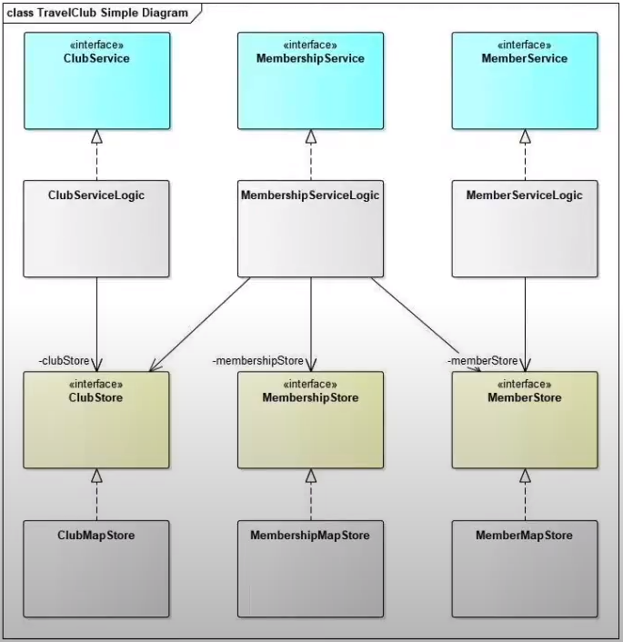
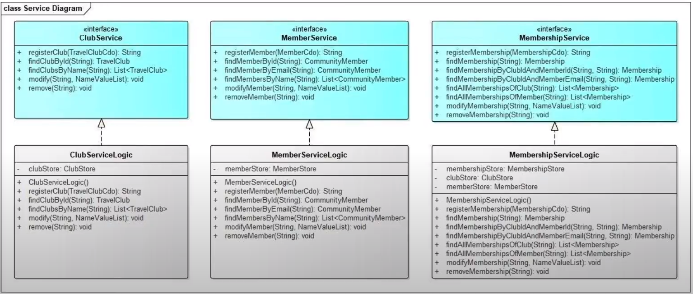
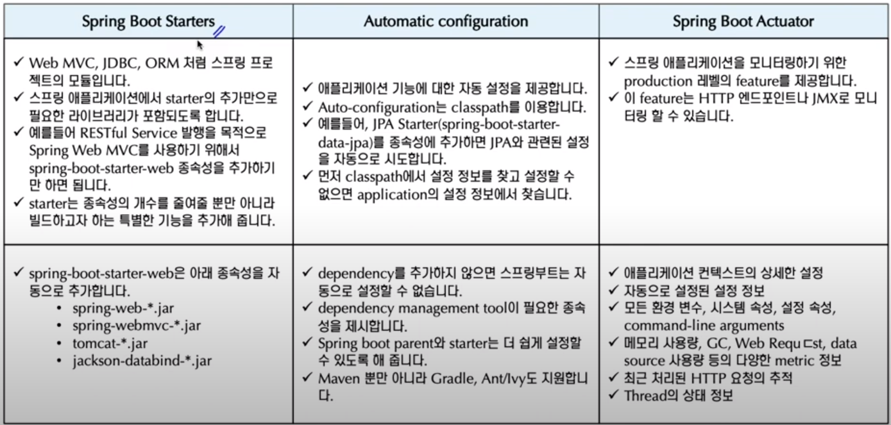

# 나무소리

#### Entities


#### Class Diagram



Service

- Logic

- 실제적인 기능과 관련된 일을 하는 곳

Store

- persistance

- DB에 있는 값들을 불러오거나 저장하는 역할을 가진 클래스의 모임

interface

- Service와 Store를 연결하는 역할

- 직접적으로 Service에서 Store로 접근하지 않는다
  
  - 이유 : store에 변화가 있으면 service에 영향이 많이 끼치기 때문에 직접적으로 연결 하지 않는다.
  
  - 느슨한 관계를 만든다 (타이트 하지 않음)

###### Service Diagram



- interface와 Logic이 존재한다.

##### Store Diagram


- interface와 Map class가 존재

#### Map만들기

- DB에 값이 있는지 등 CRUD를 진행하게 된다.

```java
package io.namoosori.travelclub.spring.store.mapstore;


import io.namoosori.travelclub.spring.aggregate.club.TravelClub;
import io.namoosori.travelclub.spring.store.ClubStore;

import java.util.LinkedHashMap;
import java.util.List;
import java.util.Map;
import java.util.Optional;
import java.util.stream.Collectors;

// interface를 implement하기 위해선 implements를 써주면 된다.
// Art enter를 누르면 자동으로 generate된다. (interface에서 정의한 것들)
public class ClubMapStore implements ClubStore {

    // key값은 String, 저장되는 객체는 TravelClub으로 저장한다는 뜻
    // 생성자 정의
    private Map<String, TravelClub> clubMap;
    private ClubMapStore(){
        this.clubMap = new LinkedHashMap<>();
    }

    // 새로 저장되는 TravelClub의 정보가 들어오게 된다.
    //
    @Override
    public String create(TravelClub club) {
        clubMap.put(club.getId(), club);
        return club.getId();
    }

    @Override
    public TravelClub retrieve(String clubId) {
        return clubMap.get(clubId);
    }
    @Override // collect에 대해서 알아보기
    public List<TravelClub> retrieveByName(String name) {
        return clubMap.values().stream()
                .filter(club -> club.getName().equals(name))
                .collect(Collectors.toList());
    }

    @Override // club에 있는 id값을 불러와서 club으로 바꿔주면 되는 것
    public void update(TravelClub club) {
        System.out.println("club.getId : " + club.getId());
        System.out.println("club : " + club);
        clubMap.put(club.getId(), club);
    }

    @Override
    public void delete(String clubId) {
        clubMap.remove(clubId);
    }

    @Override
    public boolean exists(String clubId) {
//        return clubMap.containsKey(clubId);
        return Optional.ofNullable(clubMap.get(clubId)).isPresent();
    }
}
```

#### Service만들기

- ClubService와 ClubMapStore관계가 필요하다. 

#### Spring core IoC/DI

IoC 객체 제어방식


- ClubServiceLogic(beanA)가 ClubMapStore(beanB)를 사용하기 위해서 사용하는 것

- 장점 : 의존관계가 타이트하지 않는다는 장점을 가지고 있다.

IoC용어

**bean**

- 스프링이 직접 그 생성과 제어를 담당하는 오브젝트만을 bean이라고함

**bean factory**

- bean을 모아둔 class들을 bean factory라고 한다.

**application context**

- bean factory를 확장한 class

**application metadata**

- IoC를 적용하기 위해 사용하는 메타정보

stereotype annotation

| stereotype annotation | description                                                                             |
|:---------------------:| --------------------------------------------------------------------------------------- |
| @ Repository          | Repository 클래스에 사용<br/>DAO(data acess exceoption)자동변환과 같은 AOP의 적용 대상을 선정하기 위해 사용되기도 한다. |
| @Service              | 서비스 계층의 클래스에 사용                                                                         |
| @Controller           | MVC 컨트롤러에 사용                                                                            |
| @Component            | 위의 계층 구분을 적용하기 어려운 일반적인 경우에 사용                                                          |

## Spring Boot

스프링 부트를 적용하지 않았을 경우

- 서버를 구성 => 우리가 만든 web application을 등록하는 형태이다


스프링 부트를 적용했을 경우

- 반대다

- 우리가 만든 application안에 tomcat이 등록되어 있는 형태이다


String Boot가 제공하는 모듈/기능


