# Bootstrap

### CDN(Content Delivery Network)

- 컨텐츠들을 쉽게 가져올 수 있도록 하는 것
- 가까운 서버에서 가져오는 것

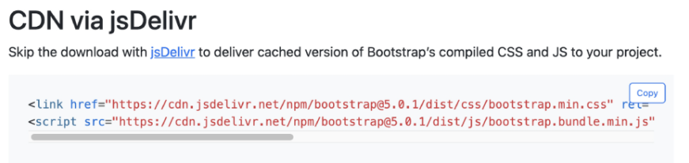


### .mt-1?

- margin-top이다

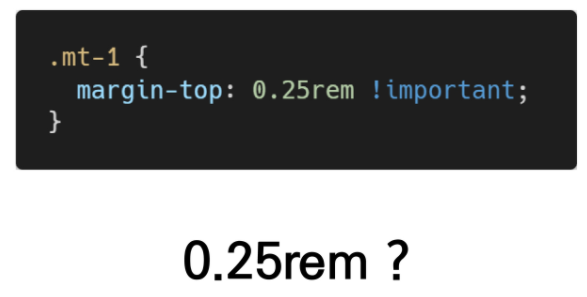

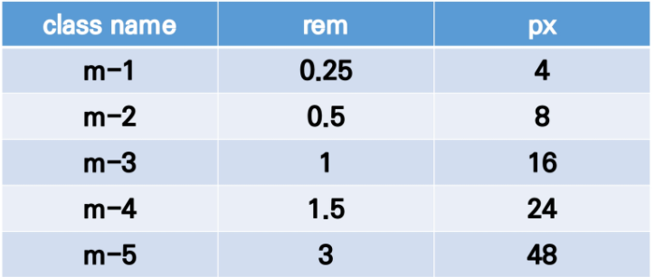


### .mx-0? .mx-auto? .py-0? 

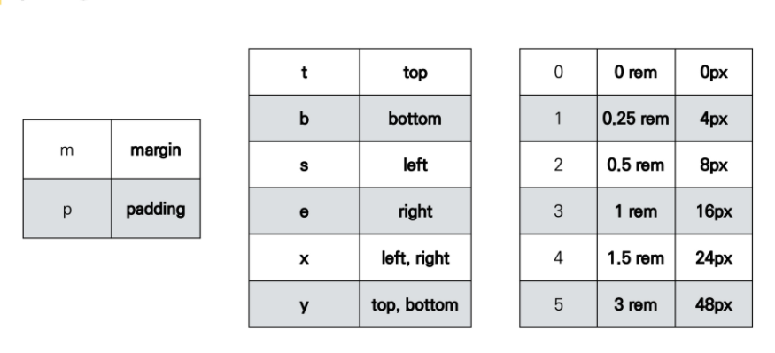

## color

class = "bg-색" : class를 이용해서 넣어준다

배경 : bg - 색

텍스트: text - 색

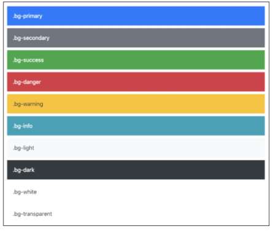


- 인라인으로 바꾸기
  - class에 d-inline이라고 쳐주면 inline으로 변경
- display and Position을 공식문서를 보며 진행하자
  - https://getbootstrap.com/docs/5.1/layout/breakpoints/

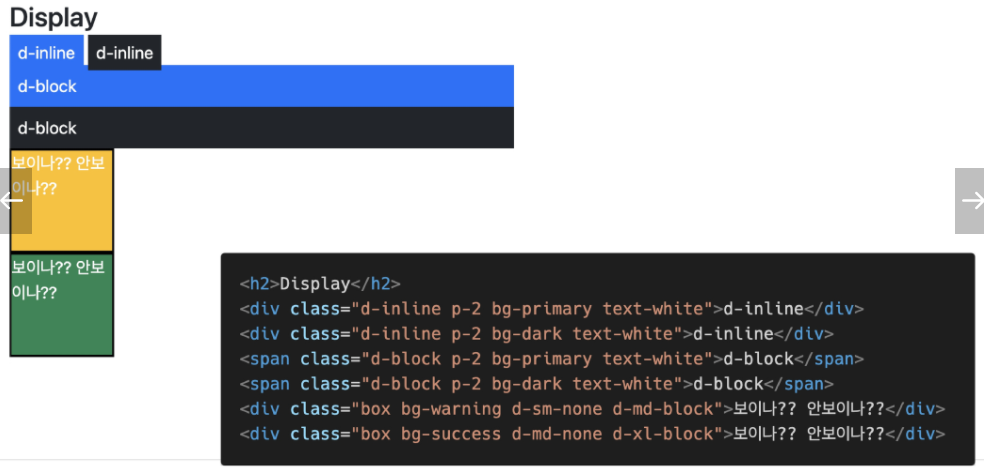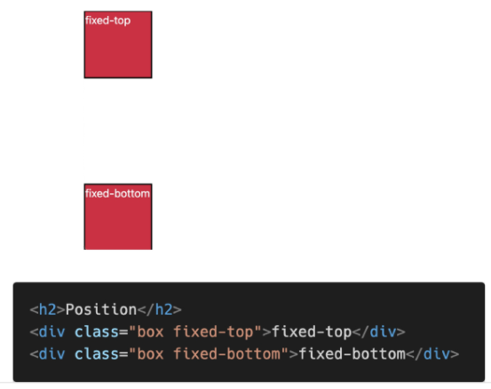


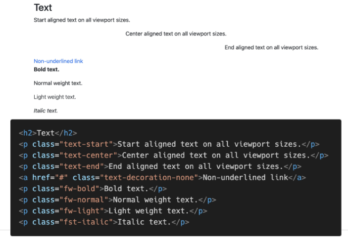


## Grid system(web design)

- column : 실제 컨텐츠를 포함하는 부분
- gutter : 칼럼과 칼럼 사이의 공간

- container: Column들을 담고 있는 공간

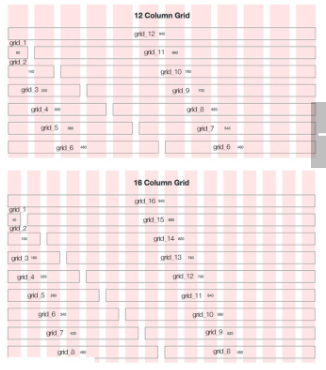

```html
<div class ="row">
    <div class ="col"></div>
</div>

row안에 col을 넣어서 사용
```


### Break Point

이렇게 하면 (row는 컨테이너 안에 들어간다)

- 사이즈들이

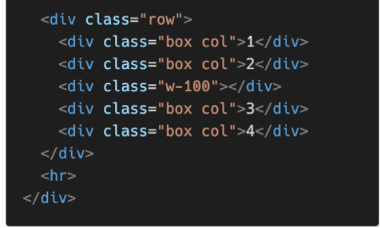

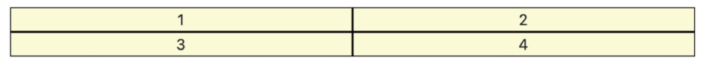

이렇게 된다 ==> 중간에 w-100으로 


##### 전체 개수는 12칸 이다 따라서

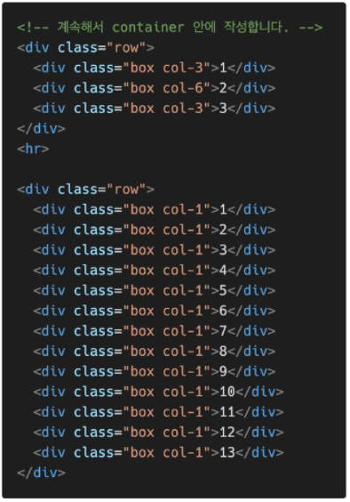

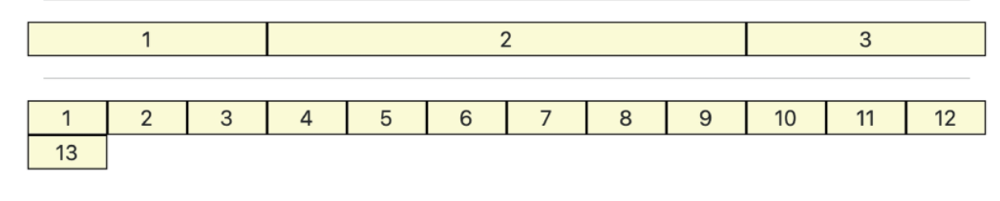

- 3 : 6 : 3
- 1: ..........:1 

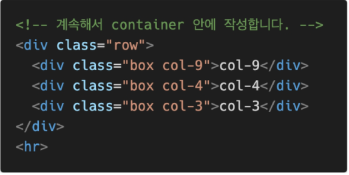


ctrl + alt 방향키 (위아래), multi line selector


### Break Point2

- 가장 작은 2개, 그다음은 3개, 그 다음은 4개 ==> 화면을 줄일때 마다 변함
- ~~ 보다 클 때  이러한 사이즈 를 사용한다

```html
<div class = "box col-6 col-sm-4 col-md-3">1</div>
<div class = "box col-6 col-sm-4 col-md-3">1</div>
<div class = "box col-6 col-sm-4 col-md-3">1</div>
<div class = "box col-6 col-sm-4 col-md-3">1</div>
<div class = "box col-6 col-sm-4 col-md-3">1</div>
<div class = "box col-6 col-sm-4 col-md-3">1</div>
<div class = "box col-6 col-sm-4 col-md-3">1</div>
<div class = "box col-6 col-sm-4 col-md-3">1</div>
<div class = "box col-6 col-sm-4 col-md-3">1</div>
```


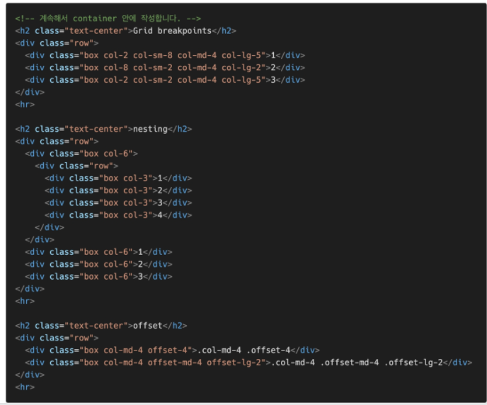

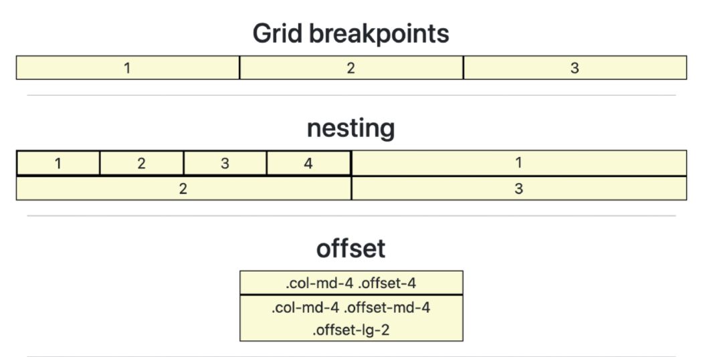

- 오프셋을 쓰면 마진으로 띄운다
- 오프셋도 전체 12중에서 나눠서 쓰는 것이다. 따라서 브레이크 포인트 가능


