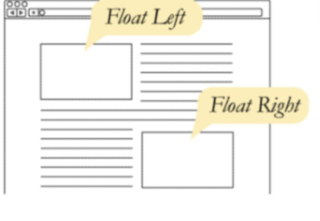
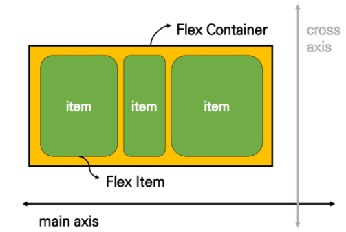
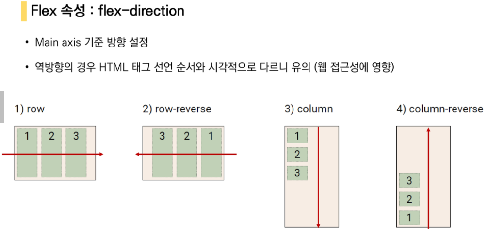
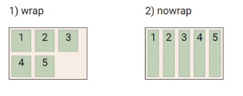
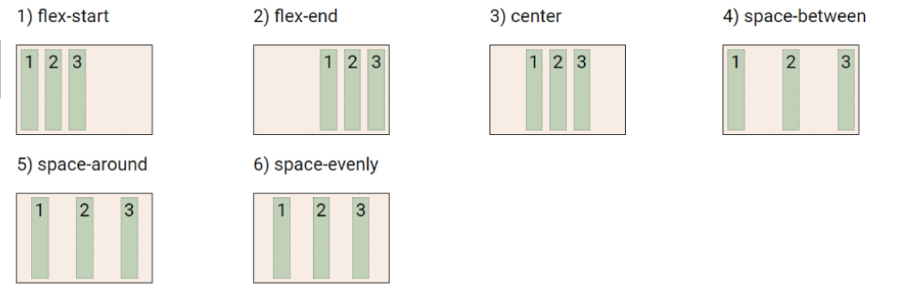
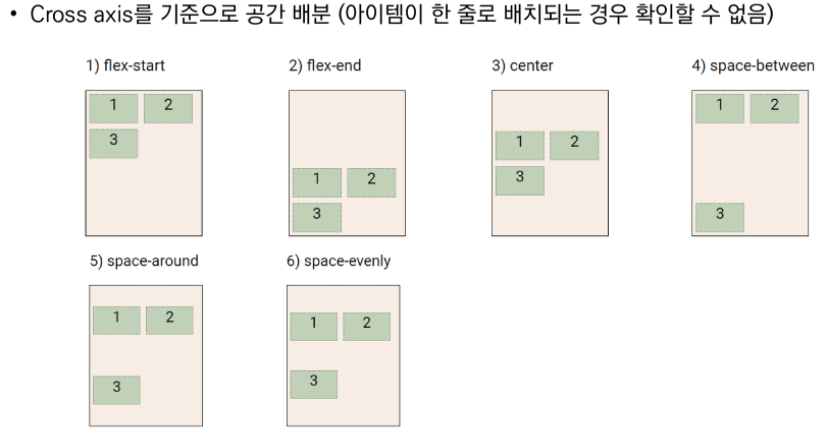
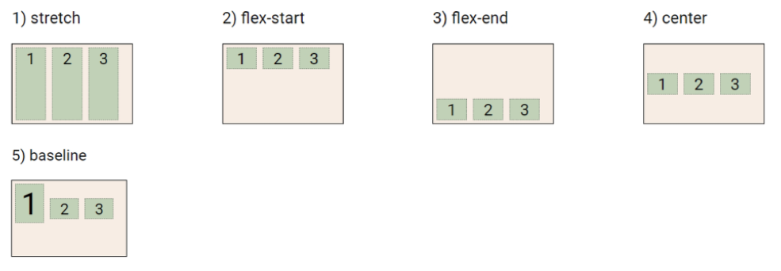
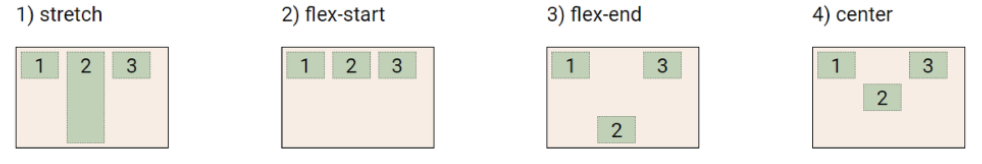
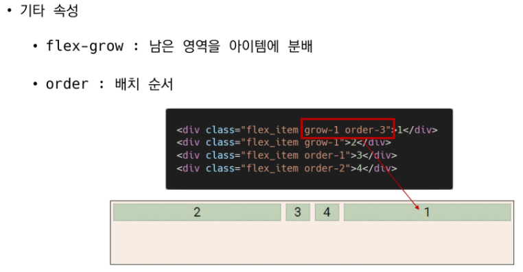
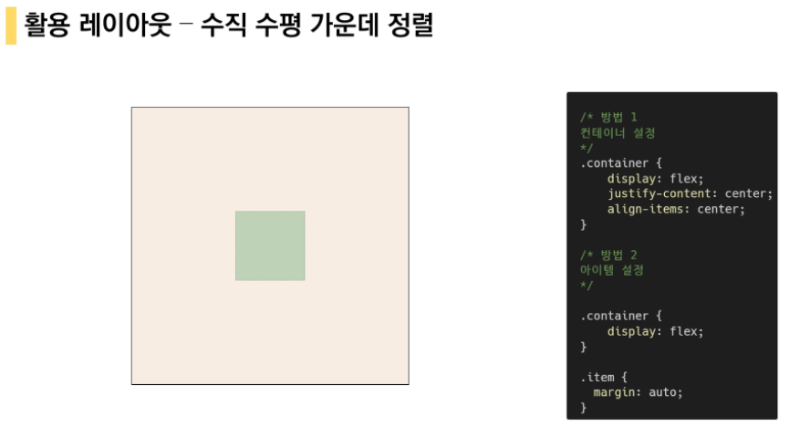

# CSS Layout

## 1. Float

==> 요즘에 잘 사용하지 않는다// 요즘은 flexbox나 grid를 사용한다

- float : 
  - 박스 왼쪽 또는 오른쪽으로 이동 ==> 텍스트 포함 인라인 요수들이 주변을 wrapping하도록 함
  - float를 하게 된면 물체가 위로 뜨게 된다
  - 마진을 조금 주게되면 조금더 편한 모습을 보이게 된다



10rem ==> 160px(root -> 16px)  (아무것도 지정이 안되었을때)

lorem300 이라고 쓰며 ==> 무의미한 글자를 쓰도록 해주고 있다

: 이유는 텍스트의 모양과 모습을 보기 위해서

#### Clearing Float

- Float는 떠있는 것이기 때문에 겹친다
- 이것을 어떻게 해결??

  1. float 요소의 부모로 div를 만든다
  2. 부모에게 .clearfix를 부여한다

- :: after ==> 내 앞에 있는 flaot를 무시하겠어 라는 뜻이다
  ==> 다음 칸으로 넘어가겠다는 뜻이다(다음 라인)

- ```html
  .clearfix::after{
  	content: "";
  	display: block;
  	clear: both;
  }
  <div class="clearfix">
      <div class "box left">box1</div>    
  </div>
  ```

- 이유
  - 부모요소 높이가 0 (하늘에 떠있음) ==> 자식 float
  - box2 공간을 채워준다
  - 따라서 높이를 만들어 준다 ==> clearing


## 2. Flex box

### css Flexible Box Layout

- 축과 컨테이너의 개념을 가지고 있다.
- 1차원 레이아웃 모델이다 (메인 축 하나만 있다)
  ==> 어떤 내부에서 균일하게 배치가 가능하다




- 사용방법
  - display: flex; 를 넣어준다
- 사용이유
  - 이전까지  normal flow를 벗어나는 수단은 Float or Position
  - (수동 값 부여없이 )
    1. 수직정렬
    2. 아이템 너비와 높이 혹은 간격을 동일하게 배치 가능
- 배열을 확인하는 순서 ==> 이 순서대로 확인을 해준다.
  - flex direction 확인
  - flex justify
  - align content
  - algin items
  - align self


### flex-direction(방향)



- 빨강색 줄: main axis

### flex-wrap

- 아이템이 컨테이너를 벗어나는 경우 해당 영역내에 배치되옥 설정
- 즉 기본적으로 컨테이너 영역을 벗어나지 않도록 함
- nowrap같은 경우에는 원래 너비보다 줄어들게 된다
- wrap과 nowrap의 너비는 같게 주어져있음



### justify -content(정렬)



- space-around와 space-evenly의 차이점
  - space-around: 양쪽 각각 여백을 따로씩 준다 -ㅁ-- ㅁ--ㅁ-  
    ==> -  (여백) 이런느낌 
  -  space-evenly: 각각의 간격이 동일하다


### align(크로스 기준 정렬)

#### align-content



- space-between에서는 가운데에 빈공간을 만든다


#### align-items

- 모든 아이템을 cross axis를 기준으로 정렬




#### align-self

- 개별 아이템을 Cross axis기준으로 정렬
- 주의사하이 해당 속성은 컨테이너에 적용하는 것이 아니라 개별 아이템에 적용한다




#### flex--grow

- 남은 공간을 지정한 값에다가 몰아서 주는 것이다
- 계산은 남은 공간에서 (숫자)만큼을 가져간다는 뜻이다
- 즉 2 1 1 주었다고해서 2:1:1의 비율만큼의 크기를 가진는 것이 아니다






### 카드 배치


