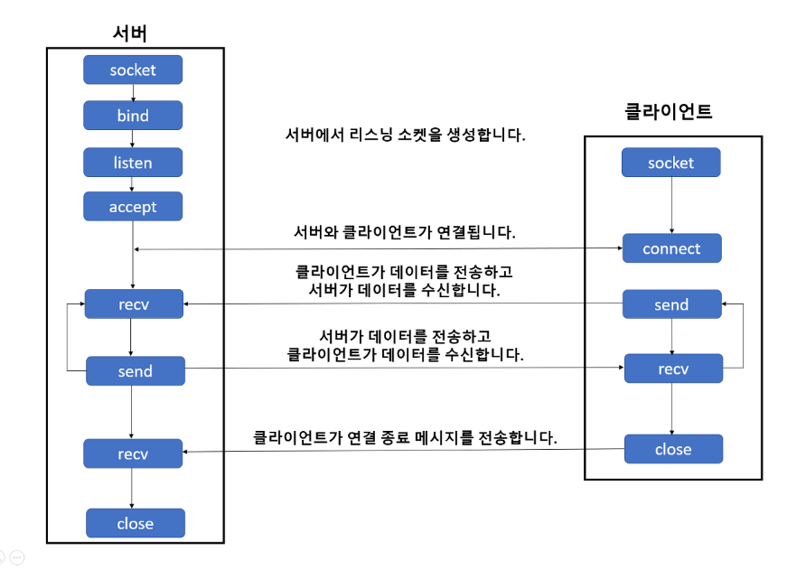

# TCP_socket

TCP

- Transmission Control Protocol

- Python : socket.SOCK_STREAM으로 지정하고 socket.socket함수를 사용하여 소켓 객체를 생성

TCP 서버에서의 기본적인 함수 호출 순서

- socket() 소캣 생성

- bind ( ) : 소켓 주소 할당

- listen ( ) : 연결 요청 대기

- accept ( ): 연결허용

- read/wirte ( ): 데이터 송수신

- close ( ): 연결 종료

TCP 기반 서버, 클라이언트의 함수 호출관계

- socket()

- connect()
  
  - listen상태일때 요청을 하게 된다
  
  - 그때 accept상태가 된다면 서버에서 read/write를 진행
  
  - 그럼 송수신을 연결해주게 된다.

- read()/write()

- close

