# Web_css

## CSS

- CSS: Cascading Style Sheets

- 스타일을 지정하기 위한 언어 => 선택하고, 스타일을 지정한다

- 속성: 어떤 스타일을 변경할지
- 값: 어떻게 스타일을 변경할지

   

- (! + ENTER)를 하면 기존 틀을 만들어준다.

#### CSS 정의 방법

- 인라인 => 한줄안에 다 때려 박음
- 내부 참조 => 하나의 함수같은 것을 만들어줌
- 외부 참조 => 분리된 CSS파일 ==> 이방법을 사용하도록 할 것임
  - 다른 페이지에 들어가더라도 같은 폰트 스타일을 원하기 때문에 파일로 만들어 줄 것이다.

#### CSS with 개발자 도구

- styles = 해당 요소에 선언된 모든 css ==> 어떤 코드를 쳤는지에 대한 느낌
- computed : 해당 요소에 최종 계산된 css ==> 

## CSS Selectors

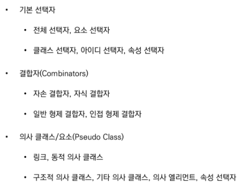

- 요소 선택자
  - html태그를 직접 선택한다

- 클래스 선택자(.)
  - 정해 놓은 클래스를 이용해서 선택하면 된다.

- 아이디 선택자(#)
  - 해당 아이디가 적용된 항목을 선택
  -  아이디로 두개로 만들지 않는다.  (하나의 문서에 1번만 사용)

- .box > p (자식결합자)
  - 박스에 바로 아래 있는 p를 선택한것

- .box  p (자손결합자)
  - 박스에 있는 모든 p를 선택하는 것

- Pseudo Class(의사클래스/요소) ==> 가짜(진짜 클라스는 아니지만 그와 비슷한 기능을 한다)
  - 링크 동적 의사 클래스 ex)  h1: hover(올리면 색이 바뀜) ==>즉 어떠한 기능을 부여하는 것이다

### css적용 우선순위

- 좁은 곳에서 넓은 곳으로 이동한다고 생각하면 된다.

- 로딩순서 ==> 뒤에 아이에게 적용 (덮어씌어지는 느낌)

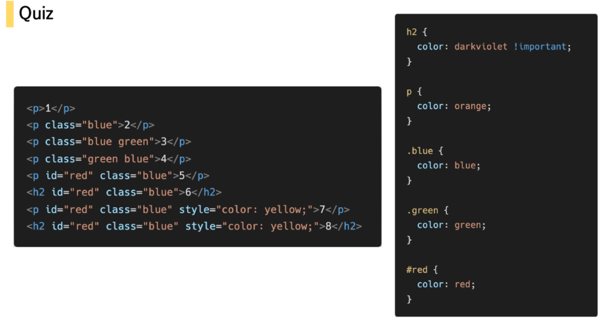

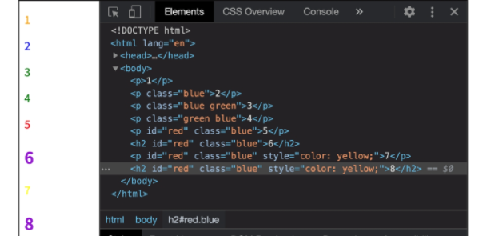

### CSS 상속

인라인(태그에 둘러쌓였을때 되었을때)이라면 상속

- 상속이 되는 것들과 안되는 것들이 있다
- 되는지 안되는지 그냥 인터넷에서 찾아서 확인
- text관련된 것들은 상속되는 것들이 많음 (font, color, text-align, opacity, visibility)
- Box, Position과 관련된 것들은 상속이 보통 되지 않음(width,height, margin등등) (position, top, right 등등)

## CSS 기본 스타일

### 크기 단위

- px(픽셀)
  - 고정적인 단위

- %
  - 가변적인 레이아웃에서 자주사용 ==> 스마트폰과 태블릿의 크기차이가 있기 때문에 등등

- em
  - 상속의 영향을 받음 ()
  - 배수 단위, 지정된 사이즈에 상대적인 사이즈 (1.5 em = 원래사이즈에서 곱하기 1.5)

- rem

  - 상속의 영향을 받지 않음

  - 최상위 요소의 사이즈를 기분으로 배수 단위를 가짐 (기준이 원래 것들)

  - rem을 많이 사용한다.

- viewport (사각형 등등)
  - 디바이스 화면
  - 디바이스의 viewport를 기준으로 상대적인 사이즈가 결정된다.
  - 80vw ==> 창을 늘리고 할때 알아서 조절이 된다
  - vmax ==> 가로세로 중에 큰 것을 기준으로 크기를 조절한다
  - vmin ==> 가로세로 중에 작은 것을 기준으로 크기를 조절한다

### 색상 단위

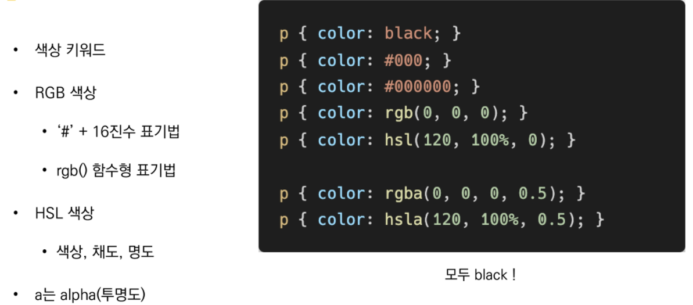

## CSS Selectors 심화

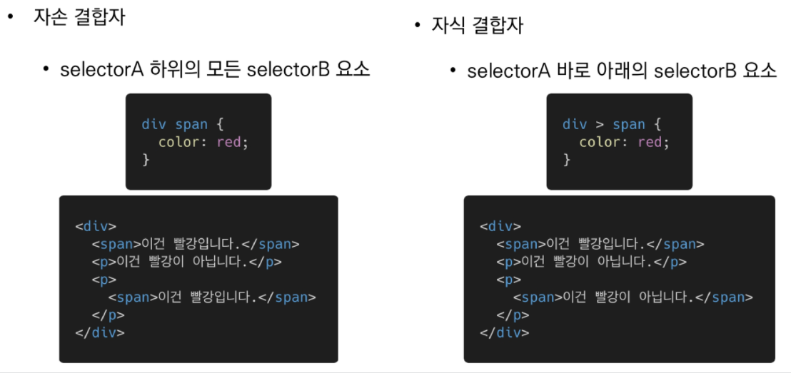

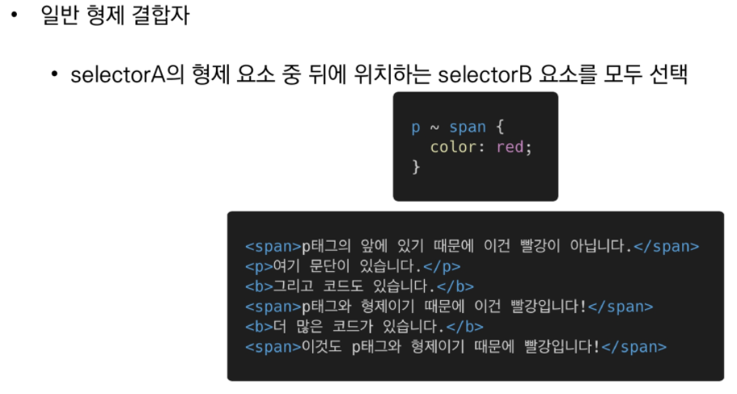

==> 뒤에 위치하는 모든 요소 선택 
(같은 줄에 있는 애들이어야 함 ==> 그 안에 속해 있는 애들은 적용 안됨)

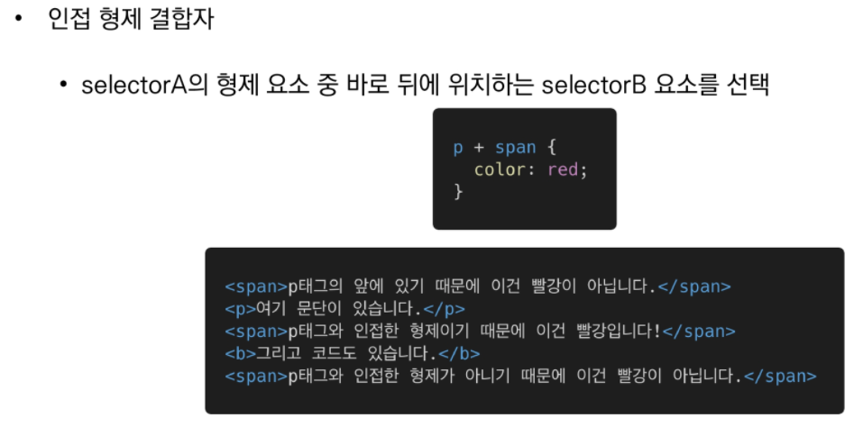

==> 뒤에 위치하는 바로 뒤의 요소만 선택 (무조건 붙어 있아야한다, 하나라도 떨어져 있으면 적용 안됨)
(같은 줄에 있는 애들이어야 함 ==> 그 안에 속해 있는 애들은 적용 안됨)

## CSS Box model

원칙: 모든 요소는 네모박스 모델이고, 위에서 아래로, 왼쪽에서 오른쪽으로 쌓인다 (normal flow)

- 박스모델
  - content : 글 그림 등등
  - padding  배경색
  - border : 테두리
  - margin : 빈공간이라고 생각

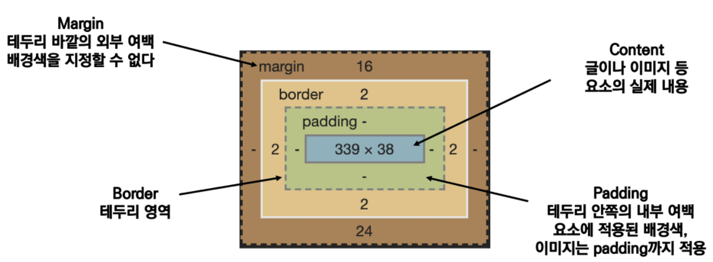

- 시계방향으로 적용 => 비는건 반대편에 있는 것을 가져온다.

### 박스 만들기

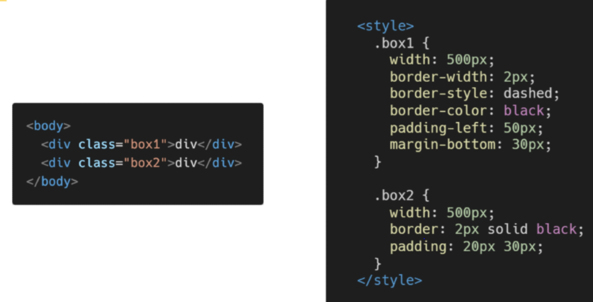

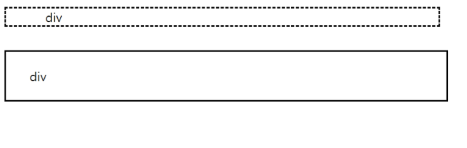

- border 박스는 눈에 보이지만 나머지는 잘 안보인다
- 따라서 border를 기준으로 박스를 짜주는 것 직관적이라 처음에 편하다

## CSS Display

- 원칙2:
  - 모든 요소는 네모이고 좌측 상단에 배치
  - display에 따라ㅏ 크기와 배치가 달라진다

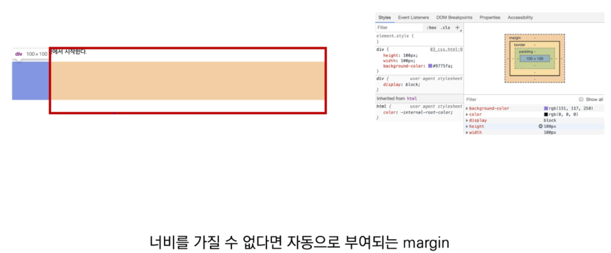

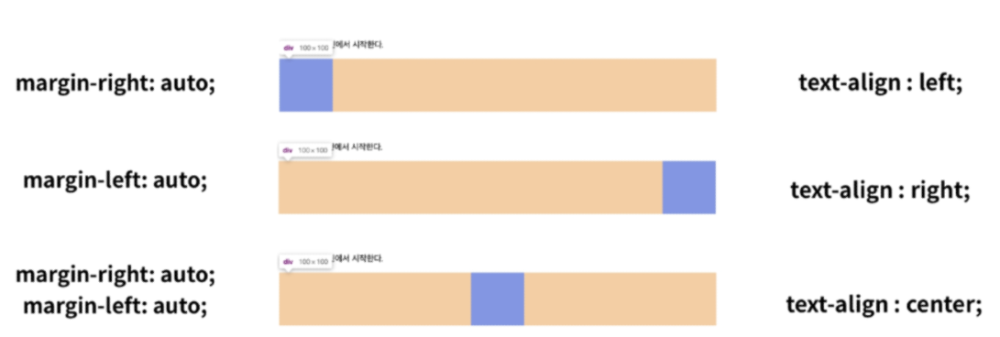

- 창 넓이에 따라 자동적으로 정렬을 시켜준다.
- 마진은 박스를 기준
- text는 텍스트 기준이다

#### display : none

- 안보이고 공간도 부여하지 않는다

- visibility: hidden은 공간은 차지하나 보이지는 않는다

## CSS Position

- 원칙 3
  - position으로 위치의 기준을 변경
    - relative : 본인의 원래 위치를 기준
    - absolute : 특정 부모의 위치를 기준
    - fixed : 화면의 위치를 기준

- static
- relative: 상대위치
  - 눈으로 보이는 위치만 옮긴것
  - 원래 있던 위치에는 빈공간이 차지하고 있음
  - 따라서 다른 박스들이 그대로 유지하고 있음 

- absolute
  - normal flow에서 벗어남
  - 즉 옮기게 되면 빈공간이 생겨남
  - 따라서 다른 박스들이 빈공간을 차지하게 된다
  - 둥둥 떠 있는 상태라고 생각하면 된다.
  - 앱솔루트는 공간을 차지하지 않음 ex) 네이버 동영상 재생 버튼
  - 따라서 기준점을 relative로 함

- fixed
  - 브라우저를 기준으로 하나를 고정시키고 있음
  - ex) 웹툰에서 리모콘 같은 것

- sticky
  - 스크롤 같은 것
- 그림 정중앙에 위치하게 만들기
  -  그림은 좌측 상단을 기준으로 하기때문에 잘 확인을 해주어야한다.

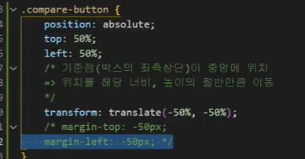

- 박스 원형으로 만들기
  -  border-radius: 50% 로하면 원형으로 바뀌게 된다

ul> li*3

ol >li*3 

이라고 하면 한번에 나온다

ul # fruit-list>li.fruit-item*3

이라고 하면 fruit itme class 인 리스트 세개와 id fruit-list가 나오게 된다

테이블 (한번에 만들기)

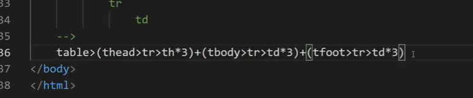

