# Web_html

## HTML & CSS

**모르는게 있을시 mdn에서 찾으면 된다**

- HTML: hyper text markup language 

  - Hyper Text: 초월한, 뛰어한 Text이다

  - markup language: 마크(mark, 기호?)로 이루어진 언어다 (의미와 구조를 만든다)

- web 표준

  - W3C // WHATWG(apple, google, ms, mozilla)

- HTML5test 사이트에서 브라우저 평가표를 볼 수 있다

  - 우리가 익스플로러를 쓰지 말아야하는 이유 

- 크롬 개발자 도구 주요기능

  - elements - DOM탐색 및 CSS 확인 및 변경
  - Style - 요소에 적용된 CSS확인
  - Computed - 스타일이 계산된 최종 결과
  - Event Listeners - 해당 요소에 적용된 이벤트 (JS)

  

## HTML

HTML: hyper text markup language  by 팀 버너스리


### HTML 기본 구조

- html: 문서의 최상위 요소

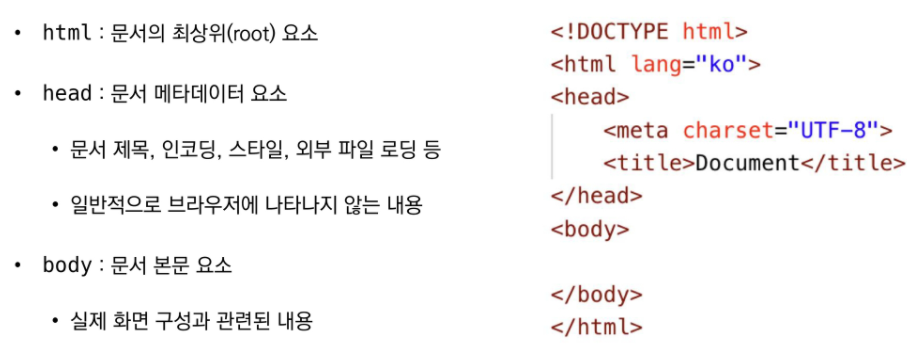


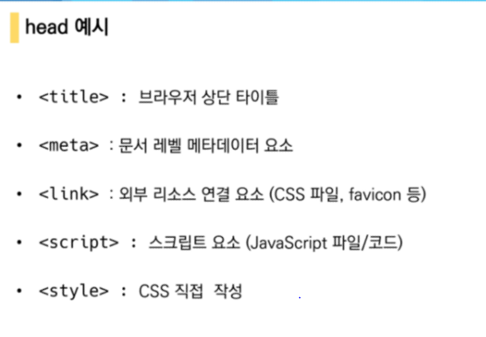

- favicon => 창에 웹 마크같은 것들

  

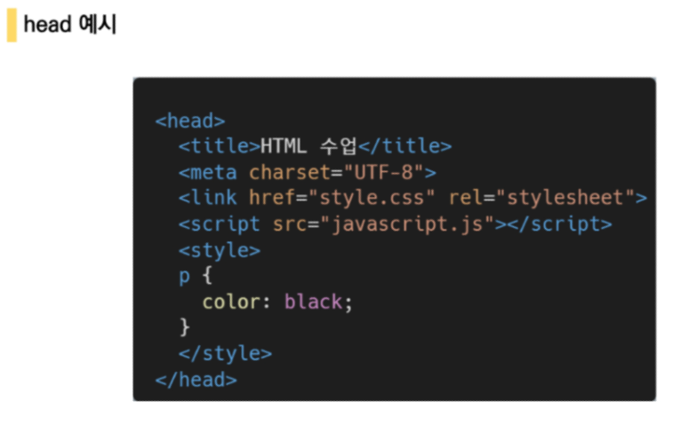

head예시 :

Open Graph Protocol: (메타에서)링크를 보내면 같이 제목과 설명등을 쓸 수 있음

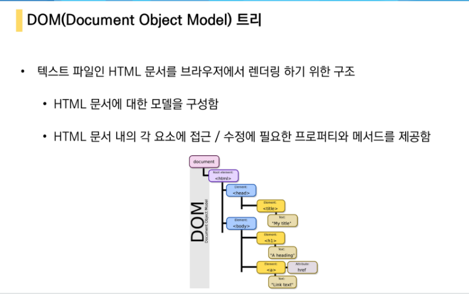


#### 요소

```html
<h1> # 여는 모양
     contensts
</h1>  # 닫는 모양
```

- 내용이 없는 태그들이 있다
  - br, hr, img, input, link, meta

- 요소는 중첩(nested)될 수있다
  - 중첩이된다면 기능도 중첨된다.
- 에러를 반환하지 않는다 ==> 디버깅이 힘들 수 있음


####  속성

```html
 <a href="https://google.com"></a> 
  #(속성명)  # 쌍따옴표사용   # 속성값
```

- 태그별로 사용할 수 있는 속성은 다르다
- 요소의 시작 태그에 작성하며 보통 이름과 값이 하나의 쌍으로 존재
- 공백은 사용하지 않는다

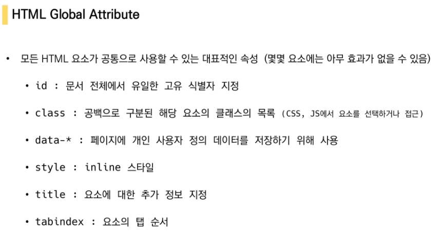

- 모든 태그들에서 사용할 수 있는 것들

- class: 여기있는건 전부 글자 크기가 100이야, 색은 보라색이야! 이런 느낌
- title: 누르면 정보가 나오는 것
- tabindex : 아이디 누르고 tab누르면 비밀번호로 간다 ==> 이것의 순서를 정해주는 것


#### 시맨틱 태그

- 이 아이들은 따로 기능이 없다/ 원래는 div만 사용했었음
- 존재 이유: 확인과 디버깅 등등을 확인하기 편하게 만들어준다/ 정보를 찾기 쉽게 만들어준다
- 목록
  - header : 문서 전체 섹션의 헤더 (머리말)
  - nav : 네비게이션 (header에 표 있는 부분)
  - aside : 메인 콘텐츠와 관련성이 적은 콘텐츠
  - section : 컨첸프의 그룹을 표현
  - article : 문서 페이지
  - footer : 마지막 부분이야 (하나의 색션의)
  - h1 (기능 존재)
  - table (기능 존재)

- Non semantic : div, span => 그냥 묶어둔다 라는 뜻/ 의미 없음


## HTML 문서 구조화

- 인라인 : ㅁ ㅁ ㅁ ㅁ ㅁ ㅁ 이런 느낌임   ==> 엔터를 인식하지 못한다.
- 블록  : [                      ] 이런 느낌임 ==> 엔터를 인식할 수 있다

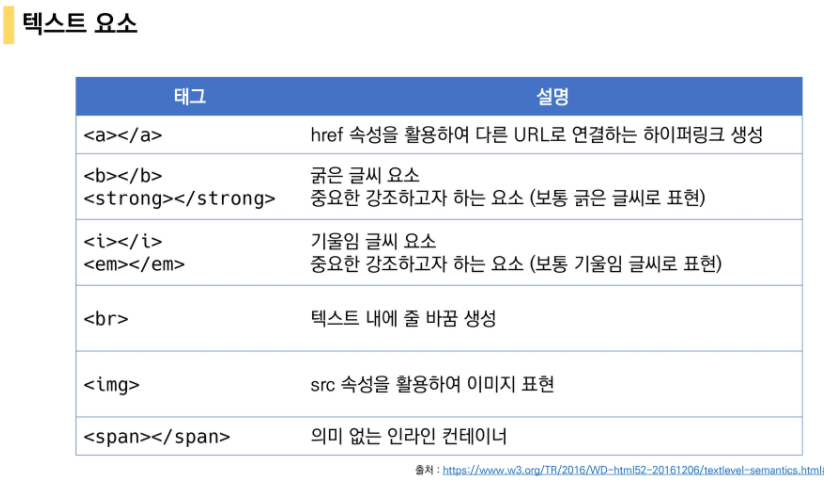

- b와 strong은 같은 기능을 가지고 있다. (인라인 속성이기 때문에 엔터를 구분하지 못한다)
- img ==> (src : 어떤 이미지인지 alt: 대체 텍스트, 이미지에 대한 설명 등등)
- Non sementic => span


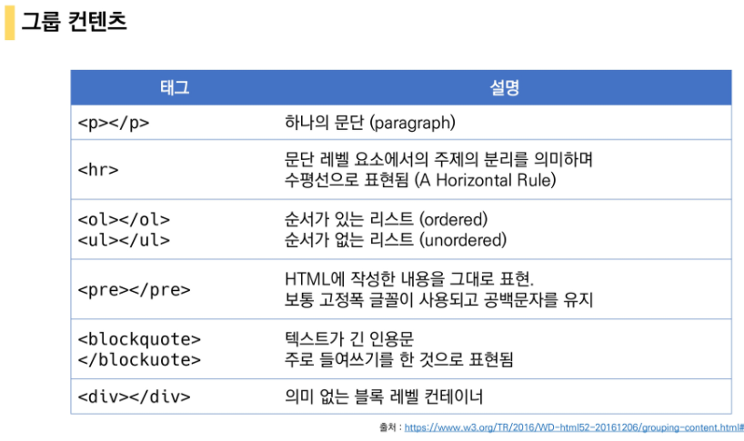

- ol는 li와 함께 사용
- pre는 인라인(엔터가 안먹는 것)을 엔터가 먹어보이게 표현가능
- 


#### table

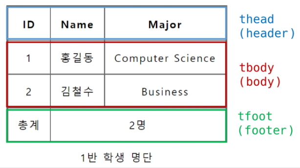

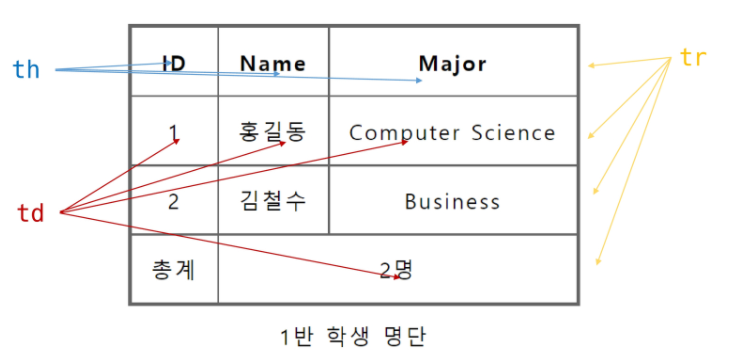


col : 세로   ==> colspan = 세로가 하나의 td로 합치겠어 라는 뜻이다

row: 가로 


#### form

- 정보를 서버에 제출하기 위한 아이

```html
<form action = "search", method = "GET" >
    
</form>
```

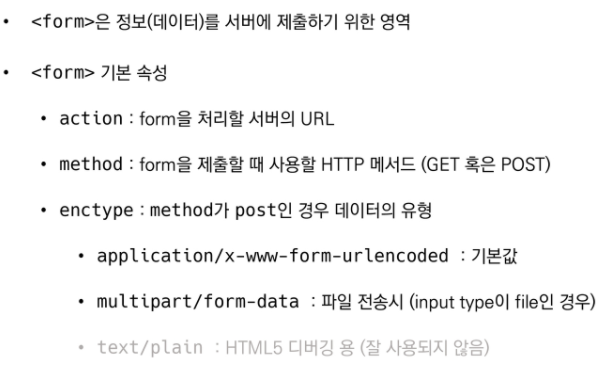

- get: 보여주면서 전강을 해준다. (url 에 표시)
- post: 숨겨서 전달을 해준다(보안과 관련된 것들)


#### input

```html
<form action = "search", method = "GET" >
	<input type= "text" name = "q">    
</form>
```

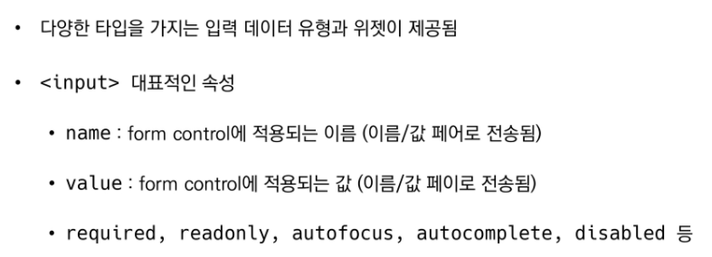


#### input label

- 라벨에 클릭을 하더라도 input에 영향을 끼친다.
- 글씨를 눌러도 체크를 할 수 있도록 만드는 것이다.
- 굳이 체크박스를 누르지 않아도 되는 것

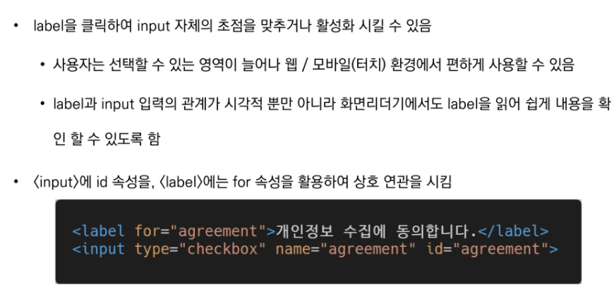

- for과 id가 세트이다 , 즉 for에 val값과 id의 val값은 같아야한다


- checkbok: 다중선택 가능
- radio : 단일선택만 가능  (name을 통일해 주어야 한다.)


